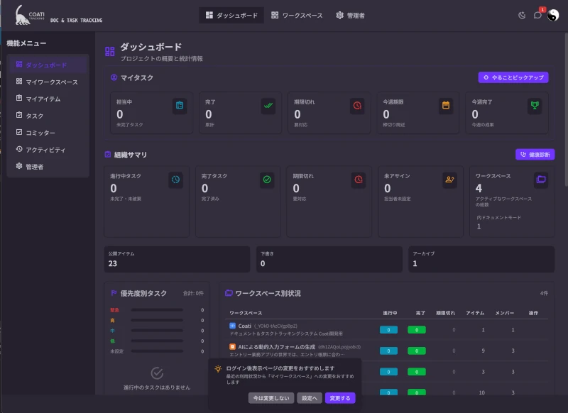

# pecus-aspire

AIを社畜扱いして作成中のAspireアプリケーション。
コーディングは一切行わずGithub Copilot エージェントのプロンプト入力だけでAspireアプリケーションを実装する実験。

コミットメッセージもGithub Copilot エージェントが生成。

> 今のところは、どうしても先に進まなくなった時だけ自分でちょい直すぐらい

AIに対するコーディングルールは、.github\copilot-instructions.mdにて

## 作業開始

2025/10/24 作業開始

## 📋 プロジェクト概要

Pecus Aspire は、.NET Aspire 10.0 を使用した分散マイクロサービス構成のマルチテナント管理システムです。
複数の組織をサポートし、ユーザー管理、ワークスペース管理、スキル管理などの機能を提供します。

## 🪧 デモサイト
https://coati.bright-l.0am.jp

ログイン: user1@demo.coati.none、user2@demo.coati.none、user3@demo.coati.none
パスワード: P@ssw0rd

- 管理者権限のユーザーは利用できません（AIプロバイダーやAPIキー保持のため）
- user2@demo.coati.noneでログインして色々触ってみるのが一番面白いかも？
- 複数のブラウザを利用して複数のユーザーでログインすればチャットも試せます。



## 🏗️ アーキテクチャ

### プロジェクト構成

- **pecus.AppHost** - Aspire オーケストレーションホスト（サービス起動・構成管理）
- **pecus.WebApi** - メイン REST API（JWT認証、ページング、統計情報）
- **pecus.BackFire** - Hangfire バックグラウンドジョブサーバー
- **pecus.DbManager** - データベースマイグレーション・シード管理
- **pecus.Libs** - 共有ライブラリ（DB モデル、Hangfire タスク、メールサービス）
- **pecus.ServiceDefaults** - サービス共通設定（Serilog、ヘルスチェック、OpenTelemetry）
- **pecus.Frontend** - Next.js フロントエンドアプリケーション (SSR-first, Server Actions)
- **pecus.LexicalConverter** - Lexical 変換ユーティリティ（Node/Nest ベースのツール）
- **pecus.Protos** - gRPC / Protobuf 定義群（サービス間およびクライアント連携用）

### 技術スタック

**バックエンド:**
- .NET 10 (Preview)
- Entity Framework Core 10
- .NET Aspire 13.1
- PostgreSQL (pgroonga拡張による全文検索)
- Redis (セッションストア、Hangfireキュー)

**フロントエンド:**
- Next.js 16.1.1 (App Router)
- React 19.2.3
- Tailwind CSS 4.1.18
- FlyonUI 2.4.1 (UIコンポーネント)
- @iconify/tailwind4 (アイコン)
- Biome 2.3.10 (リンター/フォーマッター)

### インフラストラクチャ

- **PostgreSQL** - メインデータベース（pecusdb）
- **Redis** - セッション管理、Hangfire キュー・キャッシュ
- **Hangfire Dashboard** - バックグラウンドジョブ管理UI

## 🔧 必要な環境

- **.NET 10 SDK** - [Download](https://dotnet.microsoft.com/download/dotnet/10.0)
- **Docker & Docker Compose** - インフラストラクチャ（PostgreSQL、Redis）
- **Node.js 18+** - フロントエンド開発用（オプション）

## 🚀 起動手順

### 1. リポジトリのクローン

```bash
git clone https://github.com/HiroyukiNIshimura/pecus-aspire.git
cd pecus-aspire
```

### 2. 環境構築

#### 2.1 依存パッケージの復元

```bash
# ソリューション全体のパッケージを復元
dotnet restore pecus.sln
```

#### 2.2 設定ファイルの生成

```bash
# 開発用オーバーライドファイルを作成（初回のみ）
cp config/settings.base.dev.json.example config/settings.base.dev.json

# 必要に応じて API キー等を編集
# vim config/settings.base.dev.json

# 設定ファイルを生成
node scripts/generate-appsettings.js -D
```

**補足:**
- `config/settings.base.json` がベース設定（Git管理）
- `config/settings.base.dev.json` は開発者ローカル用（.gitignore）
- 生成された `appsettings.json` は各プロジェクトに配置されます
- `pecus.Frontend/.env.local` も自動生成されます

#### 2.3 フロントエンド環境設定（pecus.Frontend）

```bash
# pecus.Frontend ディレクトリに移動
cd pecus.Frontend

# npm 依存パッケージをインストール
npm install

# Biome (リンター) のグローバルインストール (VSCode拡張機能用)
npm install -g @biomejs/biome
```

**注:** 環境変数ファイル `.env.local` は手順 2.2 で自動生成されています。手動作成は不要です。

### 3. アプリケーション起動

※開発環境のAspire環境ではRedisを永続化させていないのでNextjs側の認証情報は揮発性です。ですのでアプリ起動後は毎回ログインが必要になります。

#### 3.1 Visual Studio で起動（推奨）

1. `pecus.sln` を Visual Studio で開く
2. スタートアッププロジェクトが `pecus.AppHost` になっていることを確認
3. **F5** または **デバッグ > デバッグの開始** を実行
4. Aspire ダッシュボードが自動的にブラウザで開きます

> 💡 **ヒント:** Visual Studio では Aspire のホットリロード、デバッグ、リソース監視がシームレスに統合されています。

#### 3.2 VS Code で起動

1. ワークスペースを VS Code で開く
2. **ターミナル** で以下を実行：

```bash
# プロジェクトルートで Aspire CLI を使用して起動
aspire run
```

または、**C# Dev Kit** 拡張機能がインストールされている場合：

1. **実行とデバッグ** パネル（Ctrl+Shift+D / Cmd+Shift+D）を開く
2. 起動構成で `pecus.AppHost` を選択
3. **F5** でデバッグ開始

> 📦 **必要な拡張機能:**
> - [C# Dev Kit](https://marketplace.visualstudio.com/items?itemName=ms-dotnettools.csdevkit)
> - [.NET Aspire](https://marketplace.visualstudio.com/items?itemName=ms-dotnettools.dotnet-aspire) （オプション、ダッシュボード統合）

#### 3.3 コマンドラインから起動

**方法1: Aspire CLI を使用（推奨）**

```bash
# プロジェクトルートで実行
aspire run
```

Aspire CLI のインストール：
```bash
dotnet tool install -g Aspire.Hosting.Cli
```

**方法2: dotnet run を使用**

```bash
cd pecus.AppHost
dotnet run
```

**起動時の処理:**
1. `pecus.DbManager` が自動的に起動し、データベースマイグレーションを実行
2. シードデータが投入される（開発環境の場合）
3. `pecus.WebApi` が起動（https://localhost:7265）
4. `pecus.BackFire` Hangfire サーバーが起動
5. Aspire ダッシュボードが表示

> ⚠️ **初回起動時の注意:** 初回起動時はマイグレーションとシードデータの大量投入を行うモードの場合、**数分程度の時間がかかります**。Aspire ダッシュボードで `pecus.DbManager` のコンソールを開いてシードデータの投入完了を確認してください。

#### 3.4 個別にサービスを起動する場合

**別々のターミナルで実行:**

```bash
# ターミナル1: WebApi
cd pecus.WebApi
dotnet run

# ターミナル2: BackFire (Hangfire ワーカー)
cd pecus.BackFire
dotnet run

# ターミナル3: DbManager (データベース初期化)
cd pecus.DbManager
dotnet run
```

**注:** 個別起動の場合、Aspire ダッシュボードのUIを使用することで、各サービスの状態監視、ログ確認、サービスの再起動などを一元的に管理できます。

### 4. アプリケーションへのアクセス

| サービス | URL | 説明 |
|---------|-----|------|
| **Aspire Dashboard** | 動的 | サービス管理・監視 |
| **WebApi** | https://localhost:7265 | REST API ベースURL |
| **Hangfire Dashboard** | 動的 | バックグラウンドジョブ管理 |
| **PostgreSQL** | tcp:5432 | DB（ユーザー: postgres, パスワード: postgres） |
| **Redis** | 動的 | キャッシュ・キュー・セッション |

### 5. テストアカウント

| ユーザー | ログインID | パスワード | 権限 |
|---------|-----------|----------|------|
| 管理者 | `admin@demo.coati.non` | `P@ssw0rd` | Admin（全権限） |
| 一般 | `user1@demo.coati.non` | `P@ssw0rd` | ユーザー |
| 一般 | `user2@demo.coati.non` | `P@ssw0rd` | ユーザー |

## 📚 ドキュメント

詳細な設計ドキュメントは `docs/` ディレクトリにあります。

- **[Frontend Guidelines](docs/frontend-guidelines.md)**: フロントエンド開発ガイドライン
- **[Backend Guidelines](docs/backend-guidelines.md)**: バックエンド開発ガイドライン
- **[SSR Design Guidelines](docs/ssr-design-guidelines.md)**: SSR/Server Actions 設計指針
- **[Auth Architecture](docs/auth-architecture-redesign.md)**: 認証・セッション管理設計
- **[DB Concurrency](docs/db-concurrency.md)**: データベース同時実行制御

## 📚 API ドキュメント

WebApi のすべてのエンドポイント、リクエスト・レスポンス仕様は **Swagger UI** で確認できます。

WebApi が起動している状態で、以下にアクセスしてください：

- **Swagger UI**: https://localhost:7265/index

Swagger UI では、すべての API エンドポイント、パラメータ、レスポンススキーマが対話的に確認でき、直接 API をテストすることも可能です。

## 🗄️ データベース

### 初期化・マイグレーション

```bash
# 手動でマイグレーションを実行
cd pecus.DbManager
dotnet run

# または Aspire から自動的に実行される
```

### シードデータ

**共通（全環境）:**
- マスターデータ（権限・ロール・ジャンル・タスクタイプ）
- バックオフィス組織と管理者ユーザー

**開発環境 (Development):**
- 2 つの組織（テナント）
- 各組織に 10 人のユーザー
- 各組織に 5 つのワークスペース
- 各ワークスペースに 30 件のアイテム
- その他、タスク、コメント、アクティビティなどの関連データ

**負荷テスト環境 (LoadTest):**
- `ASPNETCORE_ENVIRONMENT=LoadTest` で実行時
- 5 つの組織
- 各組織に 100 人のユーザー
- 各組織に 50 つのワークスペース
- 大量のアイテムと関連データ

**デモモード:**
- `DemoModeOptions:Enabled=true` の場合、デモ用データを追加投入

> ⚠️ **注意:** 初回起動時はデータ投入を行うため、時間がかかる場合があります。

**本番環境 (Production):**
- マスターデータとバックオフィス組織のみ投入

## 📝 ログとモニタリング

### Serilog ログ

すべてのサービスで Serilog を使用しています。ログはコンソールと EventLog に出力されます。

### Aspire ダッシュボード

サービス状態、リソース使用状況、トレース情報が確認できます。

### Hangfire ダッシュボード

バックグラウンドジョブの実行状況が確認できます。
pecus.BackFireのURL/hangfire

## 💻 開発ワークフロー

### データベース マイグレーション

新しいエンティティやカラムを追加した場合：

```bash
cd pecus.DbManager

# 新しいマイグレーションを作成
dotnet ef migrations add MigrationName

# マイグレーションを実行
dotnet run
```

### 補足
**開発環境では以下のエンドポイントでHTMLメールデザイン確認可能**
https://localhost:7265/api/dev/email-preview/index
GET /api/dev/email-preview/index	テンプレート一覧をHTMLで表示（ブラウザ用インデックスページ）

### Hangfire タスク

新しいバックグラウンドタスクを追加：

1. `pecus.Libs/Hangfire/Tasks/` でタスククラスを定義
2. WebApi と BackFire の両方で DI 登録
3. `IBackgroundJobClient` を DI 経由で注入し、`_backgroundJobClient.Enqueue<TaskClass>(x => x.Method(...))` で実行

※ 静的API（`BackgroundJob.Enqueue`, `RecurringJob.AddOrUpdate`）は使用禁止。必ず DI 経由の `IBackgroundJobClient` / `IRecurringJobManager` を使用すること。

## ⚡ パフォーマンス最適化

- EF Core クエリ最適化（Include/Select の適切な使用）
- Hangfire で長時間処理をバックグラウンド化
- Redis キャッシング活用
- ページング実装で大規模データセット対応

## 🔐 セキュリティ

- JWT 認証（Authorization: Bearer {token}）
- ロールベースアクセス制御（RBAC）
- パスワードハッシュ化（Bcrypt）
- HTTPS 対応（本番環境）
- CSRF 保護（SameSite Cookie）

## 🤖 Botキャラ


## 📄 ライセンス

MIT License

## 📖 参考資料

- [.NET Aspire 公式ドキュメント](https://learn.microsoft.com/ja-jp/dotnet/aspire/)
- [Entity Framework Core](https://learn.microsoft.com/ja-jp/ef/core/)
- [Hangfire ドキュメント](https://docs.hangfire.io/)
- [JWT 認証](https://jwt.io/)

## 🤝 サポート

しません😅

---

**最終更新日:** 2026年1月4日
