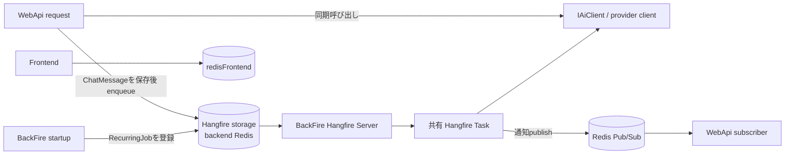

# AI連携とバックグラウンドジョブ

> 本ページは、2026-10-04時点の現行コードを確認して記述しています。最終確認日: **2026-10-04**。

## 概要

CoatiのAI呼び出しは、リクエスト処理内で完了を待つ経路と、Hangfireへ仕事を投入して後から実行する経路に分かれる。たとえばエディター向け `AiAssistantService` はリクエスト内でAIクライアントを呼び出す一方、チャット返信はControllerがメッセージを保存してからHangfireへenqueueする。AI利用全体をHangfire経由とみなすことはできない。

Hangfireのstorageとworker、定期ジョブの登録は `pecus.BackFire` が担い、タスク実装やAIクライアント、Botの拡張契約は主に共有ライブラリ `pecus.Libs` にある。`pecus.WebApi` はHangfire clientとしてenqueueし、BackFire側のHangfire Serverがジョブを実行する。

## 構造と処理経路

WebApiとBackFireのDI・Hangfire登録は[WebApi `Program.cs`](../../pecus.WebApi/Program.cs)、[BackFire `Program.cs`](../../pecus.BackFire/Program.cs)、タスク登録は[HangfireTaskExtensions.cs](../../pecus.Libs/Hangfire/Tasks/Extensions/HangfireTaskExtensions.cs)を参照。図の通知経路はPub/Subまでを示し、SignalRの中継・クライアント配信の詳細は[リアルタイム連携](collaboration-realtime.md)で扱う。

## AIプロバイダー抽象化と選択

[`IAiClient`](../../pecus.Libs/AI/IAiClient.cs) が各プロバイダーの共通呼び出し面であり、[`IAiClientFactory`](../../pecus.Libs/AI/IAiClientFactory.cs) はシステム既定設定向けの `GetDefaultClient()` と、ベンダー・APIキー・モデルを指定する `CreateClient(...)` を提供する。[`AiClientFactory`](../../pecus.Libs/AI/AiClientFactory.cs) はベンダー値を OpenAI、Anthropic、Google Gemini、DeepSeek、Kimi のclient実装へ対応付ける。各clientは例として[OpenAIClient.cs](../../pecus.Libs/AI/Provider/OpenAI/OpenAIClient.cs)にある。

[WebApiの登録](../../pecus.WebApi/Program.cs)と[BackFireの登録](../../pecus.BackFire/Program.cs)では、各providerの設定／HTTP client登録、`DefaultAiClient`、factoryをDIに登録する。既定clientの設定型は[`DefaultAiSettings`](../../pecus.Libs/AI/Configuration/DefaultAiSettings.cs)で、[`DefaultAiClient`](../../pecus.Libs/AI/Provider/Default/DefaultAiClient.cs)がそのprovider・モデル・資格情報をfactoryへ渡す。これは組織設定の自動fallbackを意味しない。

組織単位の経路では、[`AiAssistantController`](../../pecus.WebApi/Controllers/AiAssistantController.cs)がサービスをawaitし、[`AiAssistantService`](../../pecus.WebApi/Services/AiAssistantService.cs)がDBの`OrganizationSettings`からベンダー・モデル・資格情報を読み、factoryでclientを作って`GenerateTextAsync`をawaitする。設定不足や生成失敗時は`null`を返す。Bot返信では[`BotTaskGuard`](../../pecus.Libs/Hangfire/Tasks/Bot/Guards/BotTaskGuard.cs)が同じく組織設定を検査して署名情報を返し、タスクがfactoryを呼ぶ。別経路として、[`DocumentSuggestionService`](../../pecus.WebApi/Services/DocumentSuggestionService.cs)には`GetDefaultClient()`を使う実装もあるが、その既定設定メソッドはコードコメント上「未使用」とされている。

したがって、API要求中にAI応答を待つ処理と、Hangfire task内でAIを呼ぶ処理の両方が存在する。HTTP clientには標準Resilience handlerとprovider別タイムアウトが設定されるが、これはHangfireジョブの再試行設定とは別である。[DefaultAiServiceExtensions.cs](../../pecus.Libs/AI/Extensions/DefaultAiServiceExtensions.cs)

## チャット返信: 保存から生成・通知まで

### AIルーム (`AiChatReplyTask`)

1. [`ChatMessageService.SendMessageAsync`](../../pecus.WebApi/Services/ChatMessageService.cs)がユーザーメッセージをDBに保存してControllerへ返す。続いて[`ChatController.SendMessage`](../../pecus.WebApi/Controllers/ChatController.cs)がルーム種別を確認し、AIルームならメッセージID等を渡して`AiChatReplyTask`をenqueueする。HTTPレスポンスはBot応答を待たずに返る。
2. [`AiChatReplyTask.SendReplyAsync`](../../pecus.Libs/Hangfire/Tasks/Bot/AiRoom/AiChatReplyTask.cs)は最初にChatBotを取得し、task guardで組織のAI設定を検査する。無効または設定不足なら処理を終了し、有効ならfactoryからclientを作る。
3. トリガーメッセージを読み、入力品質判定とWildBot抽選を行う場合がある。それ以外はBotをランダム選択するか、会話履歴を使って宛先を分析し、必要ならBot種別判定へfallbackする。直近の宛先分析履歴は過去2日・最大10件を対象とする。
4. Botの既読状態を通知・更新し、送信者名を取得した後、入力中状態を通知する。通常経路ではメッセージ分析を行ってcontextを組み立て、履歴を使う場合は最大5往復分（最大10メッセージ）を時系列で使う。中立判定やツール結果に応じてcontextを作らず会話履歴へ進む場合もある。
5. Botのpersona・選択role・constraintからsystem promptを構築し、`GenerateTextWithMessagesAsync`を呼び出す。生成後に入力中状態を解除し、BotメッセージをDB保存してから通知をpublishする。

手順1の「保存後にenqueue」、および手順5の「Botメッセージ保存後に通知」はコード上の呼び出し順である。通知中継の実装詳細は本ページの範囲外。

### GroupルームとBehavior

ControllerはGroupルームの場合、別の[`GroupChatReplyTask`](../../pecus.Libs/Hangfire/Tasks/Bot/GroupRoom/GroupChatReplyTask.cs)をenqueueする。この経路で組織設定からAI clientを用意し、`IBotBehaviorSelector`があればbehaviorを選択して実行する。対して`AiChatReplyTask`は`IBotBehaviorSelector`を注入・呼び出ししない。つまり、BehaviorはAIルーム返信の汎用段階ではなく、現行コードではGroupルーム側の拡張点である。

## ToolsとBehaviorの拡張境界

- **AI Tools**: BackFireは[`AddAiTools`](../../pecus.Libs/AI/Extensions/AiToolsExtensions.cs)で`IAiTool`実装と`IAiToolExecutor`を登録する。現行の登録はユーザータスク取得、情報検索、類似タスク担当者推薦。AiRoomの[`AiChatReplyTask.TryGetContextAsync`](../../pecus.Libs/Hangfire/Tasks/Bot/AiRoom/AiChatReplyTask.cs)は、メッセージ分析結果から`AiToolContext`を作り、関連度50以上・最大2件を[`AiToolExecutor`](../../pecus.Libs/AI/Tools/AiToolExecutor.cs)へ渡す。executorは関連度・優先度で選び、成功したcontext promptを集約する。追加時は`IAiTool`実装とDI登録が拡張箇所となる。
- **Bot Behavior**: [`IBotBehavior`](../../pecus.Libs/Hangfire/Tasks/Bot/Behaviors/IBotBehavior.cs)が適用可否・重み・実行を定義し、[`BotBehaviorSelector`](../../pecus.Libs/Hangfire/Tasks/Bot/Behaviors/BotBehaviorSelector.cs)が適用可能な候補を重み付きで選ぶ。BackFireの[`AddBotBehaviors`](../../pecus.Libs/Hangfire/Tasks/Bot/Behaviors/Extensions/BotBehaviorExtensions.cs)でselectorと実装を登録し、Groupルームのタスクが呼び出す。新しいBehaviorはinterface実装と登録を追加する。

## BackFireのRecurringJobと共有Task

BackFire起動時に`IRecurringJobManager`を取得し、各schedulerの`Configure...`を呼んでRecurringJobを追加・更新する。無効設定では対応するIDの登録を削除する処理がある。schedulerは実行頻度と呼び出す共有Taskを結び付ける。Weekly reportは定期jobから対象組織を抽出し、組織ごとの送信jobを追加する。

| Scheduler / Recurring ID | 実行間隔（コード上の既定） | 共有Taskと入口 |
|---|---|---|
| [CleanupJobScheduler](../../pecus.BackFire/Services/CleanupJobScheduler.cs) | 各設定のCron | [`CleanupTasks`](../../pecus.Libs/Hangfire/Tasks/CleanupTasks.cs)（refresh token、device、email-change token、chat、agenda、external API key）および[`UploadsCleanupTasks`](../../pecus.Libs/Hangfire/Tasks/UploadsCleanupTasks.cs)（uploads） |
| [WeeklyReportJobScheduler](../../pecus.BackFire/Services/WeeklyReportJobScheduler.cs) / `WeeklyReportScheduler` | 設定時刻の日次 | [`WeeklyReportTasks.CheckAndDispatchWeeklyReportsAsync`](../../pecus.Libs/Hangfire/Tasks/WeeklyReportTasks.cs)から組織ごとに`GenerateAndSendWeeklyReportAsync`をenqueue |
| [SystemNotificationJobScheduler](../../pecus.BackFire/Services/SystemNotificationJobScheduler.cs) / `SystemNotificationDelivery` | 毎分 (`* * * * *`) | [`SystemNotificationDeliveryTask.ProcessPendingNotificationsAsync`](../../pecus.Libs/Hangfire/Tasks/SystemNotificationDeliveryTask.cs) |
| [AchievementJobScheduler](../../pecus.BackFire/Services/AchievementJobScheduler.cs) / `AchievementEvaluation` | 毎日03:00 UTC (`0 3 * * *`) | [`AchievementEvaluationTask.EvaluateAllOrganizationsAsync`](../../pecus.Libs/Hangfire/Tasks/AchievementEvaluationTask.cs) |
| [LandingPageRecommendationJobScheduler](../../pecus.BackFire/Services/LandingPageRecommendationJobScheduler.cs) / `LandingPageRecommendation` | 毎週月曜04:00 UTC (`0 4 * * 1`) | [`LandingPageRecommendationTasks.DispatchLandingPageAnalysisAsync`](../../pecus.Libs/Hangfire/Tasks/LandingPageRecommendationTasks.cs) |
| [AgendaReminderJobScheduler](../../pecus.BackFire/Services/AgendaReminderJobScheduler.cs) / `AgendaReminder` | 5分ごと (`*/5 * * * *`) | [`AgendaReminderTask.ProcessRemindersAsync`](../../pecus.Libs/Hangfire/Tasks/AgendaReminderTask.cs) |
| [AgendaEmailJobScheduler](../../pecus.BackFire/Services/AgendaEmailJobScheduler.cs) / `AgendaEmail` | 5分ごと (`*/5 * * * *`) | [`AgendaEmailTask.ProcessPendingEmailsAsync`](../../pecus.Libs/Hangfire/Tasks/AgendaEmailTask.cs) |

cronはコード上の既定値であり、設定から変更できるものがある。Weekly report schedulerは設定された時刻で日次起動し、実際の配信曜日はタスク内で組織設定と照合する。Shared taskのDI登録は[`AddHangfireTasks`](../../pecus.Libs/Hangfire/Tasks/Extensions/HangfireTaskExtensions.cs)および各service extensionを参照。

## Hangfire storage・worker・Redis Pub/Sub

- WebApiはHangfire clientとRedis storageを登録し、enqueueを受け付ける。BackFireもRedis storageを同じ`hangfire:` prefix・DB 1で登録し、`AddHangfireServer`を呼ぶ。worker数は`ProcessorCount × WorkerPerCore`で、後者のコード上のfallbackは2。RecurringJobの起動時登録もBackFireで行う。[WebApi `Program.cs`](../../pecus.WebApi/Program.cs)、[BackFire `Program.cs`](../../pecus.BackFire/Program.cs)
- [`AppHost.cs`](../../pecus.AppHost/AppHost.cs)ではbackendの`redis`をWebApiとBackFireへ参照させ、Frontendには別resourceの`redisFrontend`を参照させる。Hangfire storageはbackend Redisであり、Frontendのsession storeとは別。Frontend側のsession利用箇所は[`serverSession.ts`](../../pecus.Frontend/src/libs/serverSession.ts)にある。
- [`SignalRNotificationPublisher`](../../pecus.Libs/Notifications/SignalRNotificationPublisher.cs)は`IConnectionMultiplexer`からRedis subscriberを取得し、`coati:signalr:notifications` channelへ通知payloadをpublishする。WebApiはsubscriberをHosted Serviceとして登録する。これは通知中継用途であり、Hangfireの永続job storageやqueueとは別の用途。同ファイルはpublish例外をログして再throwするが、受信者側の処理完了や配信保証までは示さない。

## 失敗・再実行をコードから読める範囲

- `AiChatReplyTask`は例外をログに記録し、入力中解除・エラー通知を試行した後に再throwする。Hangfireに失敗が伝わる一方、task登録箇所や同ファイルに明示的なretry回数・`AutomaticRetry`属性は見当たらない。実際の再試行回数・条件はHangfireの既定/global filterを含めて別途確認が必要。
- `AiToolExecutor`は個別toolの例外をwarningとして記録し、そのtoolのfailure結果を加えて次へ進む。`AiAssistantService`はAI呼び出し例外をcatchして`null`を返すため、リクエスト側にはHangfire taskの再試行はない。
- [`WeeklyReportTasks`](../../pecus.Libs/Hangfire/Tasks/WeeklyReportTasks.cs)はユーザー単位の送信例外を記録して次のユーザーへ進み、組織単位の外側で捕捉した例外は再throwする。[`SystemNotificationDeliveryTask`](../../pecus.Libs/Hangfire/Tasks/SystemNotificationDeliveryTask.cs)も通知単位の例外を記録して継続する。これらのcatchがある箇所では、部分失敗がHangfire job全体の失敗として伝わらない場合がある。
- AI provider向けHTTPには標準Resilience handlerが設定されるが、Hangfire retryとは別層である。HTTP resilience policyの実効値、Hangfireのglobal retry設定、失敗したjobの運用処理は実行環境・依存パッケージも含め要確認。
- 保存後の通知失敗やjob再実行時に重複を抑止する一般保証、Redis Pub/Subの受信後処理完了保証、job全体のexactly-once実行は、ここで確認したコードからは断定できないため要確認。

## 関連ページ

- [Web API契約とセキュリティ](webapi-contracts-security.md)
- [データモデルとライフサイクル](data-model-lifecycle.md)
- [コラボレーションとリアルタイム通知](collaboration-realtime.md)
- [リッチコンテンツ処理パイプライン](rich-content-pipeline.md)
- [配布・デプロイ・復旧運用](deployment-operations.md)
