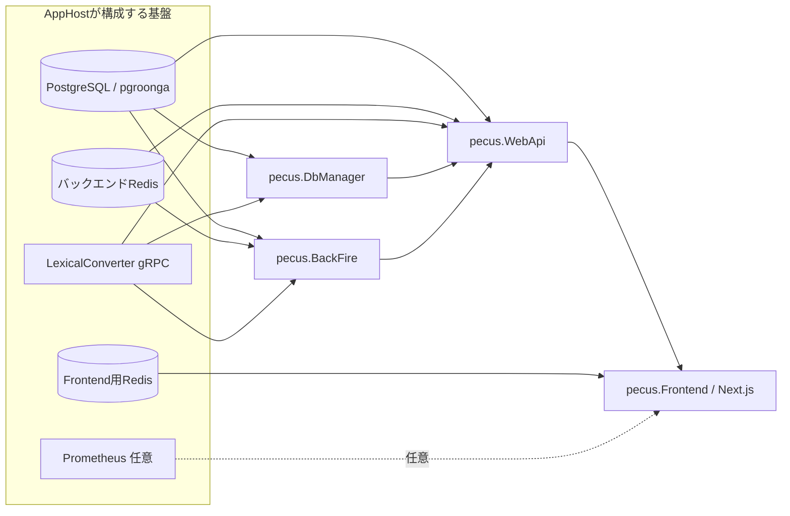

# システム構成

> 現行のサービス登録と依存関係は、[Aspire AppHost](../../pecus.AppHost/AppHost.cs)および各サービスの起動コードから確認しています。

## サービス構成

AppHost上の`.WithReference()`と`.WaitFor()`はリソース参照・起動依存を表します。図はデータの全通信を表すものではありません。

| リソース／サービス | 責務と接続 |
|---|---|
| PostgreSQL | `pecusdb`データベースを提供し、DbManager、WebApi、BackFireが参照します。AppHostではpgroonga対応イメージを使用します。 |
| バックエンドRedis | WebApiとBackFireが参照します。WebApiのSignalRバックプレーンと、BackFireのHangfireストレージにも利用されます。 |
| Frontend用Redis | Next.js Frontendが参照する別リソースです。サーバーサイドセッションに使われます。 |
| DbManager | PostgreSQLとLexicalConverterへの参照を持ち、AppHostではそれらを待って起動します。DB初期化処理は[`DbInitializer`](../../pecus.DbManager/DbInitializer.cs)がホストサービスとして登録されています。 |
| BackFire | WebApiと同じDB／バックエンドRedis／LexicalConverterを参照し、Hangfireサーバーとしてジョブを処理します。 |
| WebApi | DB、バックエンドRedis、LexicalConverterを参照し、AppHost上でDbManagerとBackFireを待ってから起動する構成です。 |
| Frontend | WebApiとFrontend用Redisを参照し、AppHostでは両者を待って起動します。 |
| LexicalConverter | Node.js gRPCサービスです。AppHostはヘルスチェックをレディネス確認に使います。 |
| Prometheus | AppHost設定で監視が有効な場合に追加される任意リソースです。 |

ソース：[`AppHost.cs`](../../pecus.AppHost/AppHost.cs)、[WebApiのサービス登録](../../pecus.WebApi/Program.cs)、[BackFireのサービス登録](../../pecus.BackFire/Program.cs)、[DbManagerのサービス登録](../../pecus.DbManager/Program.cs)。

## 主要なリクエスト経路

### Webリクエスト

1. Next.jsのページまたはサーバー処理が、生成済みAPIクライアントを使ってWebApiへリクエストします。
2. WebApiのコントローラーがユーザー／ワークスペース権限を確認し、サービス層でDB操作を行います。
3. 必要な応答はRESTレスポンスとしてFrontendへ返されます。

### バックグラウンド処理

WebApiの一部コントローラー・サービスは`IBackgroundJobClient`からジョブを登録します。BackFireは同じHangfireストレージを参照してジョブを処理します。たとえば、アイテム更新後の検索用テキスト生成はHangfireタスクからLexicalConverterを呼び出します。

- [アイテムAPI](../../pecus.WebApi/Controllers/WorkspaceItemController.cs)
- [ワークスペースアイテム用Hangfireタスク](../../pecus.Libs/Hangfire/Tasks/WorkspaceItemTasks.cs)
- [Lexical変換サービスの契約](../../pecus.Libs/Lexical/ILexicalConverterService.cs)

### リアルタイム通知

WebApiはSignalR Hubを公開し、バックエンドRedisをSignalRバックプレーンとして登録します。BackFireの通知パブリッシャーとWebApiの通知サブスクライバーはRedis Pub/Subを経由する構成です。詳細は[連携ページ](./background-and-integrations.md)を参照してください。

## Redisの区別

この構成には用途の異なるRedisリソースがあります。

- **バックエンドRedis**：WebApi／BackFireが共有し、HangfireやSignalR等のバックエンド処理に使います。
- **Frontend用Redis**：Next.jsサーバーが利用するセッションストアです。

片方の接続先・設定をもう片方に流用できるとは限りません。設定値は掲載せず、接続関係のみを説明しています。

## 関連ページ

- [開発構成と設定](./development-and-configuration.md)
- [バックエンドとデータ](./backend-and-data.md)
- [フロントエンド](./frontend.md)
- [バックグラウンド処理と連携](./background-and-integrations.md)

最終確認日: 2026-10-03
