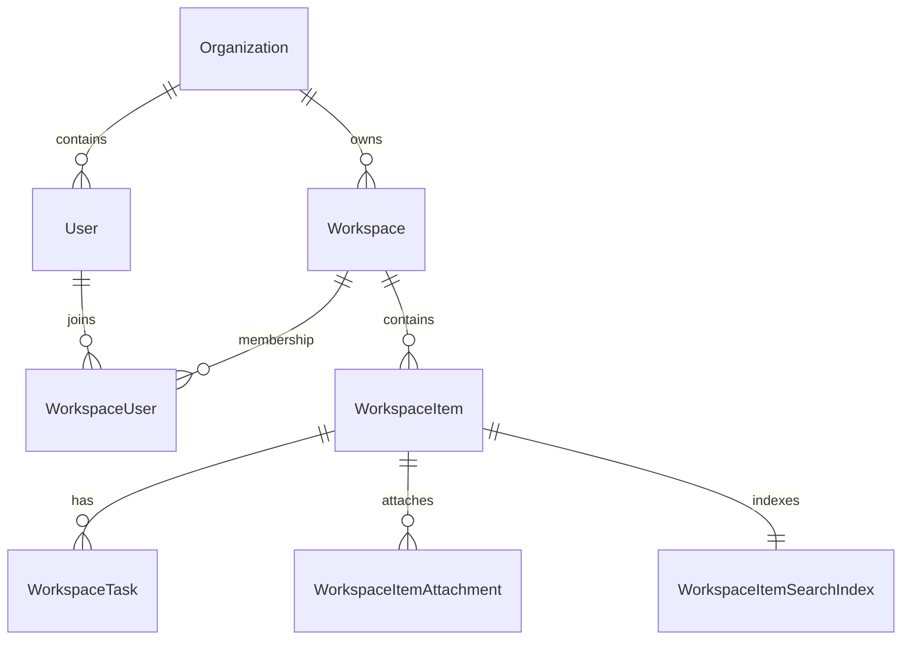

# バックエンドとデータ

> 本ページは現行の.NETコードをもとに、API・業務サービス・DBの主要な境界を説明します。網羅的なAPIリファレンスではありません。

## Web APIの処理境界

`pecus.WebApi`はASP.NET Core MVCコントローラーを登録し、JWT Bearer認証とAPIキー認証のschemeを構成します。コントローラーではリクエストとHTTP境界を扱い、業務処理はサービス層や`pecus.Libs`の共通サービスに委譲する構造です。

- [WebApi起動・DI登録](../../pecus.WebApi/Program.cs) — DbContext、認証、共通フィルター、OpenAPI、SignalR等
- [WorkspaceItemController](../../pecus.WebApi/Controllers/WorkspaceItemController.cs) — アイテム操作と権限チェック、非同期ジョブ登録の例
- [WorkspaceTaskController](../../pecus.WebApi/Controllers/WorkspaceTaskController.cs) — アイテムに紐づくタスク操作の例
- [WorkspaceItemService](../../pecus.WebApi/Services/WorkspaceItemService.cs) — アイテム操作とサービス層での永続化の例
- [OrganizationAccessHelper](../../pecus.WebApi/Libs/WorkspaceAccessHelper.cs) — 組織・ワークスペースのアクセス確認

WebApi起動時には、共通の`GlobalExceptionFilter`と`ValidationFilter`がMVCフィルターに追加されています。コントローラー／サービスからの例外と入力検証をHTTP応答へ反映する詳細は[例外処理ガイド](../global-exception-handling.md)を参照してください。

### 開発用メールテンプレートプレビュー

[`EmailPreviewController`](../../pecus.WebApi/Controllers/Dev/EmailPreviewController.cs)は、メールテンプレートをダミーデータで描画する開発用GETエンドポイントを提供します。プレビュー用モデルは[`EmailPreviewDataFactory`](../../pecus.Libs/Mail/Preview/EmailPreviewDataFactory.cs)が作成し、[`ITemplateService`](../../pecus.Libs/Mail/Services/ITemplateService.cs)を通じてレンダリングします。実装は[`RazorTemplateService`](../../pecus.Libs/Mail/Services/RazorTemplateService.cs)で、テンプレートモデルにはアプリ設定とロゴSVGを設定してからRazorLightで描画します。

| エンドポイント | 応答 |
|---|---|
| `GET /api/dev/email-preview` | プレビュー対象一覧（`EmailTemplateInfo`のJSON） |
| `GET /api/dev/email-preview/index` | HTMLの簡易一覧ページ。各テンプレートのHTML版・テキスト版へのリンクを表示 |
| `GET /api/dev/email-preview/{templateName}` | `{templateName}.html.cshtml`のHTMLプレビュー |
| `GET /api/dev/email-preview/{templateName}/text` | `{templateName}.text.cshtml`のテキストプレビュー |

一覧とダミーモデル生成は同じFactoryにあります。現在の一覧は24種類で、各プレビュー要求ごとに`DateTimeOffset.UtcNow`を基準にしたモデルを生成します。プレビューは実データを読み出さず、モデルの実行時型を使ってテンプレートサービスのジェネリック描画メソッドを呼び出します。テンプレートファイルは[`Mail/Templates`](../../pecus.Libs/Mail/Templates)にあり、テンプレートルートの設定は[`EmailSettings`](../../pecus.Libs/Mail/Configuration/EmailSettings.cs)で定義されています。

`[AllowAnonymous]`によりこのコントローラーでは認証を要求しません。一方、開発環境限定の判定はWebApi側の[`[DevelopmentOnly]`](../../pecus.WebApi/Filters/DevelopmentOnlyAttribute.cs)が行います。Development以外では、リクエストがWebApiに届いてもアクション実行前に404となります。この機能を無効化するためにNginxの設定変更は必要ありません。[WebApi起動処理](../../pecus.WebApi/Program.cs)も参照してください。

エラー時の挙動には次の差があります。

- 登録済みテンプレートのHTML／テキスト描画で例外が発生すると、Controllerがログを記録して`null`にし、400応答を返します。テキスト版のファイルがない場合も同じ経路です。
- 未登録のテンプレート名はFactoryのswitch既定分岐が`NotImplementedException`を投げます。この呼び出しはControllerの描画例外処理より前にあるため、Controllerの404分岐には到達せず、[`GlobalExceptionFilter`](../../pecus.WebApi/Filters/GlobalExceptionFilter.cs)の予期しない例外処理により500応答になります。Controllerのレスポンス属性は404も宣言していますが、このFactory実装では未知名に対してその応答になりません。FactoryのXMLコメントにも未知名で`null`を返す旨がありますが、現在の実装とは一致しません。

## 認証・認可

WebApiはJWT Bearerを既定の認証方式として登録し、JWT検証時にトークン無効化状態とユーザーの有効状態を確認します。APIキー認証schemeも登録されています。SignalR Hubへの接続では、WebApi側でHubリクエストのトークンを処理します。

認証後の業務認可は、組織所属・ワークスペースへのアクセス・メンバーシップ・編集権限などをヘルパーや各コントローラー／サービスが確認します。たとえばワークスペース編集操作ではViewer権限を除外する経路が実装されています。すべてのAPIが同一の権限条件を持つと一般化せず、対象エンドポイントの実装を参照してください。

- [WebApi認証設定](../../pecus.WebApi/Program.cs)
- [OrganizationAccessHelper](../../pecus.WebApi/Libs/WorkspaceAccessHelper.cs)
- [Backendガイドライン](../backend-guidelines.md)

## DBモデルの主要な関係

`ApplicationDbContext`は共有ライブラリ`pecus.Libs`にあり、WebApi、DbManager、BackFireから利用されます。エンティティと関連の中心は次のとおりです。

上図は主要な関連の抜粋です。実際の関連・制約はDbContextのモデル設定と各エンティティを根拠にしてください。

- [ApplicationDbContext](../../pecus.Libs/DB/ApplicationDbContext.cs) — DbSet、リレーション、インデックス等
- [Workspace](../../pecus.Libs/DB/Models/Workspace.cs)
- [WorkspaceUser](../../pecus.Libs/DB/Models/WorkspaceUser.cs)
- [WorkspaceItem](../../pecus.Libs/DB/Models/WorkspaceItem.cs)
- [WorkspaceTask](../../pecus.Libs/DB/Models/WorkspaceTask.cs)
- [EF Coreモデルスナップショット](../../pecus.DbManager/Migrations/ApplicationDbContextModelSnapshot.cs)

`WorkspaceItem`の本文はLexical EditorState JSONとして扱われ、検索用の派生テキストは`WorkspaceItemSearchIndex`に保持する実装があります。`WorkspaceItemTasks.UpdateSearchIndexAsync`は本文をプレーンテキストへ変換し、件名・コード・タグ名と組み合わせて検索インデックスを更新します。検索インデックスは元アイテムとは別のエンティティです。

- [検索インデックスモデル](../../pecus.Libs/DB/Models/WorkspaceItemSearchIndex.cs)
- [検索インデックス更新タスク](../../pecus.Libs/Hangfire/Tasks/WorkspaceItemTasks.cs)

## マイグレーションと初期化

`pecus.DbManager`は`ApplicationDbContext`のマイグレーションアセンブリをDbManagerに設定し、`DbInitializer`をホストサービスとして登録します。初期化やシードの実行順・環境条件は[`DbInitializer`](../../pecus.DbManager/DbInitializer.cs)とシーダー実装を参照してください。

- [DbManager起動処理](../../pecus.DbManager/Program.cs)
- [DbManager初期化処理](../../pecus.DbManager/DbInitializer.cs)
- [DatabaseSeeder](../../pecus.Libs/DB/Seed/DatabaseSeeder.cs)

## 競合と例外

エンティティの`RowVersion`とPostgreSQLの`xmin`を使う実装がモデルスナップショットで確認できます。競合時のレスポンスや再取得手順の規約は[DB競合ガイド](../db-concurrency.md)にまとめられています。個々の更新APIがどの競合制御を使うかは、それぞれのサービス実装を確認してください。

## 関連ページ

- [システム構成](./architecture.md)
- [バックグラウンド処理と連携](./background-and-integrations.md)
- [Backend開発ガイド](../backend-guidelines.md)
- [仕様書索引](../spec/INDEX.md) — 設計意図・機能計画

最終確認日: 2026-10-03
