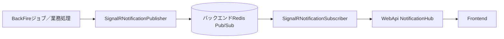

# バックグラウンド処理と連携

> 本ページでは、サービス登録と主要な連携経路を説明します。外部サービスの秘密値や実際の接続先は記載しません。

## Hangfire

WebApiはHangfireジョブを登録し、Redisストレージへ投入します。BackFireは同じストレージを参照するHangfire Serverとしてワーカーを起動し、`pecus.Libs`にあるDI対応タスクを実行します。

- [WebApiのHangfire登録](../../pecus.WebApi/Program.cs)
- [BackFireのタスク・サーバー登録](../../pecus.BackFire/Program.cs)
- [共有Hangfireタスク](../../pecus.Libs/Hangfire/Tasks/)

BackFireでは起動時に複数のRecurring Job Schedulerを登録します。現在登録されているジョブ名、実行間隔、タイムゾーン等は[`pecus.BackFire/Program.cs`](../../pecus.BackFire/Program.cs)と個別Schedulerの実装で確認してください。ここでは、全ジョブの完全な一覧を再掲しません。

## SignalR通知

WebApiは`NotificationHub`を公開し、SignalRのRedis backplaneを登録します。通知発行とHubへの転送にはRedis Pub/Subを使う構成です。BackFire側には通知Publisher、WebApi側にはSubscriberの登録があります。

Publisher／Subscriberの経路とSignalR backplaneは別の役割です。RedisがWebApiのHub接続のバックプレーンとしても使われることと、Redis Pub/Sub経由の通知転送を混同しないでください。

- [NotificationHub](../../pecus.WebApi/Hubs/NotificationHub.cs)
- [WebApiでのHub／Subscriber登録](../../pecus.WebApi/Program.cs)
- [BackFireでのPublisher登録](../../pecus.BackFire/Program.cs)
- [共有通知実装](../../pecus.Libs/Notifications/)

## AI連携

WebApiとBackFireの起動コードは、構成に応じて複数のAIプロバイダー用クライアントと`IAiClientFactory`を登録します。組織設定に基づく利用やBotの動作など、呼び出し側の機能により経路は異なります。

- [WebApiのAI登録](../../pecus.WebApi/Program.cs)
- [BackFireのAI登録](../../pecus.BackFire/Program.cs)
- [AIクライアント実装](../../pecus.Libs/AI/)
- [AIツール実装](../../pecus.Libs/AI/Tools/)

APIキーやモデル設定値はドキュメントに掲載しません。利用プロバイダーや組織設定の具体的な振る舞いは、該当クライアント・ファクトリーと呼び出し元の実装を根拠に説明してください。

## メール

メール送信サービス、テンプレートサービス、通知フィルターは共有ライブラリに実装され、WebApi／BackFireからDI登録されます。テンプレート用モデルやジョブは`pecus.Libs/Mail/`および`pecus.Libs/Hangfire/Tasks/`を参照してください。SMTPホスト、ユーザー名、パスワード、送信元等の実値は掲載しません。

- [WebApiでのメールサービス登録](../../pecus.WebApi/Program.cs)
- [BackFireでのメールサービス登録](../../pecus.BackFire/Program.cs)
- [メール実装](../../pecus.Libs/Mail/)

## Lexical Converter（gRPC）

`pecus.LexicalConverter`はLexical JSONとHTML／Markdown／プレーンテキスト間の変換を提供します。共有Proto契約には`ToHtml`、`ToMarkdown`、`ToPlainText`、`FromMarkdown`が定義されています。C#側は`ILexicalConverterService`を通じてgRPCクライアントを利用します。

- [共有Proto契約](../../pecus.Protos/lexical/lexical.proto)
- [C#変換サービス契約](../../pecus.Libs/Lexical/ILexicalConverterService.cs)
- [C# gRPCクライアント](../../pecus.Libs/Lexical/LexicalConverterService.cs)
- [Node.js gRPCコントローラー](../../pecus.LexicalConverter/src/lexical/lexical.controller.ts)
- [Node.jsサービス起動処理](../../pecus.LexicalConverter/src/main.ts)

C#側はgRPCメタデータで認証情報を渡す実装ですが、キー名・値・接続先の具体値はこのページには掲載しません。

## 関連ページ

- [システム構成](./architecture.md)
- [バックエンドとデータ](./backend-and-data.md)
- [Lexical gRPC設計資料](../spec/lexical-grpc-service.md) — 設計経緯の参照。現状はリンク先コードで確認

最終確認日: 2026-10-03
