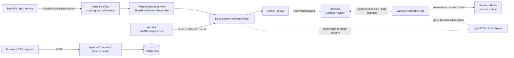

# チャット・アジェンダ・リアルタイム通知

> 本ページは、2026-10-04時点の現行コードを確認して記述しています。最終確認日: **2026-10-04**。

## 概要

Coatiでは、チャットメッセージやアジェンダなど後から取得する業務データをDBに保存し、画面を開いているクライアントへの即時通知にはSignalRを使います。SignalRの接続・グループ・プレゼンスは保存データそのものではありません。また、WebApi内からHubへ直接送る通知と、BackFireからRedis Pub/Subを経由する通知は別の経路です。

## 1. チャットのドメイン境界

`ChatRoom`はDM、グループ、AI、システム通知を同じモデルで扱います。組織と、必要に応じたワークスペースを持ち、メンバーとメッセージを束ねます。`ChatRoomMember`はルームと`ChatActor`を結ぶ参加レコードで、ルーム内ロール、参加日時、最終既読日時、通知設定を持ちます。[ChatRoom](../../pecus.Libs/DB/Models/ChatRoom.cs) · [ChatRoomMember](../../pecus.Libs/DB/Models/ChatRoomMember.cs)

`ChatActor`はユーザーとBotをチャット共通の参加者として表現します。Actor種別に応じて`UserId`または`BotId`を参照し、表示名・アバター情報も保持します。`ChatMessage`は送信者Actorを参照しますが、システムメッセージでは送信者をnullにできます。本文、種別、返信先、メンションを持ちます。メンションはメッセージと対象Actorを結ぶ`ChatMessageMention`として表現されます。[ChatActor](../../pecus.Libs/DB/Models/ChatActor.cs) · [ChatMessage](../../pecus.Libs/DB/Models/ChatMessage.cs) · [ChatMessageMention](../../pecus.Libs/DB/Models/ChatMessageMention.cs) · [ApplicationDbContext](../../pecus.Libs/DB/ApplicationDbContext.cs)

HTTP APIは`ChatController`からルーム一覧・詳細、DMやグループ等のルーム取得、メッセージ取得・送信、既読・入力中状態を扱います。メッセージ取得と送信ではルームメンバーを確認します。送信処理は`ChatMessageService.SendMessageAsync`でメッセージを保存し、本文からメンション対象を抽出してレコード化した後、通知処理を呼び出します。[ChatController](../../pecus.WebApi/Controllers/ChatController.cs) · [ChatMessageService](../../pecus.WebApi/Services/ChatMessageService.cs)

## 2. アジェンダと繰返しOccurrence

`Agenda`はシリーズの基本情報を保存します。繰返し種別・間隔・月内週番号・終了日または回数、参加者、出欠回答、例外はそれぞれモデル上で分かれています。`AgendaException`はシリーズのOccurrence index（0始まり）をキーに、特定回の中止や日時・タイトル等の変更を保持します。出欠回答のOccurrence indexがnullならシリーズ全体、値があれば特定回への回答です。[Agenda](../../pecus.Libs/DB/Models/Agenda.cs) · [AgendaException](../../pecus.Libs/DB/Models/AgendaException.cs) · [AgendaAttendee](../../pecus.Libs/DB/Models/AgendaAttendee.cs) · [AgendaAttendanceResponse](../../pecus.Libs/DB/Models/AgendaAttendanceResponse.cs)

`AgendasController`は組織アクセスを確認して`AgendaService`へ委譲します。期間指定の`GET /api/agendas/occurrences`では、参加者であるアジェンダを取得し、`RecurrenceHelper.ExpandOccurrencesWithIndex`で期間内の回を展開します。その後、回のindexに一致する例外を適用し、シリーズ全体／特定回の出欠回答を統合してOccurrence応答を作ります。`GET /api/agendas/occurrences/recent`は直近3か月分を対象にし、カーソルでページングします。[AgendasController](../../pecus.WebApi/Controllers/AgendasController.cs) · [AgendaService](../../pecus.WebApi/Services/AgendaService.cs) · [RecurrenceHelper](../../pecus.Libs/RecurrenceHelper.cs)

主な経路は次のとおりです。

- 期間一覧: `GET /api/agendas?startAt=…&endAt=…`、展開済み一覧: `GET /api/agendas/occurrences?startAt=…&endAt=…`
- 作成: `POST /api/agendas`。シリーズ全体の更新: `PUT /api/agendas/{id}`。
- 特定回以降の更新: `PUT /api/agendas/{id}/from`。指定回からシリーズを分割し、新シリーズを作成します。
- 特定回の例外: `GET/POST /api/agendas/{id}/exceptions`、`PUT/DELETE /api/agendas/{id}/exceptions/{exceptionId}`。
- 出欠更新はシリーズ全体またはOccurrence index単位のPATCH/DELETE APIがあります。

この経路はHTTP要求に対するデータ取得・更新です。確認したアジェンダController／ServiceとHubには、アジェンダ変更をSignalRイベントへ発行する呼び出しは見当たりません。従って、ここではアジェンダの更新がリアルタイム通知されるとは扱いません。

## 3. SignalR接続、認証、グループ

WebApiは`/hubs/notifications`に`NotificationHub`を公開します。Hubには`[Authorize]`が付き、JWT Bearer設定は`/hubs`配下の接続では`access_token`クエリ値も認証トークンとして読み取ります。接続時にclaimsからユーザー・組織IDを読み、組織グループと個人向け`user:{id}`グループへ接続を加えます。[WebApi Program](../../pecus.WebApi/Program.cs) · [NotificationHub](../../pecus.WebApi/Hubs/NotificationHub.cs)

ページ単位の参加はHub methodから行います。`JoinWorkspace`／`JoinItem`／`JoinTask`は有効なワークスペースメンバーかを確認し、ページ切替に応じて既存グループから離脱して新しいグループへ参加します。アイテム・タスク参加では関連するワークスペース等にも参加します。`JoinChat`はDB上の`ChatRoomMember`を検証して`chat:{roomId}`へ追加し、ルームを開いた接続だけがチャット本文イベントを受け取る設計です。切断時はSignalRがグループから接続を除去し、Hubはプレゼンス情報を掃除します。[NotificationHub](../../pecus.WebApi/Hubs/NotificationHub.cs)

Frontendの`SignalRProvider`はServer ActionからHub URLとアクセストークンを取得し、SignalR接続を開始します。`ReceiveNotification`を受けて登録済みhandlerへ渡します。自動再接続後、組織グループはサーバー側で再参加しますが、Providerのコメントではworkspace/item/task再参加を画面側の責務としています。[SignalR Server Actions](../../pecus.Frontend/src/actions/signalr.ts) · [SignalRProvider](../../pecus.Frontend/src/providers/SignalRProvider.tsx)

## 4. プレゼンスのRedis管理

`SignalRPresenceService`はバックエンドRedisに接続IDとユーザーID、接続中の組織・ワークスペース・アイテム・タスクの対応、および編集者情報を保存します。参加者一覧の取得時にはRedisから接続を集め、必要なユーザー表示情報をDBから引きます。正常な切断処理は関連状態を削除し、接続異常終了後の掃除向けにTTLも設定されています。これはオンライン接続・編集中状態の管理であり、ルームメンバーやメッセージ等の業務データの代替ではありません。[SignalRPresenceService](../../pecus.WebApi/Services/SignalRPresenceService.cs) · [NotificationHub](../../pecus.WebApi/Hubs/NotificationHub.cs)

このRedisはWebApiとBackFireが参照するバックエンド側です。Aspire構成ではFrontendに別リソース`redisFrontend`を参照させています。Frontendの共通セッション用Redisはこのプレゼンス／通知経路には含まれず、そのセッション処理は[Frontend共通リクエスト・セッションの解説](frontend-request-flow.md)の担当範囲です。[AppHost](../../pecus.AppHost/AppHost.cs) · [SignalR Server Actions](../../pecus.Frontend/src/actions/signalr.ts)

## 5. BackFireからFrontendへの通知経路

BackFireには`SignalRNotificationPublisher`がDI登録されています。Publisherは通知をJSON化し、`coati:signalr:notifications`へPublishします。WebApiは`SignalRNotificationSubscriber`をHosted Serviceとして登録し、同じチャンネルを購読します。Subscriberは通知のグループ名・イベント種別・payloadを読み、`IHubContext<NotificationHub>.Clients.Group(...).SendAsync("ReceiveNotification", ...)`で転送します。ChatBot由来通知は組織IDが必要で、組織設定の生成AIベンダーが無効なら転送を見送ります。[BackFire Program](../../pecus.BackFire/Program.cs) · [SignalRNotificationPublisher](../../pecus.Libs/Notifications/SignalRNotificationPublisher.cs) · [SignalRNotificationSubscriber](../../pecus.WebApi/Services/SignalRNotificationSubscriber.cs) · [WebApi Program](../../pecus.WebApi/Program.cs)

WebApi内で保存されたチャットメッセージ通知はこのPub/Sub経由ではありません。`ChatMessageService`はメッセージ受信・未読更新をHubContextから直接グループ送信し、メンションは個人の`user:{id}`グループへ直接通知します。メンション対象がBotならレコードには含まれ得ますが、このリアルタイムメンション通知の宛先は人ユーザーに限られます。通知メールは別にメールジョブへ投入されます。[ChatMessageService](../../pecus.WebApi/Services/ChatMessageService.cs) · [NotificationHub](../../pecus.WebApi/Hubs/NotificationHub.cs)

WebApiはSignalR自体にもRedis backplaneを構成しています。これはHub groupの接続・送信をインスタンス間で共有するための仕組みで、BackFire通知のアプリケーションPub/Sub channelとは役割が異なります。どちらもバックエンドの`redis`リソースを使いますが、Frontendの`redisFrontend`とは別です。[WebApi Program](../../pecus.WebApi/Program.cs) · [AppHost](../../pecus.AppHost/AppHost.cs)

## 6. 永続データと接続中イベントの境界

| 種別 | 例 | 主な保持先・役割 |
|---|---|---|
| 業務データ | チャットルーム、メンバー、メッセージ、メンション | PostgreSQLのEntityとして保存。REST APIから取得できる。 |
| 業務データ | アジェンダシリーズ、参加者、出欠回答、特定回例外 | PostgreSQLに保存。Occurrenceは保存済みシリーズと例外から読み出し時に展開される。 |
| 接続状態 | SignalR接続、Hub group参加、presence／編集者状態 | HubとバックエンドRedisで接続中クライアント向けに管理される。 |
| 通知イベント | チャット本文更新、メンション、BackFireからのBot等の通知 | SignalR経由の配信。イベントの配信自体を業務データ保存と同一視しない。 |

BackFireのPub/Sub処理には、通知イベントを永続化するoutboxや受信後の再送確認は見当たりません。したがって、通知配信の永続性・再送・全クライアント到達は、この経路の実装から保証できるとは断定しません。チャット本文の正本はDB上のメッセージであり、接続中イベントはその更新を画面へ知らせる別レイヤーです。

## 主なコード実体

- チャットHTTP APIとレスポンス整形: [ChatController](../../pecus.WebApi/Controllers/ChatController.cs)
- チャット保存・メンション抽出・直接通知: [ChatMessageService](../../pecus.WebApi/Services/ChatMessageService.cs)
- アジェンダAPI: [AgendasController](../../pecus.WebApi/Controllers/AgendasController.cs)、[AgendaService](../../pecus.WebApi/Services/AgendaService.cs)
- 繰り返し展開: [RecurrenceHelper](../../pecus.Libs/RecurrenceHelper.cs)
- 認証済みHub、グループ管理: [NotificationHub](../../pecus.WebApi/Hubs/NotificationHub.cs)
- Redisプレゼンス: [SignalRPresenceService](../../pecus.WebApi/Services/SignalRPresenceService.cs)
- BackFireからのPublish: [SignalRNotificationPublisher](../../pecus.Libs/Notifications/SignalRNotificationPublisher.cs)
- WebApi側のSubscribe／HubContext転送: [SignalRNotificationSubscriber](../../pecus.WebApi/Services/SignalRNotificationSubscriber.cs)
- SignalR／Hosted Service／JWT／Hub登録: [WebApi Program](../../pecus.WebApi/Program.cs)
- ブラウザー接続: [signalr actions](../../pecus.Frontend/src/actions/signalr.ts)、[SignalRProvider](../../pecus.Frontend/src/providers/SignalRProvider.tsx)

## 関連ページ

- [Frontendリクエストフロー](frontend-request-flow.md)（Frontend共通セッションはこのページでは扱わない）
- [WebApi契約とセキュリティ](webapi-contracts-security.md)
- [データモデルのライフサイクル](data-model-lifecycle.md)
- [AI連携とバックグラウンドジョブ](ai-background-jobs.md)（Bot推論・定期Jobの詳細）
- [Observability](observability.md)
