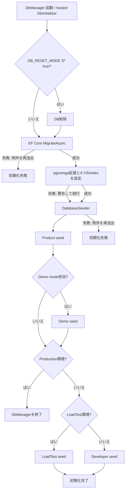

# 永続化モデルとデータベース初期化

## 概要

Coatiの永続化モデルは、`pecus.Libs` の `ApplicationDbContext` がEF Coreのエンティティ、リレーション、通常のインデックス、PostgreSQLの `xmin` との対応を定義し、`pecus.DbManager` が起動時のmigration・検索拡張設定・seedを担当する構成です。[ApplicationDbContext](../../pecus.Libs/DB/ApplicationDbContext.cs) [DbManager Program](../../pecus.DbManager/Program.cs) [DbInitializer](../../pecus.DbManager/DbInitializer.cs)

本ページは初回作成です。`OUTLINE.md` は執筆計画として扱い、以下の説明は2026-10-04時点で確認した実装に基づきます。永続モデルの全列挙や個別画面の操作手順、本番volumeの配置は扱いません。

## DbContextと代表的なモデル群

`ApplicationDbContext` は認証・ユーザー設定、組織と権限、ワークスペースとコンテンツ、チャット、通知・アジェンダなどを `DbSet` として公開します。スキーマ上の関係と削除動作・インデックスは主に `OnModelCreating` で定義されます。[ApplicationDbContext](../../pecus.Libs/DB/ApplicationDbContext.cs)

代表的な関係は次のとおりです。

- **ユーザーと組織:** `User.OrganizationId` はnullableで、ユーザーは任意の `Organization` に属します。組織にはユーザーとワークスペースのコレクションがあり、ユーザー設定は1対1、ユーザーとロールは中間テーブルによる多対多です。[User](../../pecus.Libs/DB/Models/User.cs) [Organization](../../pecus.Libs/DB/Models/Organization.cs) [ApplicationDbContext](../../pecus.Libs/DB/ApplicationDbContext.cs)
- **ワークスペースとコンテンツ:** `Workspace` は組織に属し、オーナーとジャンルを参照します。ユーザーとの参加関係は `WorkspaceUser`、アイテムは `WorkspaceItem` が保持します。アイテムには所有者・担当者等のユーザー参照、タグ・PIN・添付・アイテム間relationがあり、本文検索用の `WorkspaceItemSearchIndex` がアイテムと1対1で結び付きます。[Workspace](../../pecus.Libs/DB/Models/Workspace.cs) [WorkspaceItem](../../pecus.Libs/DB/Models/WorkspaceItem.cs) [ApplicationDbContext](../../pecus.Libs/DB/ApplicationDbContext.cs)
- **タスク:** `WorkspaceTask` はアイテムに加えてワークスペース・組織・担当者・作成者・タスク種別を参照し、コメントと添付を持ちます。先行タスクは単一FKではなくPostgreSQLの整数配列として表現され、自己参照を防ぐ制約とGIN indexがモデルに定義されています。[WorkspaceTask](../../pecus.Libs/DB/Models/WorkspaceTask.cs) [ApplicationDbContext](../../pecus.Libs/DB/ApplicationDbContext.cs) [先行タスク配列へのmigration](../../pecus.DbManager/Migrations/20260130010745_ConvertPredecessorTaskIdToArray.cs)
- **チャット:** `ChatRoom` は組織に属し、必要に応じてワークスペースを参照します。参加者は `ChatRoomMember` を介してユーザーまたはBotを表す `ChatActor` に結び付き、メッセージはルーム・送信者アクター・任意の返信先を参照します。[ChatRoom](../../pecus.Libs/DB/Models/ChatRoom.cs) [ChatMessage](../../pecus.Libs/DB/Models/ChatMessage.cs) [ApplicationDbContext](../../pecus.Libs/DB/ApplicationDbContext.cs)
- **アジェンダ:** `Agenda` は組織・作成者等を参照し、参加者、出欠回答、繰り返し予定の特定回に対する例外を別エンティティとして持ちます。通知・リマインダー記録も関連データとして登録されています。[Agenda](../../pecus.Libs/DB/Models/Agenda.cs) [ApplicationDbContext](../../pecus.Libs/DB/ApplicationDbContext.cs)

## RowVersionとPostgreSQL `xmin`

モデルの `RowVersion` はC#上では `uint` です。`ApplicationDbContext` は対象エンティティのプロパティに `IsRowVersion()` を設定し、NpgsqlのEFモデルsnapshotでは生成・更新される同時実行トークンとしてPostgreSQLのシステム列 `xmin` にマップされています。[ApplicationDbContext](../../pecus.Libs/DB/ApplicationDbContext.cs) [Model snapshot](../../pecus.DbManager/Migrations/ApplicationDbContextModelSnapshot.cs) [初期migration](../../pecus.DbManager/Migrations/20260124055243_InitialCreate.cs)

この設定は「DbSetにある全型」に一律適用されるものではありません。例えば `WorkspaceItemSearchIndex` や `ChatMessage` には `RowVersion` がなく、共通設定メソッドにも登録されていません。[ApplicationDbContext](../../pecus.Libs/DB/ApplicationDbContext.cs) [WorkspaceItemSearchIndex](../../pecus.Libs/DB/Models/WorkspaceItemSearchIndex.cs) [ChatMessage](../../pecus.Libs/DB/Models/ChatMessage.cs)

`xmin` による永続化上の競合検出と、Web APIが競合をHTTP応答へ変換する契約は別の層です。HTTP側の契約は[Web APIの契約・認証・エラー境界](./webapi-contracts-security.md)を参照してください。

## DbManagerの初期化フロー

`DbManager Program` は `ApplicationDbContext` をNpgsqlで登録し、migration assemblyを `pecus.DbManager` に指定します。`DbInitializer` は `BackgroundService` としてhosted service登録され、アプリケーション開始時にDBとSeederを取得して初期化を実行します。[DbManager Program](../../pecus.DbManager/Program.cs) [DbInitializer](../../pecus.DbManager/DbInitializer.cs)

図の順序は `DbInitializer.ExecuteAsync` と `InitializeDatabaseAsync` の実装に基づきます。設定された `DB_RESET_MODE` がtrueの場合だけ `EnsureDeletedAsync` がmigrationより先に実行されます。migrationまたはseedの例外は再送出され、pgroongaの拡張／index設定例外は警告ログの後にseedへ進みます。Productionではseed処理の後に `StopApplication` を呼び、DB初期化用プロセスを終了します。[DbInitializer](../../pecus.DbManager/DbInitializer.cs)

開発時のAppHostではDbManagerがPostgreSQLとLexicalConverterを参照して両方に `WaitFor` 依存を設定し、Web APIにもDbManagerへの `WaitFor` 依存を設定しています。ここでは依存関係の登録のみを述べ、DbManagerの終了待ちとは解釈しません。これはAppHostの開発時構成です。本番Composeの起動・volume配置・migration運用は[配布・デプロイ・復旧運用](./deployment-operations.md)の対象です。[AppHost](../../pecus.AppHost/AppHost.cs)

## Migrationとモデルsnapshot

初期スキーマは `20260124055243_InitialCreate` migrationで作成され、その後は個別migrationで変更が積み重なっています。例えば先行タスク表現は、当初の単一 `PredecessorTaskId` から整数配列へ移行しています。従って初期migrationだけで現在のスキーマを説明せず、現在のEFモデルを表すsnapshotと後続migrationを併読します。[初期migration](../../pecus.DbManager/Migrations/20260124055243_InitialCreate.cs) [先行タスク配列へのmigration](../../pecus.DbManager/Migrations/20260130010745_ConvertPredecessorTaskIdToArray.cs) [Model snapshot](../../pecus.DbManager/Migrations/ApplicationDbContextModelSnapshot.cs)

## pgroonga検索

`DbInitializer` はmigration後に `CREATE EXTENSION IF NOT EXISTS pgroonga` を実行し、ユーザー名・メールアドレス、`WorkspaceItemSearchIndices.FullText`、スキル名、タスク内容を対象とする4つのpgroonga indexを作成します。[DbInitializer](../../pecus.DbManager/DbInitializer.cs)

検索側の代表経路は以下です。

- ワークスペースアイテム検索では、Lexical本文からプレーンテキストを抽出し、件名・コード・有効タグ名と結合した `FullText` を検索indexテーブルに更新します。検索サービスはpgroongaの `&@~` とスコアを使って候補を並べます。[WorkspaceItemTasks](../../pecus.Libs/Hangfire/Tasks/WorkspaceItemTasks.cs) [WorkspaceItemSearchIndex](../../pecus.Libs/DB/Models/WorkspaceItemSearchIndex.cs) [WorkspaceItemService](../../pecus.WebApi/Services/WorkspaceItemService.cs)
- ユーザー検索はユーザー名・メールアドレスと関連スキル名をpgroonga演算子で検索します。[UserService](../../pecus.WebApi/Services/UserService.cs)
- AI向け情報検索もワークスペース内アイテムとタグをpgroongaで検索し、タスク担当者推薦は完了済みタスク内容を候補検索に使います。[InformationSearchProvider](../../pecus.Libs/Information/InformationSearchProvider.cs) [TaskAssignmentSuggester](../../pecus.Libs/Hangfire/Tasks/Services/TaskAssignmentSuggester.cs)

pgroongaのセットアップ失敗はDbManagerでは致命扱いにせず、ログ上はあいまい検索をILIKEへfallbackすると説明しています。ただし、今回確認したアイテム検索とユーザー検索の実装はpgroonga演算子を使うSQLを直接実行しており、全経路が実際にILIKEへ切り替わることは確認できませんでした。一方、タスク担当者推薦にはpgroonga検索例外時または候補不足時の通常クエリ経路があります。したがって、fallbackの保証範囲は検索経路ごとにコードで確認する必要があります。[DbInitializer](../../pecus.DbManager/DbInitializer.cs) [WorkspaceItemService](../../pecus.WebApi/Services/WorkspaceItemService.cs) [UserService](../../pecus.WebApi/Services/UserService.cs) [TaskAssignmentSuggester](../../pecus.Libs/Hangfire/Tasks/Services/TaskAssignmentSuggester.cs)

## Seederと環境分岐

`DatabaseSeeder` はまずProduct用の基礎seedを実行し、Demo modeが有効ならデモseedを追加します。その後、環境名が `Production` なら開発用seedをスキップして終了し、`LoadTest` なら負荷テスト用、その他の非Production環境では開発用seedを選びます。設定値やseedの実データは本ページに含めません。[DatabaseSeeder](../../pecus.Libs/DB/Seed/DatabaseSeeder.cs) [DbManager Program](../../pecus.DbManager/Program.cs)

## DBとファイルストレージの境界

アップロードファイル本体はPostgreSQLの行ではなく、ファイルシステムへ保存されます。添付のDBレコードはファイル名・MIME type・パス・download URL・アイテム／任意のタスクとの関連などのメタデータを保持し、Web APIはアップロード時に実ファイルを書き出してから添付サービスへレコードを登録します。[WorkspaceItemAttachment](../../pecus.Libs/DB/Models/WorkspaceItemAttachment.cs) [WorkspaceItemAttachmentController](../../pecus.WebApi/Controllers/WorkspaceItemAttachmentController.cs) [FileUploadService](../../pecus.WebApi/Services/FileUploadService.cs)

開発時のAppHostはフォルダー設定からDataPathsを組み立て、DbManager・Web API・BackFireへ環境変数として注入します。Web APIは `DataPaths:Uploads` をファイルアップロードの保存先に設定し、Seederのデモ処理も同じUploadsパスを参照します。ここでは設定ファイルの中身や保存先の実値は扱わず、本番volume・バックアップ上の配置は[配布・デプロイ・復旧運用](./deployment-operations.md)に分けます。[AppHost](../../pecus.AppHost/AppHost.cs) [WebApi Program](../../pecus.WebApi/Program.cs) [DemoAtoms](../../pecus.Libs/DB/Seed/Atoms/DemoAtoms.cs)

## 関連ページ

- [実行時システムの境界と起動トポロジー](./system-topology.md) — 開発時のサービス構成・依存関係
- [Web APIの契約・認証・エラー境界](./webapi-contracts-security.md) — `xmin`競合のHTTP契約
- [ワークスペース・アイテム・タスクの業務フロー](./workspace-workflows.md) — モデルを使う業務経路
- [チャット・アジェンダ・リアルタイム通知](./collaboration-realtime.md) — チャットとアジェンダの機能経路
- [配布・デプロイ・復旧運用](./deployment-operations.md) — 本番migrationとvolume・復旧運用

---

最終確認日: 2026-10-04
