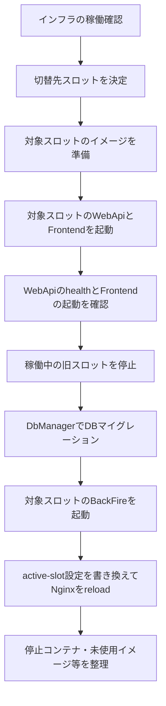

# 配置と運用

> このページはリポジトリにある配置定義・運用スクリプトの関係を示します。実環境の値や資格情報、実行時の正常性は扱いません。

## 開発とCompose環境

- 開発時の分散サービス構成は[`pecus.AppHost/AppHost.cs`](../../pecus.AppHost/AppHost.cs)に定義されています。
- Composeによる配置環境は`deploy/docker-compose.*.yml`群で管理され、インフラ、アプリケーションスロット、マイグレーション、バックアップ、監視などの定義に分かれています。
- アプリケーション用ComposeはBlue／Greenのスロット別ファイルを持ち、インフラ構成とは別に管理されています。
- インフラComposeはPostgreSQL、用途別の2つのRedis、LexicalConverter、内部Nginxを定義します。各アプリスロットのComposeはWebApi、Frontend、BackFireを定義し、共通のDockerネットワーク上でインフラへ接続します。

代表的な定義：

- [インフラ](../../deploy/docker-compose.infra.yml)
- [Blueアプリ](../../deploy/docker-compose.app-blue.yml)／[Greenアプリ](../../deploy/docker-compose.app-green.yml)
- [内部Nginxの振り分け設定](../../deploy/nginx/conf.d/10-coati.conf)
- [マイグレーション](../../deploy/docker-compose.migrate.yml)
- [バックアップ](../../deploy/docker-compose.backup.yml)／[リストア支援](../../deploy/docker-compose.restore-helper.yml)
- [監視](../../deploy/docker-compose.monitoring.yml)

## Blue／Green運用

運用スクリプトは`deploy/ops/`にあり、スロットの切替、インフラ確認、バックアップ、リストア、監視等を行います。ビルドPC／デプロイPCを分ける構成も`deploy/build-pc/`と`deploy/deploy-pc/`にあります。

- [Blue/Greenと運用スクリプトの概要](../../deploy/DEPLOY_OVERVIEW.md)
- [運用ライブラリ](../../deploy/ops/lib.sh)
- [スロット切替スクリプト](../../deploy/ops/switch-node.sh)
- [ビルドPC側のイメージ作成](../../deploy/build-pc/build-and-push.sh)
- [デプロイPC側のイメージ取得・切替](../../deploy/deploy-pc/pull-and-deploy.sh)
- [ビルドPC構成](../../deploy/build-pc/)
- [デプロイPC構成](../../deploy/deploy-pc/)

ビルドPC分離構成では、[`build-and-push.sh`](../../deploy/build-pc/build-and-push.sh)がコンテナイメージをビルドしてレジストリへ送り、[`pull-and-deploy.sh`](../../deploy/deploy-pc/pull-and-deploy.sh)がデプロイPCでイメージを取得して`switch-node.sh`をビルド省略モードで呼び出します。設定ファイルもデプロイPC側で取得・生成する実装です。接続情報や設定値は掲載しません。

### スロット切替の実装フロー

[`switch-node.sh`](../../deploy/ops/switch-node.sh)の処理順は次のとおりです。初期状態やオプションにより一部の工程は省略されます。

この順序はスクリプト上の処理順を示すもので、デプロイの成功や無停止性を保証する説明ではありません。Nginxはactive-slot設定に応じてFrontendとWebApiの転送先を選びます。Compose定義ではBackFireをスロットごとに持ち、切替スクリプトは対象スロットのBackFireをDBマイグレーション後に起動します。

この解説は運用手順の代わりではありません。実際の操作前に、対象スクリプトと環境向け手順を確認してください。破壊的操作や本番操作のコマンドはここでは再掲しません。

## 設定ファイルの生成

Compose用環境ファイルを含む設定生成の責務は[`scripts/generate-appsettings.js`](../../scripts/generate-appsettings.js)にあります。生成済み`.env`やサービスごとの`appsettings.json`には秘密値が含まれる可能性があるため、この資料では値を読まず、掲載もしません。

詳細は[開発構成と設定](./development-and-configuration.md)と[設定管理ガイド](../config-management.md)を参照してください。

## 監視とデータ保護

リポジトリにはPrometheus関連のCompose定義と運用設定、PostgreSQLバックアップ／リストア用の定義・スクリプトがあります。監視対象、保持期間、バックアップ方式などの正確な挙動は、それぞれの現行YAML・スクリプトを確認してください。

- [監視Compose](../../deploy/docker-compose.monitoring.yml)
- [Prometheus運用設定](../../deploy/ops/prometheus/)
- [バックアップ／リストアスクリプト](../../deploy/ops/)

このページは設定値や稼働状態を推定しません。運用可否の判断には対象環境の状態確認が別途必要です。

## 関連ページ

- [システム構成](./architecture.md)
- [開発構成と設定](./development-and-configuration.md)
- [Deploy概要](../../deploy/DEPLOY_OVERVIEW.md)

最終確認日: 2026-10-03
