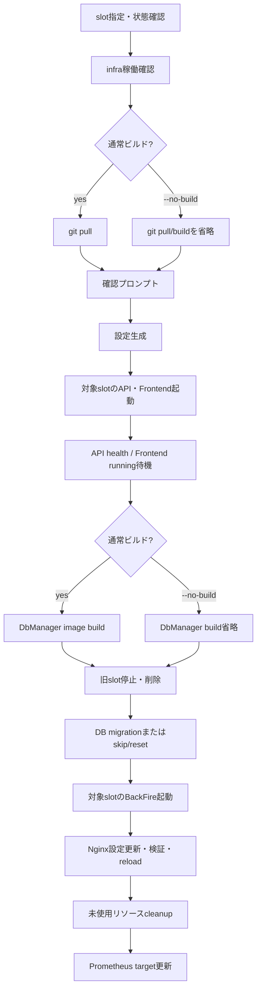
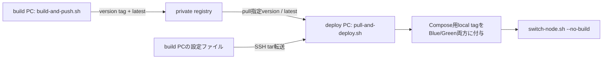

# 配布・デプロイ・復旧運用

> 本ページは、2026-10-04時点の現行Compose定義と運用スクリプトを確認して記述しています。最終確認日: **2026-10-04**。

## 概要

本番・検証向けの配布経路は、Composeを基盤（infra）、Blue/Greenのアプリslot、単発migration job、backup／restore helper、monitoringに分割し、`deploy/ops/` のスクリプトで操作順を制御します。ビルドPCとデプロイPCを分ける場合は、ビルドPCがイメージをregistryへpushし、デプロイPCがpullしてローカルCompose用のタグを付けた後、同じslot切替スクリプトを `--no-build` で利用します。

ここでは本番の配布・切替・復旧操作を扱います。開発用AppHostとの構成差は[システム構成](system-topology.md)、metricsの収集モデルは観測性の解説ページを参照してください。Compose構成は[deploy overview](../../deploy/DEPLOY_OVERVIEW.md)も参照。

## 本番Composeの分割

| Compose | 役割 | 主な境界 |
| --- | --- | --- |
| [infra](../../deploy/docker-compose.infra.yml) | PostgreSQL、バックエンド用Redis、Frontend用Redis、LexicalConverter、内部Nginx | PostgreSQL／Redisはホスト上のデータ領域を利用。Blue/Greenの上流切替はNginxの設定で行う。 |
| [app-blue](../../deploy/docker-compose.app-blue.yml)、[app-green](../../deploy/docker-compose.app-green.yml) | slotごとのWeb API、Frontend、BackFire | 両slotは同じ外部ネットワークを使う。`depends_on` はなく、起動と順序は運用スクリプト側で制御。BackFireの二重起動を避けるようComposeにも注記がある。 |
| [migrate](../../deploy/docker-compose.migrate.yml) | 一回限りのDbManager実行（DB migration／seed） | infra Composeと重ねて実行。PostgreSQLとLexicalConverterのhealthcheck成功後にDbManagerを開始する。 |
| [backup](../../deploy/docker-compose.backup.yml) | PostgreSQL `pg_dump` helper | 出力はホスト側のPostgreSQLバックアップ領域。成功後、保持日数より古い同DB名のdumpを削除する。 |
| [restore-helper](../../deploy/docker-compose.restore-helper.yml) | PostgreSQL復元用として定義されたhelper | 現状のCompose定義と呼び出しスクリプトに不整合があり、後述の通り、実際に復元可能な手順とは確認できない。 |
| [monitoring](../../deploy/docker-compose.monitoring.yml) | Prometheus、Node Exporter、Blackbox Exporter | アプリと別Composeで起動・停止する。メトリクスの詳細は観測性の解説ページへ。 |

## Blue/Green切替のsequence

`switch-node.sh` は要求されたslotが起動済みなら停止し、infraの起動状態を確認してから切替を進めます。infra確認の対象はPostgreSQL、両Redis、LexicalConverterです。Nginxはこの事前health確認の対象ではありません。active slot設定ファイルがなければ `lib.sh` がBlueを初期値として作成します。

**図の根拠:** [切替本体](../../deploy/ops/switch-node.sh)、[共有関数](../../deploy/ops/lib.sh)、[slot Compose](../../deploy/docker-compose.app-blue.yml)。

この図の細部と重要な順序は次の通りです。

1. `blue` または `green` を指定し、対象slotが既に動作中ならエラー終了します。infraの稼働確認後、通常経路では `git pull` を行い、`--no-build` ならそのpullとbuildを省略します。どちらも続行確認の入力を要求し、その後に本番設定を生成します。
2. 通常経路は対象slotのAPI／Frontend／BackFireイメージをbuildします。APIとFrontendを起動し、APIはhealthcheckを最大300秒待ち、Frontendはコンテナがrunningになるのを最大120秒待ちます。FrontendのHTTP応答healthをここでは検証しません。
3. 通常経路ではDbManager imageも事前buildします。続いて、切替前に動作していた旧slotのAPI／Frontend／BackFireを停止して削除します。停止エラーは無視する実装です。
4. migrationは旧slot停止後に実行します。成功後、対象slotのBackFireを起動してrunningを最大120秒待ちます。
5. active slotを示すNginx設定を書き換え、`nginx -t` が成功した後にreloadします。切替成功後は停止中の `pecus-*` コンテナ、未使用 `coati-*` image（`snapshot-latest`を除く）、dangling image、builder cacheを削除し、Prometheus targetを更新します。

スクリプトは途中失敗時に自動で旧slot／Nginx設定を復元するrollback処理を定義していません。特に旧slot停止後、migrationやNginx reloadに失敗したときの復旧判断は運用側に残ります。

### オプションと破壊的経路

- `--no-build` は `switch-node.sh` 自身の `git pull`、アプリimage build、DbManager image buildを省き、既存imageを使います。各Compose起動にも `--no-build` を渡します。registryからのpullを行うオプションではありません。
- `--skip-migration` はDbManager実行を飛ばします。DB resetも行いません。
- `--db-reset` はmigration jobにreset modeを渡す経路です。さらにswitch scriptはホスト上のuploads領域の中身を削除してからDbManagerを実行します。全データを失う危険のある操作です。
- `--skip-migration` と `--db-reset` を同時に指定すると、分岐順によりmigration/reset jobは実行されません（uploads削除もこの分岐では行いません）。
- 通常の切替には明示確認があります。ただし `--db-reset` は確認プロンプトを無効化する指定ではなく、`switch-node.sh` 側の続行確認は残ります。

デプロイPCの[フレッシュデプロイ](../../deploy/deploy-pc/fresh-deploy.sh)は、`pull-and-deploy.sh` に `--db-reset` を付加します。[pull-and-deploy](../../deploy/deploy-pc/pull-and-deploy.sh)もreset指定時に確認を取り、`app-down.sh -y` でactive slotを停止してから、switchへreset指定を渡します。DB resetの内部で何が削除・再作成されるかはこのCompose／opsスクリプトだけでは詳細を確定できません。

## ビルドPC → registry → デプロイPC

**図の根拠:** [build-and-push](../../deploy/build-pc/build-and-push.sh)、[registry Compose](../../deploy/docker-compose.registry.yml)、[pull-and-deploy](../../deploy/deploy-pc/pull-and-deploy.sh)。

[build-and-push.sh](../../deploy/build-pc/build-and-push.sh) は全サービス（Web API、Frontend、BackFire、DbManager、LexicalConverter）または引数で指定したサービスをbuildし、時刻ベースのversion tagと `latest` をregistryへpushします。push前にソースの `git pull` を試み、production設定を生成します。build後には `docker system prune -a --volumes -f` を実行するため、単なるimage整理にとどまらず、未使用volumeも削除対象となる点に注意が必要です。

[registry Compose](../../deploy/docker-compose.registry.yml) はregistry containerとregistry data領域を定義し、[setup-registry.sh](../../deploy/build-pc/setup-registry.sh) が起動・疎通確認を行います。

デプロイPCの[pull-and-deploy.sh](../../deploy/deploy-pc/pull-and-deploy.sh) は、指定tagまたは既定の `latest` で上記5サービスのimageをpullします。現在のactive slotと反対側を対象にし、slotが判定できない場合はBlueを選びます。取得したimageはComposeが参照する `coati-*:local` の名前へtagし、アプリimageはBlue／Green両方にtagします。infraが正常でなければ `infra-up.sh` による起動を試みた後、`switch-node.sh --no-build` を呼び出します。

同スクリプトは設定ファイルをSSHでビルドPCから転送し、deploy側でproduction設定を生成します。ここでは設定ファイルの値や秘密情報を扱いません。pull／設定転送／設定生成／slot選択／アプリ切替をまとめた経路であり、`--no-build` はこのスクリプト内のpullを省くものではなく、後段のswitchでの再buildを避ける指定です。

## DB migrationの実行単位

[migration Compose](../../deploy/docker-compose.migrate.yml) のDbManagerは `restart: "no"` の単発jobです。infraとmigrationのComposeを重ねた `compose_migrate run --rm dbmanager` が実行単位で、Composeの依存条件としてPostgreSQLとLexicalConverterのhealthcheck完了を待ちます。通常のswitch経路はDbManager imageを事前buildしてからjobを起動し、`--no-build` 経路では事前buildを行いません。

migrationは新slotのAPI／Frontendを起動した後、旧slotを停止してから走り、その完了後に新slotのBackFireとNginx切替へ進みます。DB schemaを先に変更した際に旧slotがどこまで動作可能か、どのmigrationが後方互換かという保証は、Compose／ops scriptからは確定できません。[データモデルとライフサイクル](data-model-lifecycle.md)も参照してください。

## DB backupとrestore

[pg-backup.sh](../../deploy/ops/pg-backup.sh) はbackup用ディレクトリの存在・書き込み可否を確認し、infraと[backup Compose](../../deploy/docker-compose.backup.yml)を重ねて `pgbackup` を一回実行します。Composeの処理はPostgreSQL custom format（圧縮指定あり）のdumpをUTC時刻付きファイル名で保存し、保持日数を超えた同DB名のdumpを削除します。これはDBのdumpであり、uploads等のファイル領域やDocker imageは含みません。

復元については、[pg-restore.sh](../../deploy/ops/pg-restore.sh) の意図された流れは、dump一覧表示／ファイル選択、上書き確認、active app slot停止、helper起動です。しかし現行ソースには実行上の不整合があります。

- scriptはCompose service `restore-helper` を呼びますが、[restore-helper Compose](../../deploy/docker-compose.restore-helper.yml) のservice名は `postgres-restore` です。
- restore用serviceにはbackupディレクトリのvolume mountも、`pg_restore` 等の実行commandも定義されていません。
- script内コメントの使用例や説明と、Composeの実定義も一致していません。

したがって、ソースだけからはDB復元を完了できるとは確認できません。実環境での復元作業手順として利用する前に、service名・backup fileの受け渡し・復元処理の実装確認が必要です。`pg-restore.sh` は上書き確認の後、復元成功以前にactive slotを停止するため、この不整合は特に運用上重要です。

## Image snapshotとDB backupの違い

[snapshot-create.sh](../../deploy/ops/snapshot-create.sh) はactive slotからWeb API、Frontend、BackFire、DbManagerのimageを探し、時刻付き `snapshot-*` と `snapshot-latest` tagをローカルに付けます。[snapshot-restore.sh](../../deploy/ops/snapshot-restore.sh) はそのimage tagをDbManagerのlocal tag、およびアプリ両slotのlocal tagへ戻します。

これは**container imageのタグ付けであり、DB backupではありません**。DBの内容、uploads、Redis等の永続データはsnapshotに含まれず、snapshot対象にもLexicalConverterは含まれません。また、scriptはローカルDocker imageにtagを付けるだけで、別ホスト／外部媒体への退避は行いません。時刻付きsnapshot tagはswitch／cleanupのimage整理で保護されず、保護対象は `snapshot-latest` だけです。復元後にコンテナを `--no-build` で起動できる旨はscriptにありますが、DB schemaとの互換性やアプリ全体のrollback成功は保証されません。DB復旧が必要な場合はDB backupを別途扱う必要があります。

**成果物の境界:** [DB backup](../../deploy/ops/pg-backup.sh) はPostgreSQL dump、[image snapshot](../../deploy/ops/snapshot-create.sh) は対象サービスのローカルimage tagです。一方だけで相手の復旧はできません。

## Setup・状態確認・cleanup・smoke test

| 作業 | 実装と役割 |
| --- | --- |
| ビルドPC初期化 | [setup-registry.sh](../../deploy/build-pc/setup-registry.sh) がregistry Composeを起動して疎通確認。 |
| デプロイPC初期化 | [initial-setup.sh](../../deploy/deploy-pc/initial-setup.sh) はrootでの初期化を前提とし、運用ユーザー、Docker、data directory等を準備する。個別処理は[setup-data-dirs.sh](../../deploy/deploy-pc/setup-data-dirs.sh) と[setup-docker-daemon.sh](../../deploy/deploy-pc/setup-docker-daemon.sh)。 |
| infra起動／停止 | [infra-up.sh](../../deploy/ops/infra-up.sh) は設定・active slot設定を用意し、infraを起動してDB／Redis／LexicalConverter healthとNginx runningを待つ。[infra-down.sh](../../deploy/ops/infra-down.sh) はアプリが動作していないことを確認し、確認後infraを停止する。 |
| 状態・ログ | [status.sh](../../deploy/ops/status.sh) はinfra、両slot、monitoringのcontainer状態を表示。[logs.sh](../../deploy/ops/logs.sh) はactive／指定slotのCompose logを表示する。 |
| cleanup | [cleanup.sh](../../deploy/ops/cleanup.sh) は確認後、停止中の `pecus-*` container、未使用 `coati-*` image（`snapshot-latest`を保護）、dangling image、builder cacheを削除する。image snapshot運用中は対象範囲を理解してから実行する。 |
| smoke test | [smoke-test.sh](../../deploy/ops/smoke-test.sh) は稼働中slotだけをNginx container経由で確認し、API `/health` は200、Frontend `/` は200またはredirectを受け入れる。停止slotはskipする。 |
| monitoring | [monitoring-up.sh](../../deploy/ops/monitoring-up.sh) はtargetを更新して別Composeを起動。[monitoring-down.sh](../../deploy/ops/monitoring-down.sh) はmonitoring stackを停止する。metrics詳細は観測性のページへ。 |

## ソースだけでは確定できない運用条件

- build／deploy scriptはGit pull、registry push／pull、SSH設定転送を定義しますが、CI/CDの起動主体・承認ゲート・リリース承認者はここから確認できません。
- 確認プロンプトはscript内にありますが、本番環境で誰がどの手順で承認するか、変更管理・監査の要件は要確認です。
- migration後に旧slotへ戻す場合のDB schema互換性、Expand/Contractのリリース規約、rollback可能期間はCompose／ops scriptだけでは確定できません。
- DB restore helperの不整合があるため、DB復元をどのように検証・承認し、復元後の整合性を確認するかも別途確認が必要です。

## 関連ページ

- [実行時システムの境界と起動トポロジー](system-topology.md) — AppHostを含む実行環境の全体像。本ページは本番Composeと運用経路に限定。
- [永続化モデルとデータベース初期化](data-model-lifecycle.md) — migration後のデータ／schemaのライフサイクル。
- [AI連携とバックグラウンドジョブ](ai-background-jobs.md) — BackFireの実行時役割とHangfire。
- [ヘルス・メトリクス・可観測性](observability.md) — Prometheus等のmetrics収集。
- [開発者向け生成処理とリポジトリ支援](developer-workflows.md) — 開発時の生成処理。

---

**最終確認日:** 2026-10-04
