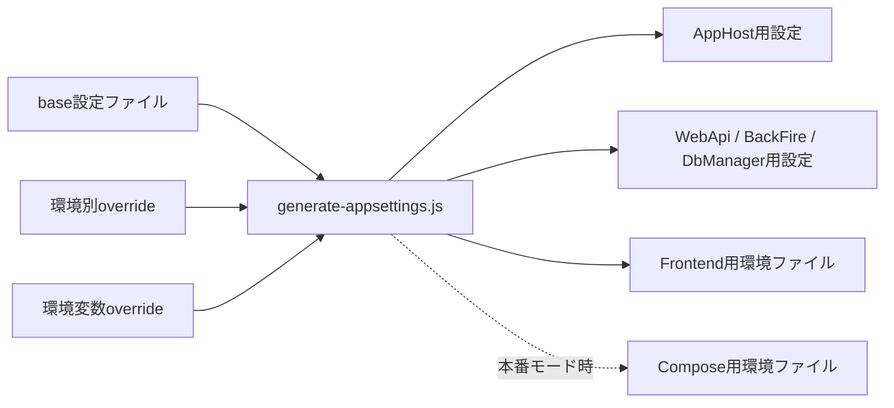

# 開発構成と設定

> このページは設定の流れとサービス構成を説明します。**設定値・資格情報は掲載しません。**

## 開発時の構成

開発環境では`pecus.AppHost`が.NET Aspireの分散アプリケーション定義を持ち、DB、Redis、LexicalConverter、.NETサービス、Next.js Frontendをまとめて登録します。サービス間の接続情報はAppHostのresource referenceを通じて注入されます。

- [AppHost](../../pecus.AppHost/AppHost.cs) — PostgreSQL、バックエンドRedis、Frontend用Redis、LexicalConverter、DbManager、BackFire、WebApi、Frontendを登録
- [README](../../README.md) — リポジトリの開発者向け導入案内
- [開発設定ガイド](../config-management.md) — 設定ファイル管理のルールと利用者向け手順

AppHostの構成上、FrontendはWebApiとFrontend用Redisを参照し、WebApiはDB、バックエンドRedis、LexicalConverterを参照します。詳細な依存関係は[システム構成](./architecture.md)を参照してください。

## 設定の生成フロー

`config/settings.base.json`を設定のソースとして、[`scripts/generate-appsettings.js`](../../scripts/generate-appsettings.js)が環境別設定のマージと各サービス用設定の生成を担います。生成スクリプトは、base設定に環境別overrideをマージし、その後に対応する環境変数のoverrideを適用します。

スクリプトが生成対象として扱うのは、AppHost・WebApi・BackFire・DbManager向けの`appsettings.json`、Frontend用環境ファイル、および本番モード時のCompose用環境ファイルです。**これらの生成物は秘密値を含み得るため、この解説では開かず、値を記載しません。**

スクリプトの引数処理には開発／本番overrideを選ぶオプションがあり、設定変更時の正確な手順は[`docs/config-management.md`](../config-management.md)を参照してください。ここではコマンドを実行していません。

## パスワード等の扱い

AppHostは設定からインフラリソースを構成し、必要なリソース参照を各サービスへ渡します。WebApi等は`IConfiguration`や型付き設定を通じて値を利用します。具体的なパスワード、JWT署名鍵、APIキー、SMTP情報、接続文字列はソース解説・図・例に複製しません。

設定の役割は[`config/settings.base.json`](../../config/settings.base.json)と生成スクリプトが管理しますが、設定ファイル本体には値が含まれるため本ページ作成では内容を参照していません。

## AppHostと配置環境の違い

AppHostは開発時のサービス構成を記述します。本番・検証環境のCompose構成は`deploy/`以下で別に管理されます。両者は同じアプリケーション群を含みますが、起動方法や設定注入方法が同じとは限りません。

- [Composeと運用構成](./deployment-and-operations.md)
- [Deployディレクトリの概要](../../deploy/DEPLOY_OVERVIEW.md)

## 関連ページ

- [システム構成](./architecture.md)
- [配置と運用](./deployment-and-operations.md)
- [既存の設定管理ガイド](../config-management.md)

最終確認日: 2026-10-03
