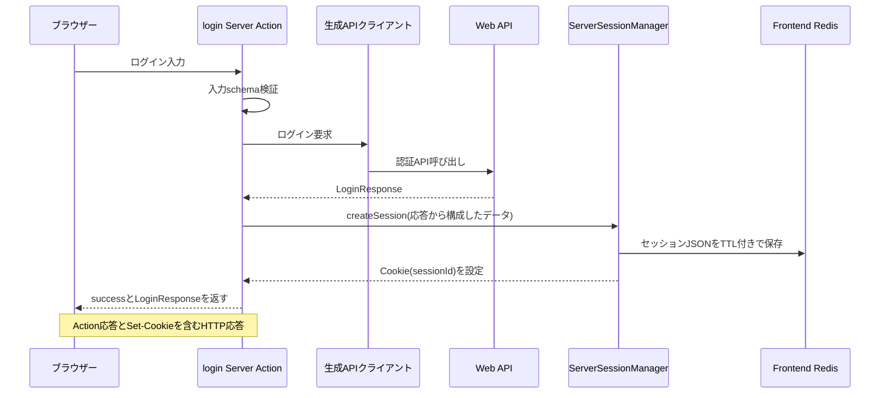
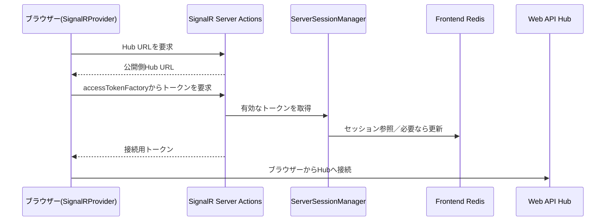

> **現行コード確認:** このページはリポジトリ内の現行実装を確認して記述しています。
> **最終確認日:** 2026-10-04

# Frontendのリクエストとセッション

## 概要

CoatiのFrontendはNext.js App Routerを使い、画面表示時のServer Components、操作時のServer Actions、用途別のNext.js API Routesを使い分けます。通常のWeb API呼び出しはサーバー側で行い、APIクライアント接続層が設定するトークン取得関数を通じてServerSessionManagerがFrontend Redisのセッションを参照します。ページアクセス前のProxyはCookieの`sessionId`の有無を確認するだけで、Redis上のセッション確認はサーバー側のセッション管理に委ねています。

ログイン成功時は、Server ActionがWeb APIの応答を受け取り、セッションデータをFrontend Redisへ保存してopaqueなIDをCookieに設定します。ただし、現行コードではActionの戻り値がWeb APIのログイン応答全体です。Cookieに保存する値とActionがClient Componentへ返す値は別経路であり、後述の通りトークン項目がAction応答に含まれる実装上の注意があります。

## 画面ルートの構成

`src/app`はRoute Groupごとに画面とレイアウトを分けています。括弧付きのGroup名はディレクトリ上の構成単位で、実際のページ配置や共通レイアウトは各Groupの`layout.tsx`とその配下で定義されています。

| Route Group／領域 | 現行コードで確認できる役割 |
|---|---|
| `(workspace-full)` | `/workspaces/[code]`向けのフルスクリーンレイアウト。Dashboardの共通ヘッダー／サイドバーを使わず、Server Componentでアプリ設定を取得し、SignalR Providerなどを配置します。 |
| `(dashboard)` | Dashboard共通レイアウト。SSRでアプリ設定・ユーザー情報を取得し、共通ヘッダー／サイドバーとSignalR Providerを配置します。 |
| `(admin-full)` | `/admin/*`向け。アプリ設定を取得し、管理者用レイアウトとSignalR Providerを使います。 |
| `(backoffice-full)` | `/backoffice/*`向け。アプリ設定を取得し、BackOffice用レイアウトとSignalR Providerを使います。 |
| `(profile)` | プロフィール用レイアウト。SSRでアプリ設定・ユーザー情報を取得し、プロフィール用サイドバーとSignalR Providerを配置します。 |
| `(entrance)` | サインイン、パスワード再設定など、認証入口のページを配置します。サインインページはServer Componentで現在のユーザーを確認し、サインイン済みならリダイレクトします。 |
| `api/` | Next.js Route Handlerの配置場所。ワークスペースアイテムの取得やメトリクス応答などを提供します。 |

根拠: [App Routerの構成](../../pecus.Frontend/src/app)、[Root Layout](../../pecus.Frontend/src/app/layout.tsx)、[Workspaceレイアウト](../../pecus.Frontend/src/app/(workspace-full)/layout.tsx)、[Dashboardレイアウト](../../pecus.Frontend/src/app/(dashboard)/layout.tsx)、[Adminレイアウト](../../pecus.Frontend/src/app/(admin-full)/layout.tsx)、[BackOfficeレイアウト](../../pecus.Frontend/src/app/(backoffice-full)/layout.tsx)、[Profileレイアウト](../../pecus.Frontend/src/app/(profile)/layout.tsx)、[Sign-inページ](../../pecus.Frontend/src/app/(entrance)/signin/page.tsx)。

## ページ表示前のセッション判定

[Next.js Proxy](../../pecus.Frontend/src/proxy.ts)は、静的アセットと`api/`を除くリクエストに適用されます。公開パスはそのまま通し、それ以外では`sessionId` Cookieの有無を確認します。Cookieがなければサインインへリダイレクトし、あればリクエストを続行します。パスワード設定・リセットのパスでは既存Cookieを削除してページを表示する分岐もあります。

Proxy自身はEdge Runtime上でRedisへ接続せず、Cookieに対応するRedisセッションの存在確認やトークンの検証をしません。これらはServer Components、Server Actions、Route Handlersから利用される[ServerSessionManager](../../pecus.Frontend/src/libs/serverSession.ts)側の責務です。例えばサインインページはServer Componentから[getCurrentUser](../../pecus.Frontend/src/actions/auth.ts)を呼び、セッションのユーザー情報を確認します。

## ログインからRedisセッションまで

[ログインフォーム](../../pecus.Frontend/src/app/(entrance)/signin/LoginFormClient.tsx)はClient Componentですが、ログイン処理は[認証Server Action](../../pecus.Frontend/src/actions/auth.ts)の`login`に委ねます。Actionは入力schemaを検証し、[APIクライアント接続層](../../pecus.Frontend/src/connectors/api/PecusApiClient.ts)から生成クライアントを作成してWeb APIのログインエンドポイントを呼び出します。成功応答からセッション情報を組み立て、`ServerSessionManager.createSession`を呼びます。

セッションマネージャーは暗号学的乱数でセッションIDを生成し、トークンやユーザー情報を含むセッションデータを`frontend:session:`プレフィックスのRedisキーへ保存します。TTLはリフレッシュ期限を基準とし、最大30日に制限します。その後、CookieにはセッションIDのみを設定します。Cookieは`httpOnly`で、`secure`は本番環境で有効、`sameSite`は`lax`です。

**現行実装上の注意:** Cookieに入れるのは`sessionId`だけですが、Actionは`return { success: true, data: response }`としてWeb API応答全体を返します。生成された[LoginResponse型](../../pecus.Frontend/src/connectors/api/pecus/models/LoginResponse.ts)にはアクセストークンとリフレッシュトークンの項目があり、Client ComponentはActionの戻り値を受け取ります。したがって、コード上はCookieとは別にAction応答にもトークン項目が含まれ得ます。「トークンはブラウザーへ送られない」というコメントとは一致しません。このページでは値を掲載しません。この実装差の修正は今回の担当範囲外です。

## Server Components／Server Actionsと生成APIクライアント

### Server Components

各レイアウトは既定のServer Componentとして実装され、初期表示に必要なアプリ設定やユーザー情報をサーバー側で取得します。例えばDashboardとWorkspaceのレイアウトは`createPecusApiClients()`を呼び出してWeb APIへ問い合わせます。サインインページではServer Action経由でセッション上のユーザー情報を調べます。401応答時の遷移など、画面ごとの扱いは各レイアウトで実装されています。

### Server Actions

[アイテム操作のServer Actions](../../pecus.Frontend/src/actions/workspaceItem.ts)は、入力schemaで検証した後にAPIクライアントを呼び出し、成功値またはAction用の応答型を返します。例として`updateWorkspaceItem`は入力検証、生成クライアントによる更新、競合応答の分類を行います。一般的なHTTPエラーは[Action共通エラー処理](../../pecus.Frontend/src/actions/apiErrorPolicy.ts)でAction用のエラー形式に変換します。ここでは個別アイテム業務の詳細には踏み込みません。

### 生成APIクライアント

[接続層](../../pecus.Frontend/src/connectors/api/PecusApiClient.ts)は`PecusApiClient.generated.ts`の生成関数を使い、`getApiBaseUrl()`で得たベースURLと、[API認証ヘルパー](../../pecus.Frontend/src/connectors/api/auth.ts)から得るアクセストークン取得関数をOpenAPI設定に登録します。ActionやServer Componentがこの接続層を使うことで、認証情報の取得と生成済みAPIサービスの初期化をサーバー側に集約します。生成ファイルそのものは自動生成物であり、手編集しません。

`ServerSessionManager.getValidAccessToken()`はRedisセッションを参照し、アクセストークンの期限が近い場合はリフレッシュ処理を試みます。API側のJWT検証や認可の方式は[Web APIの契約・認証ページ](webapi-contracts-security.md)を参照してください。

## Next.js API Routesの用途

Next.js API Routesは`src/app/api`内のRoute Handlerです。例えば[ワークスペースアイテムRoute](../../pecus.Frontend/src/app/api/workspaces/[id]/items/route.ts)はクエリを読み取り、生成APIクライアントでWeb APIを呼び、JSON応答またはRoute用エラー応答を返します。Proxyのmatcherは`api`パスを除外するため、このRoute自身が必要な処理を行います。

一方、[メトリクスRoute](../../pecus.Frontend/src/app/api/metrics/route.ts)はNext.jsプロセスのPrometheusメトリクスを取得して応答し、このハンドラー内ではWeb APIクライアントやセッションマネージャーを呼びません。Route Handlerは、Server Actionとは別に、HTTP URLを持つNext.js側のエンドポイントが必要な用途に使われています。これらはブラウザーからWeb APIを直接呼び出す設計の例ではありません。

## ブラウザーからのリアルタイム接続

通常の画面データ取得とは異なり、SignalR接続は[SignalRProvider](../../pecus.Frontend/src/providers/SignalRProvider.tsx)がブラウザー側で構築します。Hub URLは[SignalR用Server Actions](../../pecus.Frontend/src/actions/signalr.ts)から公開側のAPI URLを使って取得し、アクセストークンは別のServer Actionから取得します。ProviderはそのURLと`accessTokenFactory`を使い、ブラウザーからWeb APIのHubへ接続します。内部向けAPI URLではなくブラウザーから到達する公開URLを使う点が、SSR/API呼び出しとの境界です。

## 実行環境ごとの接続先解決

[環境変数解決層](../../pecus.Frontend/src/libs/env.ts)が接続先を選びます。ここではキー名と優先順位のみを記します。

- サーバー側Web API: `services__pecusapi__https__0` → `services__pecusapi__http__0` → `PECUS_API_URL` → フォールバック
- ブラウザー向けWeb API: `NEXT_PUBLIC_API_URL` → フォールバック
- Frontend Redis: `ConnectionStrings__redisFrontend` → `REDIS_URL`。どちらも未設定ならエラー

[Redisクライアント](../../pecus.Frontend/src/libs/redis.ts)は解決済みの接続情報からRedis接続を作成します。ここに挙げたキーの設定値や環境設定ファイルの内容は掲載しません。

## 関連ページ

- [システム全体の構成](system-topology.md)
- [Web APIの契約・認証・エラー境界](webapi-contracts-security.md)
- [ワークスペースの業務フロー](workspace-workflows.md)
- [リアルタイム共同作業](collaboration-realtime.md)
- [可観測性](observability.md)
- [開発者ワークフロー](developer-workflows.md)
