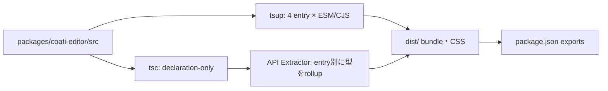
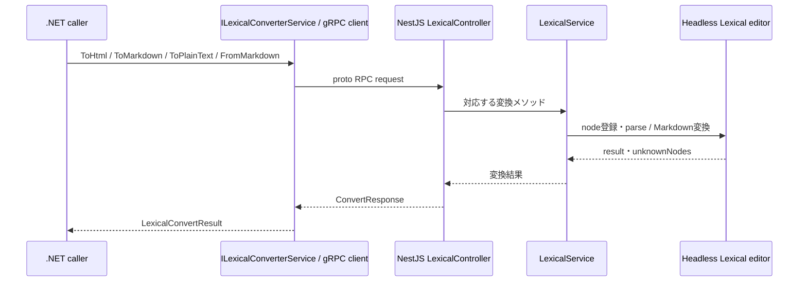

# 共有エディターとLexical変換

> 本ページは、2026-10-04時点の現行コードを確認して記述しています。最終確認日: **2026-10-04**。

## 概要

Coatiのリッチコンテンツには、役割の異なる二つの仕組みがある。`packages/coati-editor` はブラウザー向けReact/Lexicalエディターと共有node・Markdown transformerを提供する。一方、`pecus.LexicalConverter` はNode.js/NestJS上でLexical JSONとHTML・Markdown・プレーンテキストを相互変換するgRPCサービスである。両者はnode定義や変換知識の一部を共有するが、React EditorそのものがgRPCサーバーとして動くわけではない。[パッケージ公開設定](../../packages/coati-editor/package.json) [変換サービス](../../pecus.LexicalConverter/src/lexical/lexical.service.ts)

このページでは、共有パッケージのbuild・型宣言境界、Frontendのラッパー、proto契約、NestJS実装、.NETクライアントと同期点を追う。各業務画面で変換を使う理由やAI処理上の位置付けは[ワークスペース業務フロー](workspace-workflows.md)と[AI連携・バックグラウンドジョブ](ai-background-jobs.md)、パッケージbuildを含む開発作業は[開発者向け生成処理](developer-workflows.md)を参照する。

## 1. 共有パッケージの公開面とbuild境界

`@coati/editor` は `private: true` のworkspaceパッケージであり、`package.json` の `exports` がモノレポ内のimport境界を定める。ルート `.` はESM/CJS bundleと型宣言、`./nodes`・`./nodes-headless`・`./transformers` はそれぞれのbundleと宣言、`./styles` はCSSを指す。公開先は `dist/` に限定される。[package.json](../../packages/coati-editor/package.json)

buildは二段階である。tsupは `src/index.ts`、node一覧、headless node一覧、transformer一覧をentryとしてESM/CJSを出力し、型宣言生成は無効にしている。CSSはcopy loaderで扱う。続く `build-dts.mjs` はTypeScriptのdeclaration-only出力を一時領域へ作り、API Extractorで4つのentryごとに単一の`.d.ts`へロールアップする。ここでは設定ファイルとスクリプトからbuild境界を説明しており、build成果物の内容は参照していない。[tsup.config.ts](../../packages/coati-editor/tsup.config.ts) [build-dts.mjs](../../packages/coati-editor/scripts/build-dts.mjs)

図の各経路は[tsup設定](../../packages/coati-editor/tsup.config.ts)、[型宣言スクリプト](../../packages/coati-editor/scripts/build-dts.mjs)、[exports定義](../../packages/coati-editor/package.json)に基づく。

## 2. FrontendのEditor利用

Frontendの `src/components/editor/index.ts` は共有スタイルを読み込み、`@coati/editor` の汎用コンポーネント・型・plugin等を再エクスポートし、Pecus固有componentも同じローカル入口に集約する。`PecusNotionLikeEditor` は共有 `NotionLikeEditor` を包み、Frontend固有のAI pluginとpicker optionを合成する。`PecusNotionLikeViewer` は共有Viewerの薄いwrapperである。[editor入口](../../pecus.Frontend/src/components/editor/index.ts) [PecusNotionLikeEditor](../../pecus.Frontend/src/components/editor/pecus/PecusNotionLikeEditor.tsx) [PecusNotionLikeViewer](../../pecus.Frontend/src/components/editor/pecus/PecusNotionLikeViewer.tsx)

画面からは作成・編集に `PecusNotionLikeEditor`、詳細表示に `PecusNotionLikeViewer` が使われる。ここでの責務はReact上の編集・表示であり、後述のgRPC変換サービスへの接続をこの共有Editorが担うわけではない。[CreateWorkspaceItem](../../pecus.Frontend/src/app/%28workspace-full%29/workspaces/%5Bcode%5D/CreateWorkspaceItem.tsx) [EditWorkspaceItem](../../pecus.Frontend/src/app/%28workspace-full%29/workspaces/%5Bcode%5D/EditWorkspaceItem.tsx) [WorkspaceItemDetail](../../pecus.Frontend/src/app/%28workspace-full%29/workspaces/%5Bcode%5D/WorkspaceItemDetail.tsx)

## 3. protoが定めるgRPC契約

[`lexical.proto`](../../pecus.Protos/lexical/lexical.proto) の `pecus.lexical.LexicalConverter` は、次の4つのunary RPCを定義する。

| RPC | request | 変換方向 |
|---|---|---|
| `ToHtml` | `ConvertRequest.lexical_json` | Lexical JSON → HTML |
| `ToMarkdown` | `ConvertRequest.lexical_json` | Lexical JSON → Markdown |
| `ToPlainText` | `ConvertRequest.lexical_json` | Lexical JSON → プレーンテキスト |
| `FromMarkdown` | `MarkdownToLexicalRequest.markdown` | Markdown → Lexical JSON |

4 RPCのresponseは共通の `ConvertResponse` で、`success`、`result`、optional `error_message`、ミリ秒単位の `processing_time_ms`、繰り返しフィールドの `unknown_nodes` を持つ。変換形式・field番号・optional/repeatedの宣言はprotoを契約の正とする。[Lexical proto](../../pecus.Protos/lexical/lexical.proto)

## 4. NestJS変換サービスの起動と処理

`main.ts` はNestJSの `AppModule` を使ってgRPC microserviceを作り、proto package `pecus.lexical` でlistenした後、メトリクス・health用の別Fastify HTTP appを起動する。つまりgRPCとHTTPは同一のNestJSサービス内にあるが、異なるlistenerである。HTTP appは `/metrics` と `/health` を公開し、gRPC listenerが開始してから起動する順序になっている。[main.ts](../../pecus.LexicalConverter/src/main.ts) [MetricsController](../../pecus.LexicalConverter/src/metrics/metrics.controller.ts) [MetricsModule](../../pecus.LexicalConverter/src/metrics/metrics.module.ts)

シーケンスは[.NET interface](../../pecus.Libs/Lexical/ILexicalConverterService.cs)、[.NET実装](../../pecus.Libs/Lexical/LexicalConverterService.cs)、[NestJS controller](../../pecus.LexicalConverter/src/lexical/lexical.controller.ts)、[LexicalService](../../pecus.LexicalConverter/src/lexical/lexical.service.ts)、[proto契約](../../pecus.Protos/lexical/lexical.proto)に照合した。React EditorをこのRPC経路に含めていない。

`LexicalController` の各handlerは対応するservice methodを呼び、処理時間を計測して共通responseへ詰める。例外時は `success=false`、空の`result`、`errorMessage`、処理時間、空の`unknownNodes`を返す。[lexical.controller.ts](../../pecus.LexicalConverter/src/lexical/lexical.controller.ts)

`LexicalService` は `createHeadlessEditor` を生成し、Lexical標準node群と共有パッケージの `CustomNodes` を登録してからJSONをparseする。HTMLは`$generateHtmlFromNodes`、Markdownは`$convertToMarkdownString`とconverter側で定義されたtransformer群、プレーンテキストはrootのtext contentから生成する。Markdown入力はconverter側のindentation正規化後に `$convertFromMarkdownString` でEditorStateへ取り込む。共有nodeを利用することと、FrontendのMarkdown transformer実装をそのまま使うことは別である。[lexical.service.ts](../../pecus.LexicalConverter/src/lexical/lexical.service.ts) [converter nodes entry](../../pecus.LexicalConverter/src/lexical/nodes/index.ts) [converter Markdown transformers](../../pecus.LexicalConverter/src/lexical/transformers/markdown-transformers.ts)

Lexical JSONの変換前にnode typeを再帰走査し、登録済みtype一覧にないものを重複なく `unknownNodes` に入れる。`FromMarkdown` は未知node一覧を空配列として返す。JSON走査による検知とLexical parserによる実変換は別段階であり、この検知処理だけから未知nodeの全変換挙動までは保証しない。[lexical.service.ts](../../pecus.LexicalConverter/src/lexical/lexical.service.ts)

metrics controllerはPrometheus Registryにdefault metricsとgRPC request counter・duration histogram・conversion counterを登録する。ただし、確認した `pecus.LexicalConverter/src` 内にはこれらの独自metricをincrement/observeする呼出しが見当たらないため、定義があることと実測値が更新されることは区別する。`/health` は `{ status: 'ok' }` を返す。[metrics.controller.ts](../../pecus.LexicalConverter/src/metrics/metrics.controller.ts) [LexicalController](../../pecus.LexicalConverter/src/lexical/lexical.controller.ts)

## 5. .NETクライアントと呼出元

`ILexicalConverterService` は4 RPCに対応するasync methodと `LexicalConvertResult` を `pecus.Libs` に定義する。`LexicalConverterService` はgRPC channelと生成clientを内包し、RPC metadata・cancellation tokenを渡す。通常のLexical変換は空白入力を成功・空結果として返し、Markdown逆変換は空白入力に対して空のEditorStateを返す。RPC例外はログを残して `Success=false` とエラー情報を返し、proto responseの処理時間・unknown nodeも呼出側のresultへ写す。[ILexicalConverterService.cs](../../pecus.Libs/Lexical/ILexicalConverterService.cs) [LexicalConverterService.cs](../../pecus.Libs/Lexical/LexicalConverterService.cs)

`pecus.Libs.csproj` は `pecus.Protos/lexical/lexical.proto` を `GrpcServices="Client"` として指定する。通常のbuildではこのprotoをC# client側の生成入力として扱い、`SKIP_GRPC_CODEGEN` 条件時には事前生成ファイルを使う構成である。したがってproto fieldやRPC変更時はNestJS側の契約・handlerとC# client/DTO双方の整合を確認する。生成されたC#ファイルを手編集するのではなく、protoと生成条件を同期点にする。[pecus.Libs.csproj](../../pecus.Libs/pecus.Libs.csproj) [Lexical proto](../../pecus.Protos/lexical/lexical.proto)

DI登録はWeb API、BackFire、DbManagerにあり、実際の呼出しはWeb APIの `WorkspaceItemExportController`、`ExternalWorkspaceItemService`、task関連service、共有Hangfire task群、seed処理などに存在する。具体的な業務フローや呼出の背景は対象ページに譲る。[WebApi登録](../../pecus.WebApi/Program.cs) [BackFire登録](../../pecus.BackFire/Program.cs) [DbManager登録](../../pecus.DbManager/Program.cs) [WorkspaceItemExportController](../../pecus.WebApi/Controllers/WorkspaceItemExportController.cs) [WorkspaceItemTasks](../../pecus.Libs/Hangfire/Tasks/WorkspaceItemTasks.cs) [ActivityTasks](../../pecus.Libs/Hangfire/Tasks/ActivityTasks.cs)

## 6. node・schema変更時の同期点

- **proto契約:** RPC名・request/response fieldを[`lexical.proto`](../../pecus.Protos/lexical/lexical.proto)で変更したら、NestJSのhandler/request/response型と、`.NET`のproto clientおよび`LexicalConvertResult`へのmappingを照合する。[NestJS controller](../../pecus.LexicalConverter/src/lexical/lexical.controller.ts) [C# service](../../pecus.Libs/Lexical/LexicalConverterService.cs) [C# project codegen設定](../../pecus.Libs/pecus.Libs.csproj)
- **Lexical custom node:** node追加・変更は共有node実装と `NotionLikeEditorNodes` の登録、FrontendのEditor/Viewerでのnode登録、converterのheadless `CustomNodes` 登録、unknown type検知一覧の整合を確認する。共有packageには `./nodes-headless` exportもある一方、現行converterのnodes adapterは `@coati/editor` からnode群を再exportし、Node起動時にはCSS importを無視するhookを先読みする。この実装上の選択を、React UIとheadless変換が同一実行環境という意味に取り違えない。[NotionLikeEditorNodes](../../packages/coati-editor/src/nodes/NotionLikeEditorNodes.ts) [共有Editor node登録](../../packages/coati-editor/src/core/NotionLikeEditor.tsx) [共有Viewer node登録](../../packages/coati-editor/src/core/NotionLikeViewer.tsx) [headless node entry](../../packages/coati-editor/src/nodes/headless.ts) [package exports](../../packages/coati-editor/package.json) [converter nodes adapter](../../pecus.LexicalConverter/src/lexical/nodes/index.ts) [ignore-css hook](../../pecus.LexicalConverter/src/ignore-css.ts) [converter node registry](../../pecus.LexicalConverter/src/lexical/lexical.service.ts)
- **Markdown変換:** shared packageとconverterには `normalizeListIndentation` の実装がそれぞれあり、converter側ソースは両実装の同期が必要と明記する。共通Markdown表現を変える際は両方のtransformer実装を確認する。[shared transformers](../../packages/coati-editor/src/transformers/markdown-transformers.ts) [converter transformers](../../pecus.LexicalConverter/src/lexical/transformers/markdown-transformers.ts)

## 主なコード実体

| 責務 | 主な実体 |
|---|---|
| package exportsとbundle設定 | [`package.json`](../../packages/coati-editor/package.json)、[`tsup.config.ts`](../../packages/coati-editor/tsup.config.ts)、[`build-dts.mjs`](../../packages/coati-editor/scripts/build-dts.mjs) |
| Frontendの共有Editor接続 | [`src/components/editor`](../../pecus.Frontend/src/components/editor/index.ts)、[`PecusNotionLikeEditor.tsx`](../../pecus.Frontend/src/components/editor/pecus/PecusNotionLikeEditor.tsx)、[`PecusNotionLikeViewer.tsx`](../../pecus.Frontend/src/components/editor/pecus/PecusNotionLikeViewer.tsx) |
| RPC契約とNode server | [`lexical.proto`](../../pecus.Protos/lexical/lexical.proto)、[`main.ts`](../../pecus.LexicalConverter/src/main.ts)、[`lexical.controller.ts`](../../pecus.LexicalConverter/src/lexical/lexical.controller.ts)、[`lexical.service.ts`](../../pecus.LexicalConverter/src/lexical/lexical.service.ts) |
| .NET clientとcodegen入力 | [`ILexicalConverterService.cs`](../../pecus.Libs/Lexical/ILexicalConverterService.cs)、[`LexicalConverterService.cs`](../../pecus.Libs/Lexical/LexicalConverterService.cs)、[`pecus.Libs.csproj`](../../pecus.Libs/pecus.Libs.csproj) |

## 関連ページ

- [ワークスペース・アイテム・タスクの業務フロー](workspace-workflows.md)
- [AI連携とバックグラウンドジョブ](ai-background-jobs.md)
- [開発者向け生成処理とリポジトリ支援](developer-workflows.md)

---

最終確認日: **2026-10-04**
