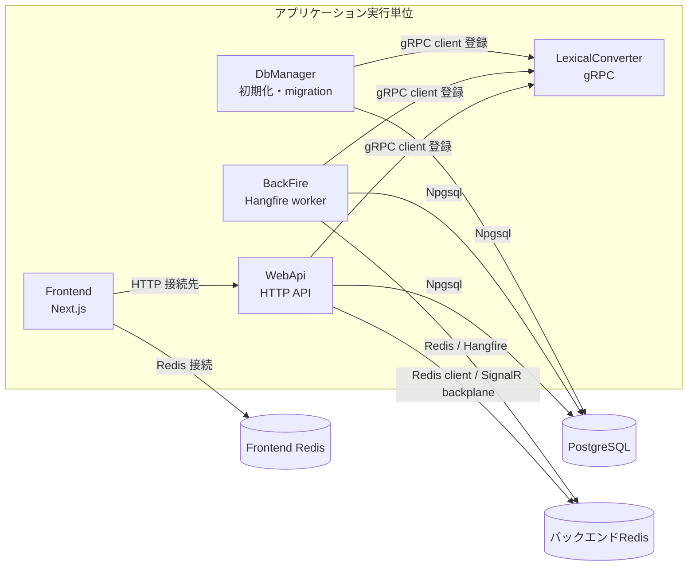

# 実行時システムの境界と起動トポロジー

> 本ページは、2026-10-04時点の現行コードとCompose定義を確認して記述しています。最終確認日: **2026-10-04**。

## 概要

Coatiは、HTTP APIを提供する`pecus.WebApi`、バックグラウンド処理を担う`pecus.BackFire`、DB初期化を行う`pecus.DbManager`、Next.jsの`pecus.Frontend`などを別々の実行単位として構成しています。開発時は`pecus.AppHost`がAspireリソースと依存関係を定義し、本番向けComposeはインフラ、アプリスロット、DBマイグレーションを別々のCompose定義に分けています。[AppHost](../../pecus.AppHost/AppHost.cs) [本番infra Compose](../../deploy/docker-compose.infra.yml) [本番blue Compose](../../deploy/docker-compose.app-blue.yml) [本番migration Compose](../../deploy/docker-compose.migrate.yml)

通信境界では、PostgreSQL、バックエンド用Redis、Frontend用Redisを別リソースとして扱います。WebApiとBackFireはDB・バックエンドRedis・LexicalConverterへの接続を持ち、FrontendはWebApiとFrontend用Redisへ接続します。LexicalConverterは.NETサービスから利用するgRPCサービスです。[AppHost](../../pecus.AppHost/AppHost.cs) [WebApi起動設定](../../pecus.WebApi/Program.cs) [BackFire起動設定](../../pecus.BackFire/Program.cs) [LexicalConverter起動処理](../../pecus.LexicalConverter/src/main.ts)

## 構造と接続境界

次図はAspire開発構成の接続先・クライアント登録をまとめたものです。矢印はサービス間の接続設定またはクライアント登録を示し、起動待ちの順序を表すものではありません。[AppHost](../../pecus.AppHost/AppHost.cs) [WebApi起動設定](../../pecus.WebApi/Program.cs) [BackFire起動設定](../../pecus.BackFire/Program.cs) [DbManager起動設定](../../pecus.DbManager/Program.cs) [Lexical proto](../../pecus.Protos/lexical/lexical.proto)

`AppHost.cs`は`pecusdb`をPostgreSQLリソースに作成し、Redisをバックエンド用とFrontend用の2つに分けます。WebApiとBackFireは`redis`という名前でバックエンドRedisを参照し、Frontendは`redisFrontend`を参照します。Frontend Redisは本番infra Composeでも独立した`redis-frontend`サービスとして定義されています。[AppHost](../../pecus.AppHost/AppHost.cs) [本番infra Compose](../../deploy/docker-compose.infra.yml) [WebApi起動設定](../../pecus.WebApi/Program.cs) [Frontend package manifest](../../pecus.Frontend/package.json)

WebApi・BackFire・DbManagerは、設定からLexicalConverterのEndpointを受け取り、`ILexicalConverterService`を登録します。protoはLexical JSONからHTML／Markdown／PlainTextへの変換、およびMarkdownからLexical JSONへの変換契約を定義しています。したがって図のgRPC線はAPIの個別処理経路を網羅したものではなく、各.NET実行単位が持つ変換サービス接続の境界です。[WebApi起動設定](../../pecus.WebApi/Program.cs) [BackFire起動設定](../../pecus.BackFire/Program.cs) [DbManager起動設定](../../pecus.DbManager/Program.cs) [Lexical proto](../../pecus.Protos/lexical/lexical.proto)

## Aspire開発時の起動とレディネス

`pecus.AppHost`はPostgreSQL、2つのRedis、LexicalConverter、DbManager、BackFire、WebApi、Frontendを開発用リソースとして登録します。Prometheusは設定で監視が有効な場合に限って追加され、Frontendにはその場合だけ参照と待機条件が加わります。[AppHost](../../pecus.AppHost/AppHost.cs)

`WithReference`は、リソース間の参照・接続設定を宣言します。`WaitFor`は依存リソースが利用可能になるまで起動を待つ依存関係を宣言します。AppHostでの組み合わせは次のとおりです。[AppHost](../../pecus.AppHost/AppHost.cs)

| 実行単位 | `WithReference` | `WaitFor` |
| --- | --- | --- |
| DbManager | PostgreSQLの`pecusdb`、LexicalConverter | PostgreSQLの`pecusdb`、LexicalConverter |
| BackFire | バックエンドRedis、`pecusdb`、LexicalConverter | バックエンドRedis、`pecusdb`、LexicalConverter |
| WebApi | `pecusdb`、バックエンドRedis、LexicalConverter | `pecusdb`、バックエンドRedis、DbManager、BackFire、LexicalConverter |
| Frontend | WebApi、Frontend Redis | WebApi、Frontend Redis |
| Frontend（任意） | Prometheus URLを環境変数として設定 | Prometheus |

待機の判定をすべて同じヘルスチェックとみなすことはできません。LexicalConverterにはAppHostからメトリクスHTTP endpoint上の`/health`を指定してあり、Node.js起動コードはgRPC listenerがlistenを開始した後にhealth／metrics用HTTP listenerを起動します。これはgRPCが利用可能になる前に依存サービスが進まないようにするレディネス判定です。[AppHost](../../pecus.AppHost/AppHost.cs) [LexicalConverter起動処理](../../pecus.LexicalConverter/src/main.ts)

WebApiにはAppHost上で`/`のHTTP health checkが指定されています。DbManagerは`MapDefaultEndpoints()`を呼び、`DbInitializer`のhealth checkを登録します。BackFireは`AddServiceDefaults()`を呼びますが、`Program.cs`では`MapDefaultEndpoints()`を呼んでいません。したがって、AppHostに書かれた`WaitFor`関係と各プロセスのHTTPヘルスチェックの有無は分けて読み取る必要があります。[AppHost](../../pecus.AppHost/AppHost.cs) [DbManager起動設定](../../pecus.DbManager/Program.cs) [ServiceDefaults拡張](../../pecus.ServiceDefaults/Extensions.cs) [BackFire起動設定](../../pecus.BackFire/Program.cs)

## 本番Composeとの違い

本番定義では、`docker-compose.infra.yml`がPostgreSQL、バックエンドRedis、Frontend Redis、LexicalConverter、Nginxを定義し、`docker-compose.app-blue.yml`がWebApi・Frontend・BackFireのBlueスロットを定義します。どちらも`pecus-network`を使いますが、Composeファイルは分かれており、アプリ側には`depends_on`を置かず、依存順は運用スクリプトで制御する旨が記載されています。[本番infra Compose](../../deploy/docker-compose.infra.yml) [本番blue Compose](../../deploy/docker-compose.app-blue.yml)

開発時はAppHostの`WithReference`でリソース参照を結び、`WaitFor`で各サービスの起動依存を表します。本番Blue Composeは接続先を環境変数で渡し、同じAppHostのリソースグラフを使いません。Compose内で確認できる対応は次のとおりです。[AppHost](../../pecus.AppHost/AppHost.cs) [本番infra Compose](../../deploy/docker-compose.infra.yml) [本番blue Compose](../../deploy/docker-compose.app-blue.yml)

| 本番サービス | 接続設定で確認できる境界 | Compose上の配置 |
| --- | --- | --- |
| WebApi | PostgreSQL、バックエンドRedis、LexicalConverter | BlueアプリCompose |
| BackFire | PostgreSQL、バックエンドRedis、LexicalConverter | BlueアプリCompose |
| Frontend | WebApiのHTTP endpoint、Frontend Redis | BlueアプリCompose |
| DbManager | PostgreSQL、LexicalConverter | 独立したmigration Compose |
| PostgreSQL／Redis 2系統／LexicalConverter | アプリから参照される各インフラendpoint | infra Compose |

DbManagerはBlueアプリComposeには含まれず、migration Composeで独立サービスとして定義されています。そちらではPostgreSQLとLexicalConverterの`service_healthy`を待ちます。infra ComposeにはPostgreSQL・Redis 2系統のhealthcheckがあり、LexicalConverterはgRPC portへのTCP接続でhealthcheckされています。一方、BlueのWebApiは`/health`をhealthcheckし、FrontendとBackFireにはこのCompose定義内のhealthcheckはありません。[本番migration Compose](../../deploy/docker-compose.migrate.yml) [本番infra Compose](../../deploy/docker-compose.infra.yml) [本番blue Compose](../../deploy/docker-compose.app-blue.yml)

このため、開発時のAspire `WaitFor`と、本番Composeの`depends_on`／healthcheck／外部運用スクリプトは別の起動制御です。Compose定義だけから、本番全体の起動順やBlue/Green切替手順を導くことはできません。運用上の詳細は[配布・デプロイ・復旧運用](deployment-operations.md)を参照してください。[AppHost](../../pecus.AppHost/AppHost.cs) [本番blue Compose](../../deploy/docker-compose.app-blue.yml) [本番migration Compose](../../deploy/docker-compose.migrate.yml)

## 共有コードと契約の配置

`pecus.Libs`はWebApi、BackFire、DbManager、ServiceDefaultsなどから参照されるC#共有ライブラリです。DbContextやサービス類などの共有コードとLexicalConverter用.NETクライアントを置き、protoファイルをgRPC clientとしてビルド対象にします。これはプロジェクト参照による共有であり、Libs自体がネットワーク上のサービスとして起動するわけではありません。[Libs project](../../pecus.Libs/pecus.Libs.csproj) [WebApi project](../../pecus.WebApi/pecus.WebApi.csproj) [BackFire project](../../pecus.BackFire/pecus.BackFire.csproj) [DbManager project](../../pecus.DbManager/pecus.DbManager.csproj)

`pecus.ServiceDefaults`も実行サービスではなく、参照元サービスが共通のホスト設定を使うためのライブラリです。`AddServiceDefaults()`はSerilog、OpenTelemetry、health check登録、service discovery、HttpClientの標準resilience／service discovery設定をまとめます。health endpointは`MapDefaultEndpoints()`を呼んだアプリにマップされます。[ServiceDefaults project](../../pecus.ServiceDefaults/pecus.ServiceDefaults.csproj) [ServiceDefaults拡張](../../pecus.ServiceDefaults/Extensions.cs) [WebApi project](../../pecus.WebApi/pecus.WebApi.csproj) [BackFire project](../../pecus.BackFire/pecus.BackFire.csproj) [DbManager project](../../pecus.DbManager/pecus.DbManager.csproj)

`pecus.Protos`は実行プロセスではなく、少なくとも確認したLexical変換については.NET側クライアントとNode.js側gRPCサービスが共有する契約の置き場です。`pecus.Libs.csproj`が`lexical.proto`を`GrpcServices="Client"`として指定し、Node.js側は同じprotoを起動設定から読み込みます。[Lexical proto](../../pecus.Protos/lexical/lexical.proto) [Libs project](../../pecus.Libs/pecus.Libs.csproj) [LexicalConverter起動処理](../../pecus.LexicalConverter/src/main.ts)

## 主なコード実体

- [`pecus.AppHost/AppHost.cs`](../../pecus.AppHost/AppHost.cs) — 開発用のPostgreSQL・Redis・アプリリソース登録、参照注入、`WaitFor`、health check、任意のPrometheus登録。
- [`pecus.AppHost/pecus.AppHost.csproj`](../../pecus.AppHost/pecus.AppHost.csproj) — Aspire AppHost SDKと開発リソースとして扱う.NETプロジェクト参照。
- [`pecus.WebApi/pecus.WebApi.csproj`](../../pecus.WebApi/pecus.WebApi.csproj)、[`pecus.BackFire/pecus.BackFire.csproj`](../../pecus.BackFire/pecus.BackFire.csproj)、[`pecus.DbManager/pecus.DbManager.csproj`](../../pecus.DbManager/pecus.DbManager.csproj) — 各実行単位の.NET依存関係と共有プロジェクト参照。
- [`pecus.Libs/pecus.Libs.csproj`](../../pecus.Libs/pecus.Libs.csproj)、[`pecus.ServiceDefaults/pecus.ServiceDefaults.csproj`](../../pecus.ServiceDefaults/pecus.ServiceDefaults.csproj) — 共通コードと共通ホスト設定のライブラリ定義。
- [`pecus.LexicalConverter/package.json`](../../pecus.LexicalConverter/package.json)、[`pecus.LexicalConverter/src/main.ts`](../../pecus.LexicalConverter/src/main.ts) — Node.js変換サービスの依存・起動処理、gRPCとhealth／metrics用HTTP listener。
- [`pecus.Frontend/package.json`](../../pecus.Frontend/package.json) — Next.jsアプリのパッケージ定義。
- [`pecus.Protos/lexical/lexical.proto`](../../pecus.Protos/lexical/lexical.proto) — Lexical変換のgRPC契約。
- [`deploy/docker-compose.infra.yml`](../../deploy/docker-compose.infra.yml)、[`deploy/docker-compose.app-blue.yml`](../../deploy/docker-compose.app-blue.yml)、[`deploy/docker-compose.migrate.yml`](../../deploy/docker-compose.migrate.yml) — 本番向けインフラ、Blueアプリ、DBマイグレーションのCompose境界。

## 関連ページ

- [Frontendのリクエストとセッション](frontend-request-flow.md)
- [Web APIの契約・認証・エラー境界](webapi-contracts-security.md)
- [永続化モデルとデータベース初期化](data-model-lifecycle.md)
- [共有エディターとLexical変換](rich-content-pipeline.md)
- [ヘルス・メトリクス・可観測性](observability.md)
- [配布・デプロイ・復旧運用](deployment-operations.md)
