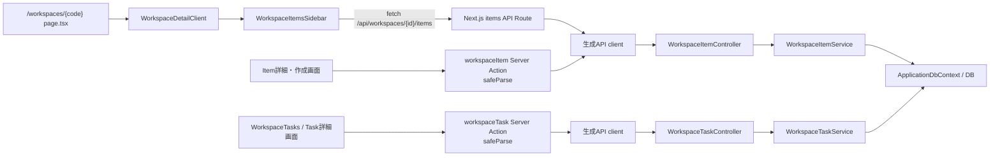

# ワークスペース・アイテム・タスクの業務フロー

> ワークスペースを入口に、Item（文書・業務対象）とTask（そのItemに属する作業）が画面から読み書きされる経路を、現行コードに沿って整理する。共通のAPIエラー契約や検索索引方式、リアルタイム編集の説明は関連ページに委ねる。
>
> **現行実装確認日:** 2026-10-04

## 概要

`/workspaces/{code}` のServer Componentがワークスペースをコードで取得し、必要ならURLの`itemCode`をItem IDに解決してクライアント画面へ渡す。画面のItem一覧取得はNext.js API Route経由、Item詳細・作成／更新やTask一覧・作成／更新は主にServer Action経由でWeb APIに届く。Web API Controllerがアクセス権を確認してServiceを呼び、Serviceが`ApplicationDbContext`を通じてDBを読み書きする。保存に続く検索索引更新や通知などはHangfireへ登録され、実際のジョブ処理とは同期API応答が分かれている。[Workspace page](../../pecus.Frontend/src/app/(workspace-full)/workspaces/%5Bcode%5D/page.tsx)、[WorkspaceDetailClient](../../pecus.Frontend/src/app/(workspace-full)/workspaces/%5Bcode%5D/WorkspaceDetailClient.tsx)、[Item一覧Sidebar](../../pecus.Frontend/src/components/workspaceItems/WorkspaceItemsSidebar.tsx)

## 1. WorkspaceからItemへ

`Workspace`は組織に属し、コードや表示モードを持ち、`WorkspaceItems`を配下に持つ。`WorkspaceItem`はWorkspace内の番号・表示コード、件名、本文、オーナー、担当者、コミッター、優先度、期限、下書き・アーカイブ状態を持つ。作成ServiceはWorkspaceに用意された連番シーケンスから番号を取得し、番号を文字列化してItemの`Code`に設定する。DBでは`WorkspaceId + ItemNumber`が一意である。[Workspace model](../../pecus.Libs/DB/Models/Workspace.cs)、[WorkspaceItem model](../../pecus.Libs/DB/Models/WorkspaceItem.cs)、[WorkspaceItemService](../../pecus.WebApi/Services/WorkspaceItemService.cs)、[ApplicationDbContext: WorkspaceItem](../../pecus.Libs/DB/ApplicationDbContext.cs)

画面URLはWorkspaceの`Code`を使い、ItemはWorkspace内の表示コードで選択できる。詳細画面には`#{item.Code}`が表示され、`{workspaceCode}#{item.Code}`形式の参照文字列も組み立てられる。`IsDraft`と`IsArchived`は別々の状態で、作成時はフォーム入力の下書き値を送り、アーカイブは別の属性／状態更新経路を持つ。Documentモードでは一覧Sidebarがツリー表示を選び、Item間の親子関係は`WorkspaceItemRelation`で表現される。[Workspace page](../../pecus.Frontend/src/app/(workspace-full)/workspaces/%5Bcode%5D/page.tsx)、[CreateWorkspaceItem](../../pecus.Frontend/src/app/(workspace-full)/workspaces/%5Bcode%5D/CreateWorkspaceItem.tsx)、[WorkspaceItemDetail](../../pecus.Frontend/src/app/(workspace-full)/workspaces/%5Bcode%5D/WorkspaceItemDetail.tsx)、[WorkspaceItemsSidebar](../../pecus.Frontend/src/components/workspaceItems/WorkspaceItemsSidebar.tsx)、[WorkspaceItemRelation model](../../pecus.Libs/DB/Models/WorkspaceItemRelation.cs)

## 2. ItemとTaskの役割・関連

ItemはWorkspace内の文書または業務対象であり、タグ、PIN、添付、他Itemとの関連、検索用派生データを持つ。タグは`WorkspaceItemTag`、Item間の関係は`WorkspaceItemRelation`、添付のファイル情報は`WorkspaceItemAttachment`として分かれている。[WorkspaceItem model](../../pecus.Libs/DB/Models/WorkspaceItem.cs)、[WorkspaceItemAttachment model](../../pecus.Libs/DB/Models/WorkspaceItemAttachment.cs)、[ApplicationDbContext: tags and attachments](../../pecus.Libs/DB/ApplicationDbContext.cs)

Taskは特定のItemに紐づく作業単位で、Item内の`Sequence`、タスク種別、担当者、優先度、開始日・期限、予定／実績工数、進捗率を持つ。状態は完了（`IsCompleted`）と破棄（`IsDiscarded`）で表され、Taskは複数の先行Task IDを保持できる。サービスは自身を先行Taskにすることや循環依存を検査し、フローマップの着手可否は先行Taskがすべて完了しているかで判定する。Taskのコメントは`TaskComment`としてTaskに属し、添付も`WorkspaceItemAttachment.WorkspaceTaskId`があればTaskに関連付く。[WorkspaceTask model](../../pecus.Libs/DB/Models/WorkspaceTask.cs)、[WorkspaceTaskService](../../pecus.WebApi/Services/WorkspaceTaskService.cs)、[TaskComment model](../../pecus.Libs/DB/Models/TaskComment.cs)、[WorkspaceItemAttachment model](../../pecus.Libs/DB/Models/WorkspaceItemAttachment.cs)、[ApplicationDbContext: task relations](../../pecus.Libs/DB/ApplicationDbContext.cs)

## 3. 画面からController・Service・DBへ

代表的な経路は次のとおり。重要な違いは、一覧Item検索がブラウザーからNext.js API Routeへ進むのに対し、詳細取得や更新、Task操作はServer Actionを使う点である。

WorkspaceページはSSR時にWorkspace詳細を取得し、`itemCode`があればItem詳細ActionでIDを解決する。Item一覧Sidebarは検索・フィルター・ページ切替のたびに`/api/workspaces/{id}/items`を`fetch`し、Routeがquery parameterを読み取って生成API clientでWeb APIを呼ぶ。Item詳細の取得、作成・更新、状態／属性更新は`workspaceItem.ts`のServer Actionsから生成API clientへ渡る。Task一覧は`WorkspaceTasks.tsx`から`workspaceTask.ts`のActionへ、作成は作成モーダルから同Actionへ進む。Task詳細更新も同じActionを利用する。[Workspace page](../../pecus.Frontend/src/app/(workspace-full)/workspaces/%5Bcode%5D/page.tsx)、[Item API Route](../../pecus.Frontend/src/app/api/workspaces/%5Bid%5D/items/route.ts)、[WorkspaceItem Actions](../../pecus.Frontend/src/actions/workspaceItem.ts)、[Item schemas](../../pecus.Frontend/src/schemas/workspaceItemSchemas.ts)、[WorkspaceTask Actions](../../pecus.Frontend/src/actions/workspaceTask.ts)、[Task schemas](../../pecus.Frontend/src/schemas/workspaceTaskSchemas.ts)、[WorkspaceTasks](../../pecus.Frontend/src/app/(workspace-full)/workspaces/%5Bcode%5D/WorkspaceTasks.tsx)

Actionは`safeParse`で入力を検証する。ただし、Itemの作成／更新やTask作成／更新でAction側が使うスキーマは、IDの正値性と`request`がオブジェクトであることを確認する`z.custom`を含む。ネストされたAPI request全体を同じスキーマで深く検証するという意味ではない。画面フォームでは別途、Itemの`createWorkspaceItemSchema`／`updateWorkspaceItemSchema`やTaskの作成・更新スキーマで項目を検証する。Task作成スキーマは組織設定に応じて予定工数を必須化する。[Item schemas](../../pecus.Frontend/src/schemas/workspaceItemSchemas.ts)、[Item form schemas](../../pecus.Frontend/src/schemas/editSchemas.ts)、[Task schemas](../../pecus.Frontend/src/schemas/workspaceTaskSchemas.ts)、[CreateWorkspaceItem](../../pecus.Frontend/src/app/(workspace-full)/workspaces/%5Bcode%5D/CreateWorkspaceItem.tsx)、[CreateWorkspaceTaskModal](../../pecus.Frontend/src/app/(workspace-full)/workspaces/%5Bcode%5D/CreateWorkspaceTaskModal.tsx)、[WorkspaceTaskDetailPage](../../pecus.Frontend/src/app/(workspace-full)/workspaces/%5Bcode%5D/WorkspaceTaskDetailPage.tsx)

ControllerはWorkspaceへのアクセス／編集権限を確認し、対応Serviceを呼んでレスポンスを構築する。代表例ではItem詳細取得が`GetWorkspaceItemAsync`、作成が`CreateWorkspaceItemAsync`、Task一覧取得が`GetWorkspaceTasksAsync`、作成が`CreateWorkspaceTaskAsync`、更新が`UpdateWorkspaceTaskAsync`へ進む。Item更新の`RowVersion`とTask更新の競合応答は共通契約の説明に委ねる。[WorkspaceItemController](../../pecus.WebApi/Controllers/WorkspaceItemController.cs)、[WorkspaceItemService](../../pecus.WebApi/Services/WorkspaceItemService.cs)、[WorkspaceTaskController](../../pecus.WebApi/Controllers/WorkspaceTaskController.cs)、[WorkspaceTaskService](../../pecus.WebApi/Services/WorkspaceTaskService.cs)、[Web API契約・エラー](./webapi-contracts-security.md)

## 4. 検索・絞り込みとページング

Item一覧Routeは`page`、`pageSize`、`searchQuery`のほか、下書き／アーカイブ、担当者、オーナー、コミッター、優先度、PIN、期限、個人メモ有無をquery parameterとして読み、ControllerからServiceに渡す。通常一覧は条件で絞った件数を数え、作成日時降順で`Skip`／`Take`する。検索語がある場合はServiceが`WorkspaceItemSearchIndices`を使う検索分岐に進む。Item本文の派生検索テキスト更新は作成時および更新リクエストに本文が含まれる場合にHangfireへ登録されるため、本文の保存応答と派生索引の更新処理は別のタイミングである。索引の共通設計や検索方式の詳細は[データモデルとライフサイクル](./data-model-lifecycle.md)を参照。[Item API Route](../../pecus.Frontend/src/app/api/workspaces/%5Bid%5D/items/route.ts)、[WorkspaceItemController](../../pecus.WebApi/Controllers/WorkspaceItemController.cs)、[WorkspaceItemService](../../pecus.WebApi/Services/WorkspaceItemService.cs)、[WorkspaceItemTasks](../../pecus.Libs/Hangfire/Tasks/WorkspaceItemTasks.cs)、[WorkspaceItemSearchIndex model](../../pecus.Libs/DB/Models/WorkspaceItemSearchIndex.cs)

Task一覧は`page`／`pageSize`、状態、担当者、ソート項目・順序をServer Action経由で送る。画面の一覧は1ページ8件を要求し、ControllerはServiceが返すページ分のTaskに総件数・総ページ数と統計サマリーを付けて返す。Serviceの絞り込み状態はActive／Completed／Discarded（Allは無絞り込み）、担当者、Sequence／Priority／DueDateのソートである。[WorkspaceTasks](../../pecus.Frontend/src/app/(workspace-full)/workspaces/%5Bcode%5D/WorkspaceTasks.tsx)、[WorkspaceTask Actions](../../pecus.Frontend/src/actions/workspaceTask.ts)、[WorkspaceTaskController](../../pecus.WebApi/Controllers/WorkspaceTaskController.cs)、[WorkspaceTaskService](../../pecus.WebApi/Services/WorkspaceTaskService.cs)

## 5. 添付・一時添付・エクスポート

新規Itemの本文編集でアップロードする画像は、一時添付経路を使う。エディターはセッションIDとともにNext.jsの一時添付RouteへPOSTし、Routeは認証付きHTTPクライアントでWeb APIの`WorkspaceItemTempAttachmentController`へ中継する。一時添付Serviceは設定されたサイズ・拡張子・MIME typeを検証し、ファイルと画像サムネイルを一時領域に置く。この段階では正式なItem添付メタデータを作らない。作成／更新Actionに一時セッションIDとファイルIDが含まれると、`WorkspaceItemService`がファイルをItem用の格納領域へ移し、`WorkspaceItemAttachment`を保存し、本文中の一時URLを正式URLに置き換えてセッションを掃除する。Web APIでは`DataPaths:Uploads`の値がファイル保存設定に渡されるが、このページでは設定値を扱わない。[useImageUploadHandler](../../pecus.Frontend/src/components/editor/hooks/useImageUploadHandler.ts)、[一時添付 API Route](../../pecus.Frontend/src/app/api/workspaces/%5Bid%5D/temp-attachments/%5BsessionId%5D/route.ts)、[TempAttachment Controller](../../pecus.WebApi/Controllers/WorkspaceItemTempAttachmentController.cs)、[TempAttachment Service](../../pecus.WebApi/Services/WorkspaceItemTempAttachmentService.cs)、[WorkspaceItemService](../../pecus.WebApi/Services/WorkspaceItemService.cs)、[WebApi Program](../../pecus.WebApi/Program.cs)

既存Itemへの通常の添付アップロード用Server Actionは認証付きHTTPクライアントでmultipartをWeb APIへ送り、ControllerがファイルとDBメタデータを保存する。画像の正式添付後のサムネイル生成とActivity記録はHangfireに登録される。ダウンロードはNext.jsのファイル名付きRouteがWeb APIの`attachments/download/{fileName}`を呼び、ファイル応答を中継する。添付はItem単位に加えて、任意の`WorkspaceTaskId`でTaskにも関連付けられる。[WorkspaceItemAttachment Actions](../../pecus.Frontend/src/actions/workspaceItemAttachment.ts)、[Attachment Controller](../../pecus.WebApi/Controllers/WorkspaceItemAttachmentController.cs)、[Attachment download Route](../../pecus.Frontend/src/app/api/workspaces/%5Bid%5D/items/%5BitemId%5D/attachments/%5BfileName%5D/route.ts)、[WorkspaceItemAttachment model](../../pecus.Libs/DB/Models/WorkspaceItemAttachment.cs)

Item詳細画面のエクスポート操作はNext.jsの形式別Routeを経由し、認証付きHTTPクライアントで`WorkspaceItemExportController`からファイルを取得してブラウザーへ返す。JSONは保存された本文データを返し、Markdown／HTMLはControllerが変換サービスを呼ぶ。変換契約の詳細は[共有エディターとLexical変換](./rich-content-pipeline.md)を参照。[WorkspaceItemDetail](../../pecus.Frontend/src/app/(workspace-full)/workspaces/%5Bcode%5D/WorkspaceItemDetail.tsx)、[Export API Route](../../pecus.Frontend/src/app/api/workspaces/%5Bid%5D/items/%5BitemId%5D/export/%5Bformat%5D/route.ts)、[WorkspaceItemExportController](../../pecus.WebApi/Controllers/WorkspaceItemExportController.cs)

> **要確認:** 既存Itemのエディター画像アップロードフックはブラウザーから`/api/workspaces/{workspaceId}/items/{itemId}/attachments`へPOSTする。一方、確認できた同じItemパスのNext.js Routeはファイル名付きのGET用で、`next.config.ts`にもこのPOST先へのrewriteはない。別途、添付Server ActionによるWeb APIへのmultipart送信経路は存在するが、エディターのこのPOSTがどこで受けられるかはリポジトリ内で確認できなかった。[useImageUploadHandler](../../pecus.Frontend/src/components/editor/hooks/useImageUploadHandler.ts)、[Attachment download Route](../../pecus.Frontend/src/app/api/workspaces/%5Bid%5D/items/%5BitemId%5D/attachments/%5BfileName%5D/route.ts)、[Next.js config](../../pecus.Frontend/next.config.ts)、[WorkspaceItemAttachment Actions](../../pecus.Frontend/src/actions/workspaceItemAttachment.ts)

## 6. 保存後の副作用と同期応答

DB保存が成功しても、Hangfireジョブの実処理まで完了したことを同期応答が意味するわけではない。Controller／Service内ではジョブをキューへ登録してからレスポンスを返すが、通知・索引・Activity等の実行はバックグラウンド側で行われる。

| 操作 | 同期リクエスト内で行うこと | Hangfire等へ渡す副作用 |
|---|---|---|
| Item作成 | ServiceがDBトランザクション内でItem、タグ、正式添付のDBメタデータ等を保存してcommit。一時ファイル自体はItem用の格納領域へ移動する。Controllerが作成レスポンスを組み立てる。 | Serviceが検索索引更新とActivity記録、Controllerが作成通知をenqueue。 |
| Item更新 | Itemと指定フィールドをDBへ保存し、更新後レスポンスを構築する。 | 本文が含まれる更新では検索索引更新をenqueue。変更Activityをenqueueし、件名／本文変更の通知・メールは3分後のジョブとしてscheduleする。 |
| Task作成 | ServiceがTaskをDBへ挿入して結果を取得する。Controllerは通知対象等を取得してジョブを登録する。 | ServiceがActivity、ControllerがTask作成通知と宛先ごとのメール送信ジョブをenqueueする。メール送信処理そのものはリクエスト内で実行しない。 |
| Task更新 | ServiceがTaskの更新と競合検査を行い、Controllerが必要なレスポンス情報を整える。 | 状態・属性の変化に応じてActivity、完了／更新通知、メールジョブ等をenqueueする。 |

各ジョブはコード上でenqueue／scheduleされることまでを確認したもので、実行完了や配信保証を示すものではない。AIジョブ全般は[AI連携とバックグラウンドジョブ](./ai-background-jobs.md)、リアルタイム通知は[コラボレーションとリアルタイム](./collaboration-realtime.md)を参照する。[WorkspaceItemController](../../pecus.WebApi/Controllers/WorkspaceItemController.cs)、[WorkspaceItemService](../../pecus.WebApi/Services/WorkspaceItemService.cs)、[WorkspaceItemTasks](../../pecus.Libs/Hangfire/Tasks/WorkspaceItemTasks.cs)、[WorkspaceTaskController](../../pecus.WebApi/Controllers/WorkspaceTaskController.cs)、[WorkspaceTaskService](../../pecus.WebApi/Services/WorkspaceTaskService.cs)

## 主なコード実体

| 責務 | 主な実装 |
|---|---|
| Workspace route・画面構成 | [page.tsx](../../pecus.Frontend/src/app/(workspace-full)/workspaces/%5Bcode%5D/page.tsx)、[WorkspaceDetailClient.tsx](../../pecus.Frontend/src/app/(workspace-full)/workspaces/%5Bcode%5D/WorkspaceDetailClient.tsx) |
| Item一覧・詳細・作成 | [WorkspaceItemsSidebar.tsx](../../pecus.Frontend/src/components/workspaceItems/WorkspaceItemsSidebar.tsx)、[WorkspaceItemDetail.tsx](../../pecus.Frontend/src/app/(workspace-full)/workspaces/%5Bcode%5D/WorkspaceItemDetail.tsx)、[CreateWorkspaceItem.tsx](../../pecus.Frontend/src/app/(workspace-full)/workspaces/%5Bcode%5D/CreateWorkspaceItem.tsx)、[workspaceItem.ts Actions](../../pecus.Frontend/src/actions/workspaceItem.ts) |
| Task一覧・作成・更新 | [WorkspaceTasks.tsx](../../pecus.Frontend/src/app/(workspace-full)/workspaces/%5Bcode%5D/WorkspaceTasks.tsx)、[CreateWorkspaceTaskModal.tsx](../../pecus.Frontend/src/app/(workspace-full)/workspaces/%5Bcode%5D/CreateWorkspaceTaskModal.tsx)、[WorkspaceTaskDetailPage.tsx](../../pecus.Frontend/src/app/(workspace-full)/workspaces/%5Bcode%5D/WorkspaceTaskDetailPage.tsx)、[workspaceTask.ts Actions](../../pecus.Frontend/src/actions/workspaceTask.ts) |
| Web API処理 | [WorkspaceItemController.cs](../../pecus.WebApi/Controllers/WorkspaceItemController.cs)、[WorkspaceTaskController.cs](../../pecus.WebApi/Controllers/WorkspaceTaskController.cs)、[WorkspaceItemService.cs](../../pecus.WebApi/Services/WorkspaceItemService.cs)、[WorkspaceTaskService.cs](../../pecus.WebApi/Services/WorkspaceTaskService.cs) |
| DBモデル・マッピング | [Workspace.cs](../../pecus.Libs/DB/Models/Workspace.cs)、[WorkspaceItem.cs](../../pecus.Libs/DB/Models/WorkspaceItem.cs)、[WorkspaceTask.cs](../../pecus.Libs/DB/Models/WorkspaceTask.cs)、[ApplicationDbContext.cs](../../pecus.Libs/DB/ApplicationDbContext.cs) |
| 添付・エクスポート・索引ジョブ | [WorkspaceItemAttachmentController.cs](../../pecus.WebApi/Controllers/WorkspaceItemAttachmentController.cs)、[WorkspaceItemTempAttachmentController.cs](../../pecus.WebApi/Controllers/WorkspaceItemTempAttachmentController.cs)、[WorkspaceItemExportController.cs](../../pecus.WebApi/Controllers/WorkspaceItemExportController.cs)、[WorkspaceItemTasks.cs](../../pecus.Libs/Hangfire/Tasks/WorkspaceItemTasks.cs) |

## 関連ページ

- [Frontendリクエストフロー](./frontend-request-flow.md)
- [Web API契約とセキュリティ](./webapi-contracts-security.md)
- [データモデルとライフサイクル](./data-model-lifecycle.md)
- [コラボレーションとリアルタイム](./collaboration-realtime.md)
- [AI連携とバックグラウンドジョブ](./ai-background-jobs.md)
- [共有エディターとLexical変換](./rich-content-pipeline.md)
