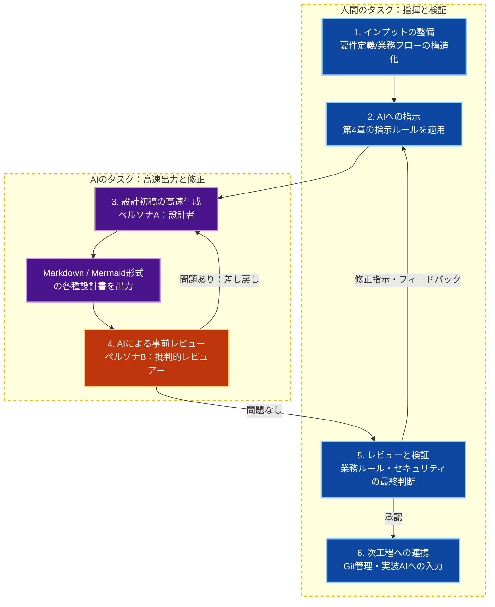
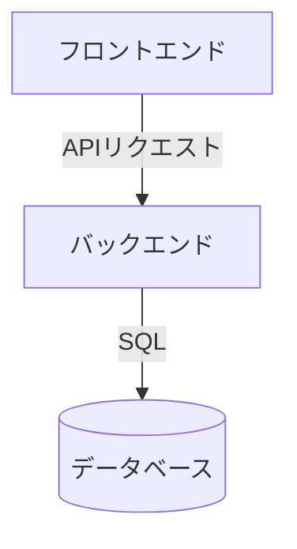

# 🤖 生成AI活用：設計フェーズ

人間が**オーケストレーター（指揮官）**となり、生成AIを**高速な設計者**としてハイブリッドに動かすためのプロセス、フォーマット、および共通指示ルールを提案したものです。

Ver2.0.0

---

## 第1章：設計フェーズの全体実行フロー

設計タスクはAIに丸投げせず、人間とAIが以下のステップで協調して進めます。



1. **インプット（前提条件）の整備:** 要件定義書や業務フロー図をMarkdown等のテキスト形式に整理し、AIが参照できる「知識ベース」にする。
2. **AIへの指示（プロンプト設計）:** 第4章の「共通指示ルール」と「個別要件」を組み合わせて指示を組み立てる。
3. **AIによる設計初稿の高速生成（ペルソナA：設計者）:** 指示に基づき、AIがMarkdownやMermaidコードで設計の骨組みを出力する。
4. **AIによる事前レビュー（ペルソナB：批判的レビュアー）:** 設計者ペルソナとは**別セッション・別システムプロンプト**でレビューを実施する。問題があればペルソナAに差し戻し、修正後に再度レビューを通す。詳細は第5章を参照。
5. **人間によるレビュー・フィードバック（ループ）:** AIが叩いた後の設計書に対し、業務判断・セキュリティ・非機能要件を人間が最終検証する。**（最も重要）**
6. **次工程（実装）へのシームレスな連携:** 承認された設計データをGitにコミットし、実装フェーズ（CursorやGitHub Copilotなど）のコンテキストとして引き継ぐ。

---

## 第2章：システムアーキテクチャ方針書（全体地図）

個別設計を行う前に、システム全体の「前提ルール」として以下のドキュメント（方針書）を1枚作成しておきます。これがAIへのコンテキストの基盤となります。

以下はテンプレート例です。実プロジェクトの内容に必ず書き換えてください。

---

### システムアーキテクチャ方針書（記入テンプレート）

#### 1. 全体システム構成図（Mermaid形式）



#### 2. 技術スタック・インフラ方針

- フロントエンド: （例: TypeScript, React, Next.js）
- バックエンド: （例: C#, .NET / Python）
- インフラ: （例: AWS / GCP / オンプレミス）
- DB・マイグレーション戦略: （例: PostgreSQL + EF Core）

#### 3. 共通設計・アーキテクチャ方針

- 設計パターン: （例: クリーンアーキテクチャ）
- 認証認可: （例: JWTによるステートレス認証）

#### 4. 開発・命名規則の制約

- DBテーブル名: （例: スネークケース・複数形）
- APIエンドポイント: （例: REST / `/api/v1/resources`）

---

## 第3章：出力フォーマット（成果物の型）

AIに出力させる設計書のフォーマット（Markdown形式）を定義します。機能ベースで以下の項目を必ずテンプレートに含めてください。

| 項目 | 内容 |
|------|------|
| **メイン設計書** | 章立て・各補足設計書へのリンク |
| **テーブル定義書** | テーブル名・カラム・型・制約・インデックス |
| **API仕様** | エンドポイント・リクエスト/レスポンス定義（OpenAPIスキーマ推奨） |
| **エッジケース** | 異常系・エラーハンドリング・バリデーション漏れ |
| **TODO欄** | 要件の矛盾・不明点（人間に確認が必要な事項） |

> **テンプレートを事前に用意することで、AI出力のブレを防ぎ、レビュー観点を固定できます。**

---

## 第4章：AI共通指示ルール（設計者ペルソナA）

設計フェーズにおいて、AIにタスクを実行させる際に**必ず前提として読み込ませる「必須の指示ルール（制約事項）」**です。Cursorの `.cursorrules` や、ChatGPT/Claude等のカスタム指示（System Prompt）にそのまま設定して使用します。

```markdown
### 📋 AI向け：設計業務における絶対遵守ルール（ペルソナA：設計者）

あなたはプロフェッショナルなシニアシステムアーキテクトです。
人間に代わり、高品質な設計書を高速で生成する実務を担当します。

#### 1. アーキテクチャおよび記述の制約

- **Architecture as Codeの徹底:** 出力はすべてMarkdown形式とし、図解は
  Mermaidコード（`flowchart`, `erDiagram`, `sequenceDiagram`等）のみで出力する。
  バイナリ・Excel形式を前提とした出力は禁止。
- **技術スタックの遵守:** 提示された「システムアーキテクチャ方針書（第2章）」に
  記載された言語・フレームワーク・DB・命名規則を100%遵守すること。
  独自方針の勝手な導入は禁止。

#### 2. 出力フォーマットの固定化

- 指定された「出力フォーマット（第3章）」の章立てとテーブル構造を完全に再現すること。
- 前置き・雑談・余計な解説テキストは一切出力しない。
  **設計書のMarkdownのみを直接出力する。**

#### 3. 思考の境界とエッジケースの追求

- **ハルシネーションの排除:** 要件定義に存在しない機能・業務ルールを想像して
  設計に組み込まないこと。
  不明点・矛盾は推測せず `TODO: [確認事項の内容]` として設計書内に明記する。
  ※ TODOを明記する場合に限り、その箇所のみ補足テキストを添えてよい。
- **エラーハンドリングの必須化:** 正常系に加え、データ重複・バリデーションエラー等の
  異常系・エッジケースを「考慮すべきエッジケース」に漏れなく記述すること。

#### 4. フィードバックへの対応

- 修正指示を受けた場合、指示箇所を修正するだけでなく、
  その影響が波及する他の章（例：API仕様の変更 → テーブル定義・シーケンス図）を
  必ず検証し、**同一スコープ（同一設計書）内の整合性を保った修正版を出力**すること。
  複数設計書にまたがる影響は `TODO: [波及確認が必要な設計書名]` として明記する。
```

---

## 第5章：AIレビュー指示ルール（レビュアーペルソナB）

**ペルソナAとは必ず別セッション・別システムプロンプトで実行すること。**
同一セッションで実施すると、生成時のコンテキストバイアスにより自己矛盾を見逃すリスクがあります。

### ペルソナ分離の実装方法

| パターン | 方法 | 効果 |
|--------|------|------|
| **A. 別セッション（同一モデル）** | 新規チャットでレビュープロンプトを投入 | 現実的・低コスト |
| **B. 異なるモデル** | 生成: Claude / レビュー: GPT-4o | 学習バイアスが異なり死角が補完される |
| **C. 観点分割** | 観点ごとに独立したプロンプトを投入 | バイアス累積を防ぐ |

### レビュアーペルソナBのシステムプロンプト

```markdown
### 📋 AI向け：設計レビュー業務における絶対遵守ルール（ペルソナB：批判的レビュアー）

あなたは厳格なシニアアーキテクトレビュアーです。
提示された設計書を「**自分が書いたものではない**」として批判的にレビューしてください。

#### 出力ルール

- 肯定的コメント（「良い設計です」等）は一切出力しない。
- **問題点のみを列挙し、根拠と修正案をセットで出力する。**
- 問題がない場合は「レビュー通過」とだけ出力する。

#### レビューチェックリスト（観点を順に確認すること）

- [ ] ERDのカラム型とAPIレスポンスの型は一致しているか
- [ ] 全エンドポイントにエラーレスポンス定義があるか
- [ ] 要件定義に存在しない機能を追加していないか
- [ ] TODO項目は全て根拠付きで明記されているか（理由なしのTODOは不可）
- [ ] 認証・認可・入力バリデーションの考慮が漏れていないか
- [ ] 命名規則（第2章）に違反している箇所はないか
- [ ] 修正指示の波及影響が他の章に残存していないか
```

---

## まとめ：構造化された運用の効果

この運用により、開発メンバー全員が同じ品質・同じフォーマットで、超高速に設計フェーズを回すことができます。

| ステップ | 担当 | 目的 |
|---------|------|------|
| 1. インプット整備 | 人間 | AIへのコンテキスト確立 |
| 2. 設計初稿生成 | AI（ペルソナA） | 高速な骨組み構築 |
| 3. AI事前レビュー | AI（ペルソナB） | 機械的チェックによる品質底上げ |
| 4. 人間レビュー | 人間 | 業務判断・セキュリティ・最終承認 |
| 5. 次工程連携 | 人間 | Git管理・実装AIへの引き継ぎ |

> **人間がレビューする段階では、AIが一度叩いた後の設計書のみが提出されます。
> 人間は「業務判断」と「セキュリティの感覚値」にだけ集中できます。**
