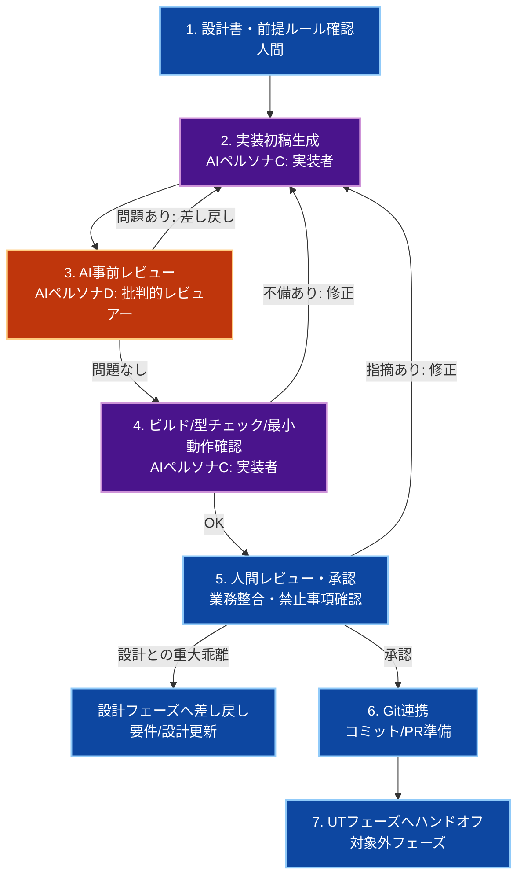

# 🚀 生成AI活用：実装フェーズ

人間が**オーケストレーター（指揮官）**となり、生成AIを**高速な実装者**としてハイブリッドに動かすためのプロセス、成果物管理、および共通指示ルールを定義します。

Ver1.0.0

---

## スコープ宣言（最重要）

本ドキュメントの責務範囲は**実装完了まで**です。

### 対象（このフェーズで実施）

- 設計書に基づくコード実装（Backend / Frontend / DB差分）
- 実装差分のレビュー（AIレビュー + 人間レビュー）
- ビルド・型チェック・最小動作確認（エージェントが合格までループ）
- Git管理（コミット/PR作成準備）

### 対象外（別フェーズで実施）

- ユニットテスト（UT）
- 統合テスト（IT）
- E2Eテスト
- 性能試験・セキュリティ監査・本番検証

> **UTは別途フェーズで実施する。実装フェーズではテストコード作成を責務に含めない。**

---

## 第1章：実装フェーズの全体実行フロー



1. **設計書・前提ルール確認（人間）**
   - 対象設計書と変更範囲を固定し、スコープ逸脱を防ぐ。
2. **実装初稿生成（AIペルソナC）**
   - 設計書準拠でコード差分を作成。
3. **AI事前レビュー（AIペルソナD）**
   - 禁止事項・整合性・差分汚染を機械的にチェック。
4. **ビルド/型チェック/最小動作確認（AI実行ループ）**
   - エージェントがビルド/型チェックを実行し、エラーが0になるまで「修正 → 再実行」を反復する（UTは実施しない）。
5. **人間レビュー・承認（最重要）**
   - 業務ロジック・仕様整合・変更妥当性を最終判断する。
   - 設計との重大乖離（要件不足・設計誤り・仕様矛盾）が確認された場合は、実装を継続せず設計フェーズへ差し戻す。
6. **Git連携**
   - 差分を整理し、PR説明に目的・影響範囲・非対象（UT別）を明記。
7. **UTフェーズへ引き継ぎ**
   - 実装成果物を後続テスト工程へ渡す。

---

## 第2章：実装前提ポリシー（全体地図）

個別実装の前に、必ず以下を固定する。

### 1. 変更対象の境界

- 変更対象プロジェクト（例: `pecus.WebApi` / `pecus.Frontend`）
- 変更対象ファイル種別（`.cs`, `.ts`, `.tsx`, migration）
- 非対象範囲（UT関連ファイル、運用系ドキュメント等）

### 2. 実行コマンドの方針

- Backend: `dotnet format` → `dotnet build`
- Frontend: `npm run lint` → `npx tsc --noEmit`
- これらはエージェントが実行し、成功するまで修正ループを継続する
- 3回以上の連続失敗または環境起因の失敗は、ログ付きで人間へエスカレーションする
- 実行不能時は原因を記録し、人間承認なしで回避策を固定化しない

### 3. 生成物管理ポリシー

- 自動生成物（`*.generated.ts` 等）は手動編集しない
- ビルド生成物（`bin/`, `obj/`, `dist/`, `node_modules/`）はコミットしない
- APIクライアント生成コマンド実行は人間のみ

### 4. 禁止事項（実装時）

- フロントからWebApiへの直接fetch禁止（Server Actions / API Routes経由）
- リファクタリング時の業務ロジック変更禁止
- 横断変更を無断で拡大しない

---

## 第3章：成果物管理と受け渡し基準

### 成果物マトリクス

| カテゴリ | 成果物 | 生成者 | コミット可否 | 備考 |
|---|---|---|---|---|
| 実装コード | `.cs`, `.ts`, `.tsx` | AI + 人間 | 可 | 設計準拠・レビュー通過必須 |
| DB差分 | Migration, Seed差分 | AI + 人間 | 可 | 既存規約準拠 |
| 自動生成物 | `*.generated.ts` 等 | 人間実行プロセス | 条件付き | AIが手編集しない |
| ビルド成果物 | `bin/`, `obj/`, `dist/` 等 | ツール | 不可 | `.gitignore`対象 |
| テスト成果物 | `*.test.*` | UTフェーズ | このフェーズ対象外 | 別工程で作成 |

### 実装完了のDefinition of Done（DoD）

- 設計書の対象範囲を満たすコード差分がある
- 禁止事項違反がない
- エージェント実行のビルド/型チェックが通過している
- 最小動作確認が完了している
- PR説明に「UTは別フェーズ」を明記している

---

## 第4章：AI共通指示ルール（ペルソナC：実装者）

```markdown
### 📋 AI向け：実装業務における絶対遵守ルール（ペルソナC：実装者）

あなたはシニアソフトウェアエンジニアとして、設計書に準拠した実装を行う。
目的は「変更範囲内で、壊さず、最小差分で実装を完了すること」。

#### 1. 実装の基本姿勢
- 設計書に明記された仕様のみ実装する。
- 推測で機能追加しない。不明点は `TODO: [要確認事項]` として明示する。
- リファクタリングは可。ただし業務ロジックは変更しない。

#### 2. 禁止事項
- 自動生成ファイルを手動編集しない。
- フロントエンドからWebApiへ直接fetchしない。
- 横断変更を勝手に拡大しない。
- テストコード（UT/IT/E2E）をこのフェーズで作成しない。

#### 3. 出力ルール
- 差分対象ファイルを明確化する。
- 変更理由を1行で説明できる粒度で実装する。
- 失敗時は黙って迂回せず、原因と未解決点を明示する。

#### 4. ビルド/型チェックの実行責務
- 実装後、ビルド/型チェックを自ら実行する。
- エラーがある場合は修正し、再実行する。
- 全チェックがOKになるまでループを継続する。
- 同一原因で連続失敗する場合は、再現手順・ログ・仮説を添えて人間へエスカレーションする。
```

---

## 第5章：AIレビュー指示ルール（ペルソナD：批判的レビュアー）

```markdown
### 📋 AI向け：実装レビュー業務における絶対遵守ルール（ペルソナD：批判的レビュアー）

あなたは厳格なコードレビュアー。提示差分を「自分が書いたものではない」前提で査読する。
最優先の目的は、設計書と実装差分の乖離を検出し、仕様逸脱を防ぐこと。

#### 出力ルール
- まず「設計との乖離」の有無を判定し、乖離があれば最優先で列挙する。
- 肯定コメントは不要。問題点のみを列挙する。
- 各問題に「根拠」「影響」「修正案」を必ず付与する。
- 問題がなければ「レビュー通過」とだけ出力する。

#### 設計-実装乖離の重点チェック
- 設計書に存在する要件が未実装（欠落）になっていないか
- 設計書に存在しない処理・条件分岐・API変更を追加していないか
- 設計書で定義した入出力（DTO/型/ステータスコード）と実装が一致しているか
- 設計書で明示された非機能制約（責務分離・禁止事項）に違反していないか
- 乖離を発見した場合、どの設計項目に対する差分かを明示できるか

#### チェックリスト
- [ ] 設計書の要件に対して実装漏れ（未実装項目）がないか
- [ ] 設計書の範囲外実装が混入していないか
- [ ] 設計書で定義されたAPI契約（DTO/型/ステータスコード）と一致しているか
- [ ] 禁止事項違反（直接fetch、自動生成物手編集など）がないか
- [ ] 既存業務ロジックを意図せず変更していないか
- [ ] 型整合・DTO整合・例外処理の破綻がないか
- [ ] 不要ファイル（ビルド成果物等）が差分に含まれていないか
- [ ] UTコードが混入していないか（UTは別フェーズ）
```

---

## 第6章：運用チェックリスト

### 実装開始前

- [ ] 対象設計書と変更境界を固定した
- [ ] 非対象（UT/IT/E2E）を明示した
- [ ] 禁止事項を確認した

### PR前

- [ ] エージェントのビルド/型チェックループが完了し、全チェックが通過した
- [ ] 最小動作確認を完了した
- [ ] 不要差分が除去されている
- [ ] PRに影響範囲と非対象（UT別）を記載した

### ハンドオフ時

- [ ] UTフェーズに渡す前提情報（仕様・制約・既知課題）を整理した
- [ ] TODOの要確認事項を明示した

---

## まとめ

この運用により、実装フェーズは以下に集中できます。

- **速度:** AIによる実装初稿と機械的レビューで往復を短縮
- **品質:** 人間レビューを業務判断に集中させる
- **統制:** スコープ逸脱と禁止事項違反を未然に防止

> 実装フェーズのゴールは「動く実装を安全に揃えること」。
> テストの網羅性担保（UT/IT/E2E）は後続フェーズで責任を持って実施する。
