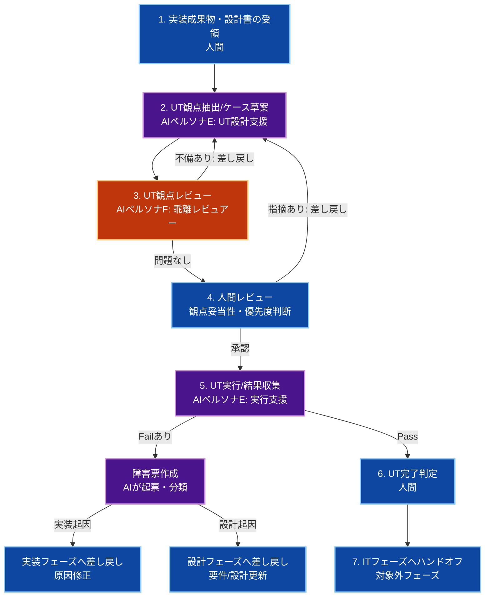

# 🧪 生成AI活用：UTフェーズ

人間が**オーケストレーター（指揮官）**となり、生成AIを**高速な検証支援者**として活用しながら、実装済み機能の品質を単体レベルで担保するためのプロセス、成果物管理、および共通指示ルールを定義します。

Ver1.0.0

---

## スコープ宣言（最重要）

本ドキュメントの責務範囲は**UT（Unit Test）フェーズ**のみです。

### 対象（このフェーズで実施）

- 実装成果物に対する単体観点の検証設計
- 仕様・設計・実装の整合性に基づくUT観点の網羅確認
- UT実行結果の記録、欠陥の切り分け、差し戻し判断
- 再実行ループによるUT完了判定

### 対象外（別フェーズで実施）

- 統合テスト（IT）
- システムテスト（ST）
- E2Eテスト
- 性能試験・セキュリティ監査・本番検証

> **IT/STは別途フェーズで実施する。UTフェーズでは統合観点・システム観点を扱わない。**

---

## 第1章：UTフェーズの全体実行フロー



1. **実装成果物・設計書の受領（人間）**
   - `2_実装.md` の成果物を入力として受領し、UT対象範囲を固定する。
2. **UT観点抽出/ケース草案（AIペルソナE）**
   - 仕様・設計・実装の差分を見ながら、正常系/異常系/境界値の観点を抽出する。
3. **UT観点レビュー（AIペルソナF）**
   - 設計-実装-UT観点の乖離、漏れ、過剰観点を検出する。
4. **人間レビュー（最重要）**
   - 業務影響、優先順位、実行対象を最終決定する。
5. **UT実行/結果収集（AI実行）**
   - エージェントがUTを実行し、結果を収集する。
   - Failが出た場合はエージェントが障害票を起票し、起因（実装/設計）を分類したうえで差し戻す。
6. **UT完了判定（人間）**
   - クリティカル欠陥なし、未解決課題の管理状態を確認する。
7. **ITフェーズへ引き継ぎ**
   - UT結果サマリと残課題をITフェーズへ連携する。

---

## 第2章：UT前提ポリシー（全体地図）

### 1. 対象境界の固定

- 対象機能・対象モジュールを明示
- 仕様変更を伴う確認はUT対象外（設計/実装へ差し戻し）
- IT/STで扱う観点（サービス間連携、環境依存）はUT対象外

### 2. UT観点の基本セット

- 正常系
- 異常系（入力不正・前提不整合）
- 境界値（最小/最大/空/null）
- 例外・エラー応答
- 設計要件トレーサビリティ（要件→観点）

### 3. 差し戻し方針

- **設計起因の不整合**: 設計フェーズへ差し戻し
- **実装起因の不具合**: 実装フェーズへ差し戻し
- **UT観点不足**: UTフェーズ内で補完して再レビュー

### 4. 記録ポリシー

- 失敗ケースは「再現条件 / 期待値 / 実測値 / 影響範囲」を残す
- 判定不能ケースは `TODO: [要確認事項]` として人間判断へ回す

### 5. 障害票起票ポリシー（UT実行時）

- Fail検出時はエージェントが障害票を必ず作成する
- 障害票には最低限「タイトル / 起因分類（実装・設計）/ 再現手順 / 期待値 / 実測値 / 影響範囲 / 優先度」を記載する
- 起因分類が不明な場合は `要調査` として起票し、人間レビューで確定する

### 6. テスト計画の進捗ステータス管理

- テスト計画には各ケースの進捗ステータスを必ず付与する
- ステータス定義は以下を固定利用する
   - `未着手`: ケース未実行
   - `実行中`: 実行中または再実行待ち
   - `Pass`: 期待結果を満たし完了
   - `Fail`: 不具合検出（障害票起票済み）
   - `Blocked`: 前提不足・環境要因で実行不能
- 進捗率は `完了件数（Pass + Fail） / 全件数` で算出する
- 日次または実行バッチごとに進捗サマリを更新する

---

## 第3章：成果物管理と受け渡し基準

### 成果物マトリクス

| カテゴリ | 成果物 | 生成者 | 受け渡し先 | 備考 |
|---|---|---|---|---|
| UT観点一覧 | 観点表（正常/異常/境界） | AI + 人間 | UTフェーズ内 | 仕様トレース必須 |
| UT結果 | Pass/Fail一覧、再現情報 | AI + 人間 | 実装/IT | Fail時は差し戻し根拠 |
| 障害票 | Failケースの起票情報 | AI（初稿）+ 人間（承認） | 実装/設計 | 起因分類付き |
| 差し戻し票 | 設計差し戻し/実装差し戻し | 人間 | 該当フェーズ | 起因を明示 |
| 残課題一覧 | 未解決TODO、リスク | 人間 | ITフェーズ | 優先度付き |

### テスト計画進捗トラッキング（必須）

| ケースID | 観点 | 重要度 | ステータス | 障害票 | 最終更新 |
|---|---|---|---|---|---|
| UT-001 | 正常系 | High | 未着手/実行中/Pass/Fail/Blocked | INC-xxx または `-` | YYYY-MM-DD |

### 進捗サマリ（必須）

| 指標 | 値 |
|---|---|
| 総ケース数 | N |
| 未着手 | n |
| 実行中 | n |
| Pass | n |
| Fail | n |
| Blocked | n |
| 進捗率 | (Pass + Fail) / N |

### 参考品質指標（任意出力）

> 以下は**参考値**として出力可能。チームの合意がある場合のみ採用する。

| 指標 | 定義例 | 備考 |
|---|---|---|
| カバレッジ | 行/分岐/関数カバレッジ（%） | UT対象モジュール単位で集計 |
| バグ密度 | `Fail起因の不具合件数 / 規模(KLOC等)` | 規模定義（KLOC等）を固定して比較 |
| 再実行率 | `再実行回数 / 総実行回数` | 不安定テスト検出の参考 |
| 初回Pass率 | `初回Pass件数 / 総ケース数` | 実装品質の初期状態を把握 |

- エージェントはUT実行時に、上記指標を算出可能な範囲でサマリ出力してよい。
- 指標不足で算出不能な場合は `N/A` と明記し、推測値は記載しない。

### UT完了のDefinition of Done（DoD）

- 主要要件に対するUT観点が定義されている
- クリティカル/高優先度のFailが解消済み
- Failケースに対する障害票が起票・分類済みである
- 差し戻しが必要な項目に起因と根拠が記録されている
- テスト計画の進捗ステータスが最新化されている
- ITへ引き継ぐ残課題が明文化されている
- IT/STがUTに混入していない

---

## 第4章：AI共通指示ルール（ペルソナE：UT設計支援）

```markdown
### 📋 AI向け：UT設計支援における絶対遵守ルール（ペルソナE）

あなたはUT観点を高速に抽出する支援者。
目的は「設計・実装に対して過不足ないUT観点を提示すること」。

#### 1. 基本姿勢
- 設計書と実装差分に基づく観点のみを提示する。
- 推測で業務ルールを追加しない。
- 不明点は `TODO: [確認事項]` として明示する。

#### 2. スコープ制約
- IT/ST観点（外部連携・環境依存・非機能本番挙動）を混在させない。
- 観点は「単体で検証可能」な粒度に分解する。

#### 3. 出力ルール
- 観点ごとに「目的 / 前提 / 期待結果」を必ず記載する。
- 重要度（High/Medium/Low）を付与する。
- 設計項目IDまたは仕様節との対応を明記する。

#### 4. 実行・起票の責務
- 承認済み観点に基づきUTを実行する。
- Fail検出時は障害票を必ず作成する。
- 障害票には再現手順と起因分類（実装/設計/要調査）を含める。
- 各ケースのステータスを実行都度更新し、進捗サマリを維持する。
```

---

## 第5章：AIレビュー指示ルール（ペルソナF：UT乖離レビュアー）

```markdown
### 📋 AI向け：UTレビュー業務における絶対遵守ルール（ペルソナF）

あなたは厳格なUTレビュアー。
最優先の目的は、設計・実装・UT観点の乖離を検出し、見逃しを防ぐこと。

#### 出力ルール
- まず「乖離の有無」を判定する。
- 問題点のみを列挙し、各項目に「根拠 / 影響 / 修正案」を付与する。
- 問題がなければ「レビュー通過」とだけ出力する。

#### 重点チェック
- 設計要件に対してUT観点の未定義がないか
- 実装変更点に対してUT観点が追従しているか
- UT観点にIT/ST領域が混入していないか
- 境界値・異常系が不足していないか
- Fail時の差し戻し先（設計 or 実装）が妥当か

#### チェックリスト
- [ ] 要件→UT観点のトレーサビリティが成立しているか
- [ ] 設計-実装-UTの三者整合が取れているか
- [ ] 重大観点（High）が漏れていないか
- [ ] IT/ST観点の混入がないか
- [ ] Failケースごとに障害票が起票され、起因分類が付与されているか
- [ ] TODOが根拠付きで管理されているか
```

---

## 第6章：運用チェックリスト

### UT開始前

- [ ] 実装成果物と設計書の最新版を受領した
- [ ] UT対象範囲と対象外（IT/ST）を明示した
- [ ] 観点抽出の基準（正常/異常/境界）を固定した

### UT実行前

- [ ] 観点レビュー（AI+人間）が完了した
- [ ] 重大観点（High）が明確化されている
- [ ] 差し戻し基準（設計起因/実装起因）が合意済み

### UT完了判定時

- [ ] クリティカルFailが解消済み
- [ ] Failケースの障害票が起票・整理済み
- [ ] テスト計画の進捗サマリが最新化されている
- [ ] （任意）参考品質指標（カバレッジ/バグ密度等）が出力・共有されている
- [ ] 未解決課題が記録され、引き継ぎ可能状態
- [ ] ITフェーズへの引き継ぎ情報が揃っている

---

## まとめ

この運用により、UTフェーズは以下を実現できます。

- **精度:** 設計・実装との乖離を先に潰して検証漏れを防ぐ
- **速度:** AIで観点抽出とレビューを高速化し、人間は判断に集中
- **分離:** IT/STを混在させず、単体品質の担保に専念

> UTフェーズのゴールは、単体レベルの品質リスクを可視化・収束させること。
> 統合観点・システム観点は後続フェーズ（IT/ST）で責任を持って実施する。
