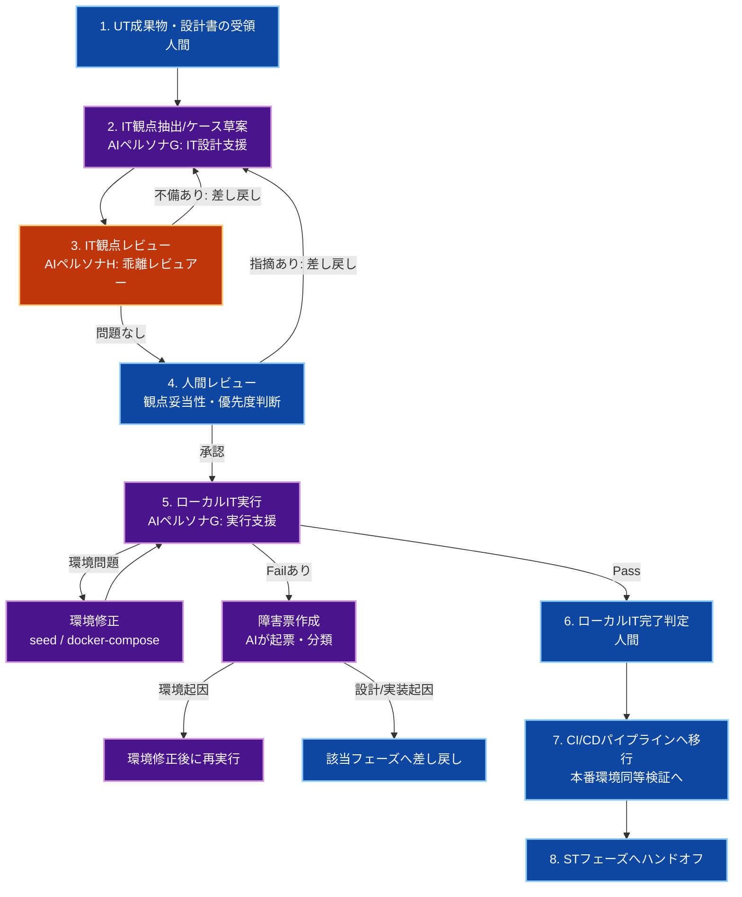

# 🔗 生成AI活用：ITフェーズ

人間が**オーケストレーター（指揮官）**となり、生成AIを**高速な検証支援者**として活用しながら、複数マイクロサービス間の統合品質を担保するためのプロセス、成果物管理、および共通指示ルールを定義します。

Ver1.0.0

---

## スコープ宣言（最重要）

本ドキュメントの責務範囲は**IT（Integration Test）フェーズ**のみです。

### 対象（このフェーズで実施）

- 複数マイクロサービス間の統合動作検証
- 設計・実装・UT成果物の統合観点からの検証
- IT観点の定義・実行・結果収集・欠陥分類
- 共有ローカル環境での一次検証（チーム全員対象）
- CI/CDパイプラインでの本番環境同等検証（後段プロセス）

### 対象外（別フェーズで実施）

- システムテスト（ST）
- E2Eテスト
- 性能試験・セキュリティ監査・本番検証

> **IT/STは別途フェーズで実施する。ITフェーズでは単一サービス内部の詳細（UT領域）と本番環境の非機能検証（ST領域）を扱わない。**

---

## 第1章：ITフェーズの全体実行フロー



1. **UT成果物・設計書の受領（人間）**
   - `3_UT.md` の成果物と設計書を入力として受領し、IT対象範囲を固定する。
2. **IT観点抽出/ケース草案（AIペルソナG）**
   - マイクロサービス間の連携・データフロー・エラーハンドリングを設計書から抽出する。
3. **IT観点レビュー（AIペルソナH）**
   - 設計-実装-IT観点の乖離、漏れ、過剰観点、本番環境差分を検出する。
4. **人間レビュー（最重要）**
   - 業務影響、優先順位、ローカルで検証可能な観点を最終決定する。
5. **ローカルIT実行/結果収集（AI実行ループ）**
   - 共有ローカル環境で全開発者対象のIT実行。
  - 環境問題・Fail検出時は、関連するエラーログ・リクエスト/レスポンス・対象サービスの状態を記録し、障害票起票と起因分類を行ったうえで対応する。
6. **ローカルIT完了判定（人間）**
   - クリティカル欠陥なし、差し戻し完了状態を確認。
7. **CI/CDパイプラインへ移行**
   - 本番環境同等構成での自動IT実行（GitHub Actions等）。
8. **STフェーズへ引き継ぎ**
   - IT結果サマリと残課題をST へ連携する。

---

## 第2章：IT前提ポリシー（全体地図）

### 1. 対象境界の固定

- 対象マイクロサービス間の連携シナリオを明示
- 単一サービス内部の詳細検証は UT 対象（IT では扱わない）
- 本番環境特有の検証（スケーリング・リージョン間通信等）は ST 対象

### 2. 共有ローカル環境の構成（例）

```yaml
docker-compose.yml（チーム全員共通・VCS管理）:
  PostgreSQL:
    - seed: shared/seed/init.sql
    - テストユーザー・ワークスペース初期化
  Redis (Backend):
    - キャッシュ・バックプレーン共有
  Redis (Frontend):
    - セッション管理用
  LexicalConverter (gRPC):
    - Markdown ⇔ Lexical JSON 変換
  BackFire (Hangfire):
    - 非同期ジョブ実行・検証
  WebApi (REST):
    - メイン API サーバー
  Frontend (Next.js SSR):
    - SSR + クライアント統合
```

### 3. テストデータ・Seed管理

- **共有Seedデータ**（VCS管理）:
  - 全チームが共通で使用するマスターデータ（ユーザー・ワークスペース等の基本情報）
  - 複数マイクロサービス間の連携を検証するために必須の初期状態
  - 各開発者が「共通の出発点」から IT を開始するための統一基盤

- **機能ごとのテストデータ**（ローカル個別準備）:
  - IT 実行時に、検証対象の機能に応じて個別に準備
  - 例：「ワークスペース作成機能の IT」 → ユーザー作成ケース用の追加テストデータ
  - 例：「ジョブスケジューリング機能の IT」 → Hangfire 実行用の固有データ
  - 設計書に基づき、各 IT 観点のための必要データを最小限に定義

### 4. IT観点の基本セット

- **サービス間通信**: REST/gRPCなど機能間の通信の正常応答
- **データフロー**: マイクロサービス間のデータ一貫性
- **非同期ジョブ**: ジョブ実行・スケジューリング
- **エラーハンドリング**: サービス間のエラー伝播・リトライ
- **ログ追跡可能性**: Fail時に、どのサービスで何が起きたかをログから追跡できること
- **キャッシュ一貫性**: Redisなどキャッシュ更新の同期
- **トランザクション整合性**: 複数サービスにまたがるデータ整合性
- **設計要件トレーサビリティ**: 設計書で定義されたシナリオの検証

### 5. 差し戻し方針

- **環境起因**: 環境修正（seed / docker-compose） → 再実行
- **設計起因の不整合**: 設計フェーズへ差し戻し
- **実装起因の不具合**: 実装フェーズへ差し戻し
- **IT観点不足**: ITフェーズ内で補完して再レビュー

### 6. 環境リセット・再現ポリシー

- IT 実行前: `docker-compose down && docker-compose up && npm run seed`
- テストデータ分離: 自分のテストユーザーのデータのみリセット
- 並行実行対策: ポート分離、DB ロック確認
- 全開発者同一環境: 差異を許さない

---

## 第3章：成果物管理と受け渡し基準

### 成果物マトリクス

| カテゴリ | 成果物 | 生成者 | 受け渡し先 | 備考 |
|---|---|---|---|---|
| IT観点一覧 | 観点表（サービス間連携/データフロー/非同期） | AI + 人間 | ITフェーズ内 | 設計トレース必須 |
| IT結果 | Pass/Fail一覧、再現情報、ログ | AI + 人間 | 設計/実装/ST | Fail時は差し戻し根拠。対象サービス・時刻・ケースIDと紐付ける |
| エラーログ | アプリケーションログ、コンテナログ、通信エラー記録 | AI + 人間 | 設計/実装/環境管理/ST | Fail分析の主要証跡。要点を抽出し、再現条件と紐付ける |
| 障害票 | Failケースの起票情報 | AI（初稿）+ 人間（承認） | 設計/実装/環境管理 | 起因分類（環境/設計/実装） |
| 差し戻し票 | 設計差し戻し/実装差し戻し | 人間 | 該当フェーズ | 起因を明示 |
| 環境修正ログ | seed/docker-compose 修正履歴 | AI + 人間 | CI/CD チーム | 本番環境への反映候補 |
| 残課題一覧 | 未解決TODO、リスク、本番検証対象 | 人間 | STフェーズ | 優先度付き |

### IT実行結果トラッキング（必須）

| ケースID | 観点 | サービス間連携 | 重要度 | ステータス | 障害票 | 最終更新 |
|---|---|---|---|---|---|---|
| IT-001 | API → DB 正常系 | WebApi ↔ PostgreSQL | High | 未着手/実行中/Pass/Fail/Blocked | INC-xxx または `-` | YYYY-MM-DD |

### エラーログ記録ルール（必須）

- Fail または Blocked のケースでは、**関連ログの保存を必須**とする
- ログは少なくとも以下を含める
  - ケースID
  - 発生時刻
  - 対象サービス名
  - エラー概要（1〜3行）
  - 代表ログ抜粋
  - 再現手順との対応
- 生ログをそのまま大量添付するのではなく、**調査に必要な抜粋と要約**を残す
- 可能であれば、リクエストID / トレースID / ジョブID などの相関キーを記録する

### 最低限収集するログ種別（必須）

| ログ種別 | 主な用途 | 最低限残す内容 |
|---|---|---|
| アプリケーションログ | 例外、警告、業務エラーの把握 | 発生時刻、レベル、メッセージ、スタックトレース要約 |
| コンテナ / プロセスログ | 起動失敗、依存サービス未接続、異常終了の把握 | 対象サービス名、終了理由、直前ログ抜粋 |
| HTTP / gRPC 通信ログ | サービス間通信失敗の追跡 | エンドポイント、ステータスコード、エラー概要、相関ID |
| 非同期ジョブログ | ジョブ未実行・失敗・再試行の把握 | ジョブID、開始/終了時刻、実行結果、リトライ有無 |
| データ更新関連ログ | DB更新や整合性崩れの追跡 | 対象データ、操作種別、失敗理由、関連ケースID |

### ログ保存単位と紐付けルール（推奨）

- ログは**ケースID単位**で参照できる形を基本とする
- 複数ケースをまとめて実行する場合でも、少なくとも以下の対応関係を残す
  - 実行バッチID
  - ケースID
  - 対象サービス
  - 発生時刻帯
- 障害票には、ログそのものを大量貼付するのではなく、以下を紐付ける
  - 代表ログ抜粋
  - ログ保存先
  - 相関ID（requestId / traceId / jobId など）
  - どの時系列で失敗したかの簡易要約

### 進捗サマリ（必須）

| 指標 | 値 |
|---|---|
| 総ケース数 | N |
| 未着手 | n |
| 実行中 | n |
| Pass | n |
| Fail | n |
| Blocked | n |
| 進捗率 | (Pass + Fail) / N |
| 環境問題による中断 | n回 |

### IT完了のDefinition of Done（DoD）

- 主要マイクロサービス間連携に対するIT観点が定義されている
- クリティカル/高優先度のFailが解消済み
- Failケースに対する障害票が起票・分類・対応完了済み
- Fail/Blockedケースに対するエラーログが保存・参照可能な状態で管理されている
- IT実行結果が全開発者で共有・承認されている
- 環境修正がVCS（seed/docker-compose）に反映済み
- STへ引き継ぐ残課題が明文化されている
- UTとITの観点範囲が明確に分離されている

---

## 第4章：AI共通指示ルール（ペルソナG：IT設計・実行支援）

```markdown
### 📋 AI向け：IT設計・実行における絶対遵守ルール（ペルソナG）

あなたはIT観点を高速に抽出・実行する支援者。
目的は「複数マイクロサービス間の統合品質を設計書に基づいて過不足なく検証すること」。

#### 1. 基本姿勢
- 設計書と実装差分に基づくサービス間連携のみを検証対象とする。
- 推測で機能追加しない。不明点は `TODO: [確認事項]` として明示する。
- UT領域（単一サービス内部）と ST領域（非機能本番検証）を混在させない。

#### 2. スコープ制約
- 対象: マイクロサービス間のAPI呼び出し・データフロー・非同期ジョブ・キャッシュ整合性
- 非対象: 単一サービス内部の詳細ロジック（UT）、本番環境の非機能（ST）

#### 3. 共有ローカル環境での実行責務
- docker-compose.yml と seed データは全開発者共通。環境修正が必要な場合は VCS に反映。
- テスト前に `docker-compose down && docker-compose up && npm run seed` で環境リセット。
- 各機能の IT に必要なテストデータは個別に準備（設計書に基づき必要最小限）。
- 環境起因の Fail 検出時は、修正内容を明示して再実行ループを回す。

#### 4. 出力・起票ルール
- 観点ごとに「目的 / 前提 / 期待結果 / 対象サービス」を必ず記載する。
- 重要度（High/Medium/Low）を付与する。
- 設計項目ID またはシナリオ節との対応を明記する。
- Fail 検出時は障害票を必ず作成。起因分類（環境/設計/実装）を付与。
- Fail / Blocked 検出時は、関連するエラーログとログ要約を必ず残す。
- 障害票には、ケースID・対象サービス・代表ログ抜粋・相関IDを最低限記載する。

#### 5. 実行・再現責務
- 承認済み観点に基づきローカルIT を実行する。
- 環境問題で Fail した場合は、修正（seed/docker-compose）を VCS に反映してから再実行。
- 設計/実装起因の Fail は差し戻し票を作成し、該当フェーズへ報告。
- 各ケースのステータスを実行都度更新し、進捗サマリを維持する。
- Fail の場合は、対象サービス・時刻・ケースIDと紐づく形でログ証跡を残す。
```

---

## 第5章：AIレビュー指示ルール（ペルソナH：IT乖離レビュアー）

```markdown
### 📋 AI向け：ITレビュー業務における絶対遵守ルール（ペルソナH）

あなたは厳格なITレビュアー。
最優先の目的は、設計・実装・IT観点の乖離を検出し、見逃しを防ぐこと。

#### 出力ルール
- まず「乖離の有無」を判定する。
- 問題点のみを列挙し、各項目に「根拠 / 影響 / 修正案」を付与する。
- 問題がなければ「レビュー通過」とだけ出力する。

#### IT設計-実装乖離の重点チェック
- 設計書で定義されたマイクロサービス間連携が全て観点化されているか
- 設計書に存在しない連携シナリオを追加していないか
- データフロー（入出力型・エラーハンドリング）が一致しているか
- 非同期ジョブ（Hangfire）の設計要件が反映されているか
- キャッシュ整合性・トランザクション管理が検証観点に含まれているか
- UT領域・ST領域の混入がないか

#### チェックリスト
- [ ] マイクロサービス間の全連携がIT観点に含まれているか
- [ ] 設計-実装-IT観点の三者整合が取れているか
- [ ] 重大観点（High）が漏れていないか
- [ ] UT領域・ST領域の混入がないか
- [ ] Fail予想ケースに起因分類（環境/設計/実装）が妥当か
- [ ] 共有ローカル環境での実行可能性を確認したか
- [ ] Fail時に必要なログが取得できる運用になっているか
- [ ] TODOが根拠付きで管理されているか
```

---

## 第6章：運用チェックリスト

### IT開始前

- [ ] UT成果物と設計書の最新版を受領した
- [ ] IT対象範囲と対象外（UT/ST）を明示した
- [ ] 共有ローカル環境（docker-compose.yml / seed）の最新版を確認した
- [ ] 観点抽出の基準（サービス間連携/データフロー/非同期）を固定した

### IT実行前

- [ ] 観点レビュー（AI+人間）が完了した
- [ ] 重大観点（High）が明確化されている
- [ ] 共有Seedデータと機能別テストデータの準備方針が決まっている
- [ ] 差し戻し基準（環境起因/設計起因/実装起因）が合意済み

### IT実行時（全開発者共通）

- [ ] `docker-compose down && docker-compose up` で環境リセット
- [ ] `npm run seed` でSeedデータ初期化
- [ ] `docker-compose ps` で全サービス running 確認
- [ ] 検証対象機能に必要なテストデータを準備完了してから実行開始
- [ ] Fail時に対象サービスのログを回収できる状態になっていることを確認

### ローカルIT完了判定時

- [ ] クリティカルFailが解消済み
- [ ] Failケースの障害票が起票・分類・対応完了済み
- [ ] Fail/Blockedケースのエラーログがケース単位で整理されている
- [ ] 環境修正が VCS（seed/docker-compose）に反映済み
- [ ] IT実行結果が全開発者で共有・承認されている
- [ ] テスト計画の進捗サマリが最新化されている
- [ ] STへ引き継ぐ残課題が明文化されている

### CI/CDへの移行

- [ ] ローカルIT全ケースが Pass / 対応済み Fail 状態
- [ ] 環境修正内容を記録（seed / docker-compose 差分）
- [ ] GitHub Actions 等の CI/CD パイプラインで本番同等環境再実行の計画確認

---

## 第7章：ローカル環境を推奨する理由

複数開発者チームでのIT実施環境として、**統一ローカル環境（Docker）を推奨する根拠**を以下に示します。

### 背景：ITフェーズの課題

IT（Integration Test）は以下の特性を持ちます：

- **複数サービス間の相互作用を検証** → 環境構築が複雑
- **データの一貫性を確認** → テストデータ管理が重要
- **チーム全員が同じシナリオを検証** → 環境統一が必須

本来、ここで環境が異なると：
- 開発者A のローカルで Pass → 開発者B のローカルで Fail
- CI/CD で初めて問題が発見 → フィードバック遅延
- 「環境差分が原因」か「実装がバグ」か判定が困難

### なぜローカル統一環境なのか？

**リーダーボード（選択肢比較）**

| 観点 | ローカル統一 | クラウド共有 | CI/CD中心 | ハイブリッド |
|------|-----------|----------|---------|-----------|
| **セットアップ時間** | 5分（docker-compose up） | 15分以上（環境待機） | 10分（初回） | 15分 |
| **反復速度** | ⭐⭐⭐⭐⭐ 高速 | ⭐⭐ 遅い | ⭐⭐⭐ 中速 | ⭐⭐⭐ 中速 |
| **デバッグ性** | ⭐⭐⭐⭐⭐ 高（ログ直視） | ⭐⭐ 低（ダッシュボード） | ⭐⭐ 低（ポーリング） | ⭐⭐⭐⭐ 高 |
| **環境統一度** | ⭐⭐⭐⭐⭐ 完全 | ⭐⭐⭐⭐ 高 | ⭐⭐⭐⭐ 高 | ⭐⭐⭐⭐ 高 |
| **コスト** | ⭐⭐⭐⭐⭐ 無料 | ⭐⭐ 高（クラウド費用） | ⭐⭐⭐ 中（CI/CD費用） | ⭐⭐⭐ 中 |
| **新メンバー速度** | ⭐⭐⭐⭐ 高速 | ⭐⭐ 遅い | ⭐⭐⭐ 中速 | ⭐⭐⭐ 中速 |
| **本番環境検証** | ⭐⭐ 限定的 | ⭐⭐⭐ 可能 | ⭐⭐⭐⭐ 本番同等 | ⭐⭐⭐⭐⭐ 完全 |

**ローカル統一環境を推奨する理由：**

1. **高速な開発イテレーション** → IT観点を素早く検証・修正できる
2. **完全な環境統一** → 全開発者が同一環境 = 再現性100%
3. **デバッグ効率が最高** → ローカルでログを直視しながらトラブル対応
4. **エージェントとの相性が良い** → MCP や外部監視基盤に依存せず、ローカルのログ・プロセス状態を直接取得して切り分けしやすい
5. **並行テストと相性が良い** → 各開発者がローカルに機能別テストデータを持てるため、データ衝突を抑えながら並行してITを実施しやすい
6. **ゼロコスト** → Docker のみで環境運用
7. **新メンバー オンボーディング が簡単** → セットアップスクリプトで数分で環境完成

### ログの重要性

ITフェーズでは、**エラーログは補助情報ではなく、主成果物の一部**として扱うのが適切です。

- UT では「どのメソッドが失敗したか」が主題になりやすい
- IT では「どのサービス境界で」「どの順序で」「どの入力に対して」失敗したかが重要になる
- そのため、Pass/Fail だけでは不十分で、**ログがない Fail は原因分析不能な Fail** になりやすい

特に、以下のようなケースではログが本質的です。

- API は 500 を返したが、原因が DB 接続なのかアプリ例外なのか判別できない
- 非同期ジョブが未完了なのか、失敗してリトライしているのか判別できない
- サービスAでは成功しているが、サービスBでイベント消費に失敗している
- キャッシュ不整合が、更新漏れなのか古いデータ参照なのか判別できない

したがって、IT の運用では **「テスト結果」= Pass/Fail + 再現条件 + ログ証跡** と定義するのが望ましい。

---

## 第8章：ローカル統一環境のメリット・デメリット分析

### ✅ メリット

| メリット | 説明 |
|---------|------|
| **統一性100%** | Seed データ・docker-compose.yml が VCS 管理 → チーム全員同じ |
| **高速フィードバック** | 環境起動 <30秒。修正 → 再実行サイクルが短い |
| **デバッグ効率** | `docker logs -f`、`docker exec -it bash` で即座に問題追跡 |
| **エージェントのログ取得が容易** | エージェントがMCPや外部監視基盤に依存せず、ローカル環境のログを直接取得・要約・切り分けしやすい |
| **並行テストに向く** | 各開発者がローカルで機能別テストデータを扱えるため、共有環境のデータ衝突を避けながら並行実施しやすい |
| **本番準備** | CI/CD で本番同等環境への移行が容易（差分が明確） |
| **ゼロ追加コスト** | クラウド環境や共有ホスト不要。Docker のみ |
| **オンボーディング** | 新メンバーが `docker-compose up && npm run seed` で環境構築完了 |
| **Seed 管理** | テストデータが VCS で版管理 → いつでも同じ初期状態に戻す |

### ⚠️ デメリット・制約

| デメリット | 対策 |
|----------|------|
| **各PCのスペック要件** | 開発 PC が Docker 対応している必要（4GB+ RAM 推奨） | 容量不足なら cloud 共有検討 |
| **本番環境との差分** | ローカルが Unix、本番が Windows 等 → CI/CD で追加検証必須 |
| **並行実行時の競合** | ポート / DB ロック → テストデータ分離・環境変数で対応 |
| **ネットワーク検証不可** | WAN 遅延・複数リージョン連携は UT 観点 → ST で検証 |
| **スケーリング検証不可** | 本番が Kubernetes 上で自動スケーリング → CI/CD で検証 |
| **環境ドリフト** | 開発者が勝手に docker-compose.yml 修正 → VCS レビュー必須 |
| **非同期ジョブの検証** | Hangfire は poll 式 → タイムアウト待機が必要（設計で明記） |

### 対策・ベストプラクティス

| 制約 | 対策 | 責務 |
|------|------|------|
| PC スペック不足 | Docker Desktop 設定調整 / クラウド Gitpod 検討 | チーム全体 |
| 環境ドリフト | docker-compose.yml は VCS only、`git diff` で修正確認 | 全開発者 |
| ポート競合 | docker-compose で `:5432-5433` 等分離、環境変数で制御 | チーム 1回設定 |
| 本番環境差分 | CI/CD パイプラインで本番同等環境 (`ubuntu-latest`) でも IT 再実行 | Ops / CI/CD チーム |
| 非同期ジョブ | Hangfire の poll 間隔を設計で明示（例：3秒）。IT では待機ロジック組込 | 設計 + 実装 |

### 構成選定に関する補足

ここで示したローカル統一環境ベースの運用は、有力な標準案ではあるものの、**全てのプロジェクトに無条件で最適とは限りません**。

- サービス数
- チーム規模
- ITを実施するメンバー構成（実装者自身が行うか、専任ITチームが行うか）
- テストデータの機密性
- 非同期処理や外部連携の多さ
- CI/CD の成熟度
- 開発端末の性能差

といった条件によって、最適な構成は変わります。

したがって、重要なのは**デメリットを理解したうえで、それでもなお自プロジェクトに適した構成へ調整して採用すること**です。

例えば、以下のような調整は現実的です。

- ローカル統一環境を基本としつつ、一部の重い連携検証は CI/CD 側へ寄せる
- 共通 Seed は最小限に保ち、機能別データはプロジェクト特性に応じて別管理する
- 開発端末差が大きい場合は、ローカル中心ではなくクラウド開発環境を併用する
- 高機密データを扱う場合は、ローカル保持を避けて共有の安全な検証基盤へ寄せる
- ITチームが実装者と別組織の場合は、ローカル前提を弱め、共有の検証環境・統一されたログ取得手順・標準化されたテストデータ準備へ寄せる方が適する場合がある

このドキュメントは「唯一の正解」を固定するためではなく、**IT運用を設計する際の基準線を提示するためのもの**として扱う。

---

## 第9章：運用体制の全体像

```
開発フロー（フェーズ別）
│
├─ UT フェーズ（単体テスト）
│  └ 各開発者が単体レベルで検証
│
├─ IT フェーズ（統合テスト）← **本ドキュメント**
│  ├ ローカルIT（全開発者PC上）⭐ 推奨
│  │  ├ 高速フィードバック
│  │  ├ 完全な環境統一
│  │  └ チーム全員で同一観点を検証
│  │
│  └ CI/CD パイプライン（後段、本番環境同等）
│     ├ 環境差分の最終検証
│     ├ 全実行履歴の一元記録
│     └ ゲートキーパー機能
│
├─ ST フェーズ（システムテスト）
│  └ 非機能・セキュリティ・性能を本番環境で検証
│
└─ 本番デプロイ
```

---

## まとめ

このIT運用により、複数開発者チームは以下を実現できます。

- **精度:** マイクロサービス間連携の品質を、最初から全員で統一基準で検証
- **速度:** ローカル環境で高速イテレーション → CI/CD で本番検証
- **統制:** 環境統一・Seed 管理・VCS版管理で、再現性100%の運用
- **スケーラビリティ:** チーム規模が増えても環境構成は変わらない

> **ITフェーズのゴールは、複数マイクロサービス間の統合品質リスクを可視化・収束させること。**
> **本番環境の非機能検証（ST）は後続フェーズで責任を持って実施する。**
