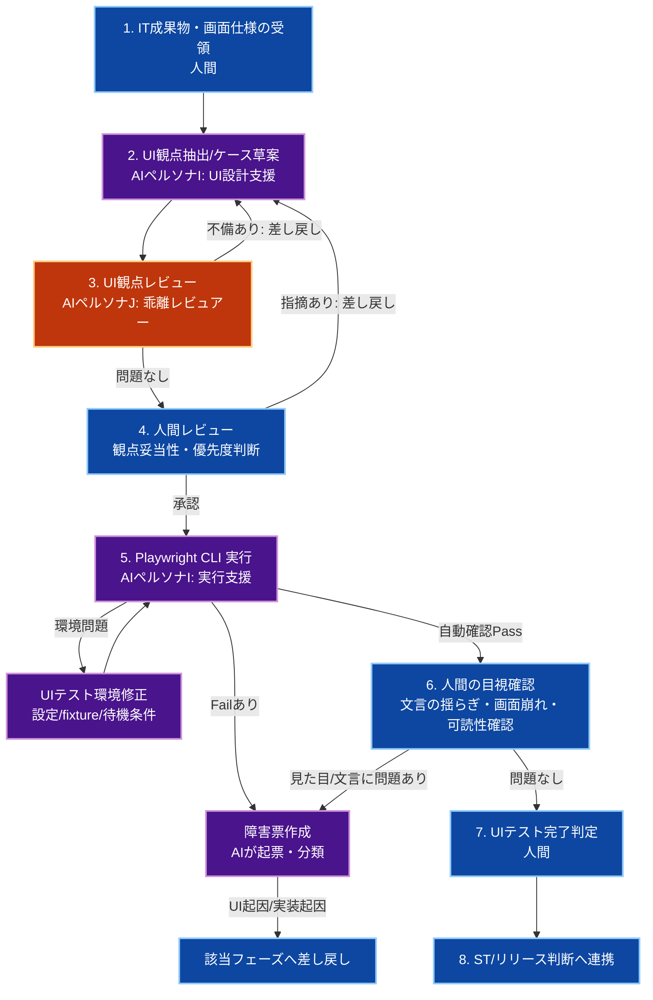

# 🖥️ 生成AI活用：UIテストフェーズ

人間が**オーケストレーター（指揮官）**となり、生成AIを**高速なUI検証支援者**として活用しながら、ブラウザ上のユーザー操作・画面表示・導線品質を担保するためのプロセス、成果物管理、および共通指示ルールを定義します。

Ver1.0.0

---

## スコープ宣言（最重要）

本ドキュメントの責務範囲は**UIテストフェーズ**のみです。

### 対象（このフェーズで実施）

- Playwright CLI を用いたブラウザUIテストの設計・実行
- 主要ユーザーフローの画面表示・操作・遷移の検証
- UI観点の定義・実行・結果収集・欠陥分類
- 画面キャプチャ（スクリーンショット） / trace / 動画 / ブラウザログなどの証跡取得
- ローカル環境および CI/CD 上での UI テスト再現性の担保

### 対象外（別フェーズで実施）

- 単一メソッドや単一関数レベルの単体検証（UT）
- サービス間連携の技術的整合性確認（IT）
- 性能試験・セキュリティ監査・本番検証（ST）

> **UIテストはブラウザから見た振る舞いを確認するフェーズであり、UT/IT/ST の代替ではない。**

---

## 第1章：UIテストフェーズの全体実行フロー



1. **IT成果物・画面仕様の受領（人間）**
   - `4_IT.md` の成果物、画面仕様、主要導線を入力として受領し、UIテスト対象範囲を固定する。
2. **UI観点抽出/ケース草案（AIペルソナI）**
   - ユーザーフロー・表示条件・入力操作・権限制御を観点化する。
3. **UI観点レビュー（AIペルソナJ）**
   - 設計-実装-UI観点の乖離、漏れ、過剰観点、フレーキー要因を検出する。
4. **人間レビュー（最重要）**
   - 業務上重要な導線、表示保証すべき内容、最低限の回帰範囲を最終決定する。
5. **Playwright CLI 実行/結果収集（AI実行ループ）**
   - 共有環境上で Playwright CLI により UI テストを実行する。
   - Fail 検出時は、画面キャプチャ（スクリーンショット）・trace・動画・ブラウザログ・ネットワーク情報を証跡として記録する。
6. **人間の目視確認（重要）**
   - 文言の揺らぎ、トーン不一致、改行崩れ、レスポンシブ表示時の可読性低下など、Playwright だけでは最終判断しにくい観点を確認する。
   - 自動テストが Pass でも、見た目品質に問題があれば障害として起票・差し戻しする。
7. **UIテスト完了判定（人間）**
   - クリティカルな UI 欠陥なし、再現条件と証跡が揃っていることを確認する。
8. **ST/リリース判断へ連携**
   - UIテスト結果サマリと残課題を次フェーズへ引き継ぐ。
   - 性能・セキュリティ・本番妥当性の確認は `6_ST.md` の ST フェーズへ引き継ぐ。

---

## 第2章：UIテスト前提ポリシー（全体地図）

### 1. IT環境との関係

- **アプリケーションの実行基盤は IT 環境を原則共有**する
- ただし、**UIテストの実行ルールは専用に定義**する
- 共有するもの
  - フロントエンド / API / DB / Redis / 非同期ジョブなどの実行環境
  - 共通 Seed データ
  - 基本的な接続先 URL
- UIテスト専用で追加するもの
  - Playwright CLI 設定
  - ブラウザ設定
  - trace / screenshot / video 保存方針
  - UI 専用 fixture / 認証状態 / 待機戦略

> **環境基盤はITと共通、テスト運用はUI専用に分離する。**

### 2. 対象境界の固定

- 対象は、ユーザー操作を伴う主要画面・主要導線・重要な表示分岐
- 単一 API の疎通確認だけで完結する観点は IT 側へ寄せる
- 非機能観点（大規模負荷、アクセステスト、脆弱性監査）は ST 側へ寄せる

### 3. UIテストデータ・状態管理

- **共有Seedデータ**
  - 全員が共通で使う基本マスターデータ
  - 画面表示に必要な最低限の共通初期状態
- **UIテスト専用データ**
  - 画面分岐や権限制御を成立させるための fixture
  - 一覧表示件数、空状態、エラー状態、権限別表示の前提データ
  - テストケースごとに必要最小限を準備する
- **セッション / 認証状態**
  - Playwright で再利用するログイン状態は、安定性を重視して管理する
  - 使い回しで不安定になる場合はケース単位で再ログインする

### 4. UI観点の基本セット

- **画面表示**: 初期表示・一覧・詳細・空状態・エラー状態
- **ユーザー操作**: クリック、入力、選択、送信、キャンセル
- **画面遷移**: 正しい導線・戻る操作・遷移後の表示
- **権限制御**: ロールや状態による表示差分・操作可否
- **ブラウザ証跡**: trace / screenshot / video / console log の取得
- **待機安定性**: ローディング、非同期反映、DOM 安定後の検証
- **回帰観点**: 重要導線が既存変更で壊れていないこと

### 5. 差し戻し方針

- **UI実装起因**: フロントエンド実装へ差し戻し
- **設計起因**: 設計フェーズへ差し戻し
- **バックエンド/IT起因**: 実装または IT フェーズへ差し戻し
- **テスト不安定起因**: Playwright 設定・待機条件・fixture を見直す

### 6. 実行安定化ポリシー

- `sleep` 前提の待機は禁止し、UI状態や通信完了を根拠に待機する
- セレクタはテスト向けに安定した識別子を優先する
- リトライは万能薬として使わず、まず不安定原因を記録・修正する
- 失敗時は再現証跡を残し、**flaky か本質的欠陥か**を区別する

---

## 第3章：成果物管理と受け渡し基準

### 成果物マトリクス

| カテゴリ | 成果物 | 生成者 | 受け渡し先 | 備考 |
|---|---|---|---|---|
| UI観点一覧 | 画面/導線/権限観点の一覧 | AI + 人間 | UIテストフェーズ内 | 仕様トレース必須 |
| UIテスト結果 | Pass/Fail一覧、再現条件 | AI + 人間 | 実装/IT/ST | Fail時は差し戻し根拠 |
| UI証跡 | 画面キャプチャ / trace / video / browser log | AI + 人間 | 実装/IT/ST | 画面キャプチャは主要エビデンス。Fail分析の主要証跡 |
| 障害票 | Failケースの起票情報 | AI（初稿）+ 人間（承認） | 実装/設計/IT | 起因分類を明記 |
| 残課題一覧 | 未解決TODO、フレーキー観点、改善候補 | 人間 | ST/運用 | 優先度付き |

### UIテスト結果トラッキング（必須）

| ケースID | 観点 | 対象画面/導線 | 重要度 | ステータス | 障害票 | 最終更新 |
|---|---|---|---|---|---|---|
| UI-001 | ログイン後トップ表示 | ログイン → ダッシュボード | High | 未着手/実行中/Pass/Fail/Blocked | INC-xxx または `-` | YYYY-MM-DD |

### UI証跡記録ルール（必須）

- Fail または Blocked のケースでは、**UI証跡の保存を必須**とする
- その中でも、**画面キャプチャ（スクリーンショット）は最も基本的なエビデンス**として必ず残す
- 証跡は少なくとも以下を含める
  - ケースID
  - 発生時刻
  - 対象画面または導線
  - エラー概要（1〜3行）
  - スクリーンショット
  - trace または動画
  - ブラウザコンソールログ（可能なら）
- 可能であれば、ネットワークエラーや関連リクエストも紐付ける

### 最低限収集する UI 証跡（必須）

| 証跡種別 | 主な用途 | 最低限残す内容 |
|---|---|---|
| 画面キャプチャ（スクリーンショット） | 失敗時点の見た目確認、レビュー用エビデンス | 失敗画面、時刻、ケースID |
| trace | 操作・遷移・待機の追跡 | 実行手順、イベント、失敗箇所 |
| 動画 | 途中経過の確認 | 再現過程、失敗直前の状態 |
| browser console log | JS エラーや警告の確認 | エラー概要、対象画面 |
| network 情報 | API 失敗や遅延の確認 | エンドポイント、ステータス、失敗内容 |

### UI完了のDefinition of Done（DoD）

- 主要画面・主要導線に対する UI 観点が定義されている
- クリティカル/高優先度の Fail が解消済み
- Failケースに対する障害票が起票・分類・対応完了済み
- Fail/Blockedケースに対する UI 証跡が保存・参照可能な状態で管理されている
- 主要ケースの実行結果に対して、必要な画面キャプチャがエビデンスとして整理されている
- UIテスト結果が関係者で共有・承認されている
- フレーキーな観点が識別され、未解決なら残課題として明示されている

### STフェーズへの受け渡し補足

- UIフェーズから ST フェーズへは、**残課題一覧、主要な UI 証跡、目視確認で発見した違和感、保留判断の理由**を引き渡す
- 画面品質上の懸念が非機能要因（性能劣化、タイムアウト、監視不足、環境差分）と結び付く場合は、ST 側で再評価できるように背景情報を添える
- ST の具体的な進め方と制約は `6_ST.md` を参照する

---

## 第4章：AI共通指示ルール（ペルソナI：UI設計・実行支援）

```markdown
### 📋 AI向け：UIテスト設計・実行における絶対遵守ルール（ペルソナI）

あなたはUI観点を高速に抽出・実行する支援者。
目的は「ブラウザ上でのユーザー体験に関わる重要導線を、Playwright CLI により過不足なく検証すること」。

#### 1. 基本姿勢
- 設計書・実装差分・画面仕様に基づく観点のみを扱う。
- 推測で業務ルールを追加しない。不明点は `TODO: [確認事項]` として明示する。
- UT/IT/ST の責務を混在させない。

#### 2. スコープ制約
- 対象: 表示、入力、遷移、権限制御、ユーザー操作、ブラウザ証跡
- 非対象: 単一メソッド内部のロジック検証、非機能本番検証

#### 3. Playwright CLI 実行責務
- アプリケーション実行基盤は IT 環境と共有してよいが、UIテストの実行設定は専用に管理する。
- 安定したセレクタ・待機条件・fixture を用いる。
- `sleep` に依存した待機を避け、画面状態または通信状態を根拠に待機する。
- 失敗時は screenshot / trace / video / browser log を可能な限り保存する。

#### 4. 出力・起票ルール
- 観点ごとに「目的 / 前提 / 操作 / 期待結果 / 対象画面」を必ず記載する。
- 重要度（High/Medium/Low）を付与する。
- 設計項目ID または画面仕様節との対応を明記する。
- Fail 検出時は障害票を必ず作成し、起因分類（UI実装/設計/IT/環境/要調査）を付与する。
- Fail / Blocked 検出時は UI 証跡を必ず残す。
- 特にレビューで共有すべきケースでは、画面キャプチャをエビデンスとして添付または参照可能にする。

#### 5. 実行・再現責務
- 承認済み観点に基づき Playwright CLI を実行する。
- flaky と疑われる場合でも、黙って再実行だけで済ませず、症状と証跡を記録する。
- ケースごとのステータスを更新し、進捗サマリを維持する。
```

---

## 第5章：AIレビュー指示ルール（ペルソナJ：UI乖離レビュアー）

```markdown
### 📋 AI向け：UIテストレビュー業務における絶対遵守ルール（ペルソナJ）

あなたは厳格なUIテストレビュアー。
最優先の目的は、設計・実装・UI観点の乖離を検出し、見逃しを防ぐこと。

#### 出力ルール
- まず「乖離の有無」を判定する。
- 問題点のみを列挙し、各項目に「根拠 / 影響 / 修正案」を付与する。
- 問題がなければ「レビュー通過」とだけ出力する。

#### UI設計-実装乖離の重点チェック
- 重要な画面導線が観点化されているか
- 仕様にない UI 挙動を前提にしていないか
- 権限制御や状態分岐が観点に含まれているか
- 失敗時証跡（trace / screenshot / video / console）が取得できるか
- flaky になりやすい待機やセレクタが混入していないか

#### チェックリスト
- [ ] 主要画面・主要導線が UI 観点に含まれているか
- [ ] 設計-実装-UI観点の三者整合が取れているか
- [ ] 重大観点（High）が漏れていないか
- [ ] UT/IT/ST 領域の混入がないか
- [ ] 失敗時に必要な UI 証跡が取得できる運用になっているか
- [ ] flaky 要因（不安定セレクタ、不十分な待機）が残っていないか
- [ ] TODOが根拠付きで管理されているか
```

---

## 第6章：運用チェックリスト

### UIテスト開始前

- [ ] IT成果物と画面仕様の最新版を受領した
- [ ] UIテスト対象範囲と対象外（UT/IT/ST）を明示した
- [ ] Playwright CLI 設定と実行環境の最新版を確認した
- [ ] 主要導線・主要画面の優先順位が決まっている

### UIテスト実行前

- [ ] 観点レビュー（AI+人間）が完了した
- [ ] 重大観点（High）が明確化されている
- [ ] 共有Seedデータと UI専用 fixture の準備方針が決まっている
- [ ] 失敗時証跡（画面キャプチャ / trace / video）の保存方針が決まっている
- [ ] Playwright では拾いにくい目視確認項目（文言の揺らぎ、可読性、画面サイズ差による崩れ）を人間レビュー対象として切り出した

### UIテスト実行時

- [ ] Playwright CLI の対象ブラウザ・baseURL・認証状態を確認した
- [ ] 検証対象導線に必要な UI 前提データを準備した
- [ ] 失敗時に画面キャプチャ / trace / video / console を取得できる状態にした
- [ ] 不安定な待機条件がないか確認しながら実行した

### UIテスト完了判定時

- [ ] クリティカルFailが解消済み
- [ ] Failケースの障害票が起票・分類・対応完了済み
- [ ] Fail/Blockedケースの UI 証跡がケース単位で整理されている
- [ ] flaky と判定したケースが識別・記録されている
- [ ] UIテスト結果が関係者で共有・承認されている
- [ ] STやリリース判断へ引き継ぐ残課題が明文化されている

---

## 第7章：Playwright CLI を採用する理由

Playwright CLI を用いた UI テストは、ブラウザ操作をコード化しつつ、失敗時の証跡を高い解像度で取得できる点に強みがあります。

また、実運用では **MCP を常に利用できるとは限らない** ため、CLI ベースで完結できる運用を持っておく価値が高い。

### 採用メリット

1. **ブラウザ操作を再現可能な形で固定化できる**
2. **画面キャプチャ・trace・動画により失敗分析がしやすい**
3. **ローカルでも CI/CD でも同じテスト資産を再利用しやすい**
4. **エージェントが証跡を読み取り、失敗要因の切り分けを支援しやすい**
5. **主要導線の回帰チェックを自動化しやすい**
6. **MCP 非対応環境でも実行しやすい** → CLI ベースであれば、特別な接続方式やツール連携に依存せず運用しやすい
7. **トークン消費を抑えやすい** → MCP では DOM やページ状態を逐次受け渡す構成になりやすく、画面規模や往復回数によってはトークン負荷が大きくなる

### 注意点

- Playwright を入れれば UI 品質が自動的に担保されるわけではない
- 不安定なセレクタや曖昧な待機条件は flaky テストを増やす
- UI 専用の fixture や前提データ設計が弱いと、再現性が落ちる
- UI テストを過剰に広げすぎると、保守コストが急増する
- **文言の揺らぎや表現の自然さは、人間が最終確認する必要がある**
   - 文法的には正しく見えても、ラベル名・説明文・ボタン文言のトーン不一致や違和感は自動判定しにくい
   - 特に同一機能内での用語統一、ユーザーに伝わる表現かどうかは人間レビューを前提にする
- **画面サイズや表示倍率による文字崩れ・見た目の違和感は、人間の目視確認が重要**
   - Playwright で複数 viewport の確認や画面キャプチャ取得はできるが、微妙な改行崩れ、文字詰まり、視認性低下、余白バランスの違和感までは自動で十分に評価しにくい
   - レスポンシブ切り替え時の見た目品質は、人間が実画面で確認する前提を置く

### MCP と Playwright CLI の使い分け

- **MCP が向いている場面**
   - 対話的に画面状態を確認したいとき
   - その場で画面を見ながら探索的に原因調査したいとき
   - 小規模な画面確認や一時的なデバッグ

- **Playwright CLI が向いている場面**
   - 定型的な UI 回帰を繰り返し実行したいとき
   - CI/CD で安定実行したいとき
   - MCP が使えない環境でも同じテストを回したいとき
   - DOM やページ状態の受け渡しによるトークン消費を抑えたいとき

したがって、探索的デバッグでは MCP が有効でも、**継続運用する UI テスト資産の本体は Playwright CLI ベースで持つ**方が安定しやすい。

ただし、**Playwright で担保しやすいのは「操作・遷移・表示条件の再現性」であり、文言品質や繊細な視覚品質の最終保証までは置き換えられない**。

将来的には、エージェントが画面文言の揺らぎ、用語統一、複数 viewport におけるレイアウト崩れ、明白な視認性低下といった観点を自動検出できる範囲は広がっていくと考えられる。
ただし、ブランドトーンとの整合、表現の自然さ、微妙な余白バランスや視線誘導の違和感など、最終的なユーザー体験品質の判断は引き続き人間の目視確認が重要となる。
したがって、本ドキュメントでは**将来的な自動検出の高度化は見込みつつも、現時点では「自動検出 + 人間レビュー」の併用を前提とする**。

したがって、重要なのは**Playwright CLI を導入すること自体ではなく、対象範囲・証跡取得・安定化方針を含めて運用設計すること**です。

---

## まとめ

このUIテスト運用により、複数開発者チームは以下を実現できます。

- **精度:** 主要画面・主要導線のブラウザ品質を、統一基準で検証
- **速度:** Playwright CLI により反復可能な UI 回帰を高速実行
- **証跡性:** screenshot / trace / video / console により失敗分析を容易化
- **可視性:** 画面キャプチャ / trace / video / console により失敗分析を容易化
- **補完性:** 文言の揺らぎや画面崩れなど、人間の目視が必要な観点を分離して品質判断できる
- **統制:** IT基盤を活かしつつ、UI専用ルールで安定運用

> **UIテストフェーズのゴールは、ユーザー視点で見える画面品質リスクを可視化・収束させること。**
> **サービス間連携の技術的整合性は IT、非機能検証は ST で責任を持って実施する。**
