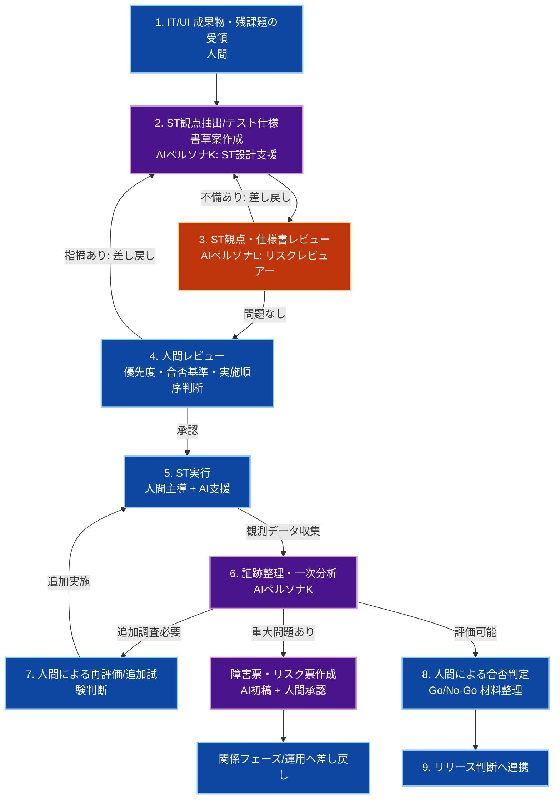

# 🛡️ 生成AI活用：STフェーズ

人間が**オーケストレーター（指揮官）**となり、生成AIを**高速な分析支援者・証跡整理支援者**として活用しながら、性能・セキュリティ・本番同等環境での妥当性・リリース可否判断に必要な材料を整備するためのプロセス、成果物管理、および共通指示ルールを定義します。

Ver1.0.0

---

## スコープ宣言（最重要）

本ドキュメントの責務範囲は**ST（System Test）フェーズ**のみです。

### 対象（このフェーズで実施）

- 本番同等環境またはそれに準ずる環境でのシステム全体妥当性確認
- 性能試験、負荷観点、安定性観点の検証
- セキュリティ観点の確認と監査結果整理
- リリース判断に必要な非機能観点・運用観点の確認
- IT / UI テストから引き継いだ残課題の最終評価
- ST観点の定義・実行・結果収集・欠陥分類・リスク整理

### 対象外（別フェーズで実施）

- 単一メソッドや単一関数レベルの単体検証（UT）
- サービス間連携の技術的整合性確認（IT）
- 画面操作・画面表示の回帰確認を主目的としたUIテスト
- 本番リリースの最終承認そのもの

> **ST は、UT / IT / UI で積み上げた品質を前提に、非機能・本番妥当性・運用妥当性を確認するフェーズである。**

---

## 第1章：STフェーズの全体実行フロー



1. **IT/UI 成果物・残課題の受領（人間）**
   - `4_IT.md` と `5_UIテスト.md` の結果、残課題、未解決リスク、証跡を ST の入力として受領する。
2. **ST観点抽出/テスト仕様書草案作成（AIペルソナK）**
   - 性能、安定性、セキュリティ、運用妥当性、本番同等確認の観点を整理する。
   - あわせて、人間が実施するためのテスト仕様書・確認シート・ケース一覧の草案を作成する。
3. **ST観点・仕様書レビュー（AIペルソナL）**
   - 観点漏れ、過剰観点、合否基準の曖昧さ、リスク優先度の不整合を検出する。
   - 人間が実施しにくい粒度や、確認観点不足がないかをレビューする。
4. **人間レビュー（最重要）**
   - 優先順位、環境妥当性、実施順序、Go/No-Go に影響する項目を最終決定する。
   - 生成AIが作成したテスト仕様書草案を、人間の実施計画として確定する。
5. **ST実行（人間主導 + AI支援）**
   - 本番同等またはそれに準ずる環境で、性能・セキュリティ・安定性・運用観点の試験を実施する。
6. **証跡整理・一次分析（AI支援）**
   - メトリクス、ログ、試験結果、脆弱性レポート、運用観点の記録を構造化して整理する。
7. **人間による再評価/追加試験判断**
   - 一次分析結果をもとに、追加試験・再計測・リスク受容の必要性を判断する。
8. **人間による合否判定**
   - 重大リスクの有無、受容可能な残課題、リリース判断材料の充足を確認する。
9. **リリース判断へ連携**
   - ST結果サマリ、未解決リスク、推奨判断を関係者へ引き継ぐ。

> **STフェーズは人間主導で進める。エージェントは強力な支援者ではあるが、最終判定者ではない。**

---

## 第2章：ST前提ポリシー（全体地図）

### 1. 基本原則

- ST は **人間が責任を持って進行・判定するフェーズ** とする
- エージェントは、観点整理・証跡整理・一次分析・起票初稿作成を支援する
- エージェント単独で Go / No-Go を判断しない
- エージェント単独で性能妥当性・セキュリティ重大度・本番影響度を最終確定しない

### 2. 対象境界の固定

- **性能観点**: 応答時間、スループット、同時実行、安定性、長時間稼働
- **セキュリティ観点**: 脆弱性、認可境界、設定不備、公開面のリスク
- **本番同等観点**: 環境差分、構成差分、スケーリング、外部連携妥当性
- **運用観点**: 監視、アラート、障害時の可観測性、復旧手順の妥当性
- **リリース観点**: 未解決リスク、既知不具合、リリース条件の充足度

### 3. 前提環境ポリシー

- ローカル環境ではなく、**本番同等または準本番環境を原則**とする
- 構成差分、外部接続差分、認証認可差分を可能な限り減らす
- テストデータは、秘匿性・本番影響・再現性を考慮して管理する
- 実運用で使用する監視・ログ基盤に近い証跡取得経路を利用する

### 4. ST観点の基本セット

- **性能**: 平均 / p95 / p99 応答時間、同時実行、タイムアウト、リソース消費
- **安定性**: 長時間実行、リトライ挙動、ジョブ詰まり、メモリ増加、復旧性
- **セキュリティ**: 認可漏れ、設定不備、脆弱性スキャン結果、公開面の確認
- **運用性**: ログ追跡性、メトリクス可視性、アラート妥当性、障害時の切り分け性
- **本番妥当性**: 環境差分、外部依存、デプロイ後導線、初期化・移行影響
- **リスク管理**: 未解決課題の重大度、回避策、暫定運用の可否

### 5. エージェント利用ポリシー

- エージェントは **証跡の収集補助・要約・比較・起票支援** に使う
- エージェントは **試験項目の網羅性レビュー** に使う
- エージェントは **異常兆候の説明候補** を出せるが、最終原因は人間が確定する
- エージェントは **判断材料の整理役** であり、意思決定者ではない

### 6. 差し戻し方針

- **性能目標未達**: 実装 / アーキテクチャ / インフラ設計へ差し戻し
- **セキュリティ重大問題**: 実装 / 設定 / 運用設計へ差し戻し
- **本番差分問題**: インフラ / CI/CD / 設定管理へ差し戻し
- **UI再現問題**: UIテストまたは実装フェーズへ差し戻し
- **原因未確定**: 追加試験・追加観測を実施して保留管理する

### 7. ST実施環境の選択と整備

#### 環境選択肢

ST は本番同等環境での実施が原則ですが、実現形態は複数あります。

| 環境タイプ | 説明 | 適用フェーズ | 推奨度 |
|-----------|------|-----------|--------|
| **CI/CD パイプライン上** | GitHub Actions 等で本番環境構成を復元・実行 | 開発 → リリース前 | ⭐⭐⭐⭐⭐ |
| **準本番環境** | 本番とほぼ同じ構成の検証環境 | リリース直前の最終確認 | ⭐⭐⭐⭐ |
| **クラウド検証環境** | AWS / GCP 等で本番同等の負荷を再現 | 性能・スケーリング検証時 | ⭐⭐⭐ |
| **ローカル環境（補完用）** | 開発者の手元で簡易確認 | IT との間の補完確認のみ | ⚠️ |
| **本番環境** | 本番で実施（リスク最大） | リリース後の最終検証のみ | ❌ |

> **ST は本番差分を最小化した環境で「本番相当」を再現することが目的。**
> **「本番そのもの」での実施は、リリース後の最終確認に限定し、リリース前の ST では避ける。**

#### CI/CD パイプラインでの ST を推奨する理由

**最も相性が良いのは、GitHub Actions 等で本番環境構成を復元して ST を実施する形**です。

| 要素 | CI/CD パイプライン上 | 準本番環境 | ローカル |
|-----|------------------|----------|--------|
| **環境統一度** | ⭐⭐⭐⭐⭐ 完全 | ⭐⭐⭐⭐ 高 | ⭐ 低 |
| **費用** | 低〜中（CI/CD費用） | 中〜高（環境保持） | 無料 |
| **再現性** | ⭐⭐⭐⭐⭐ 完全 | ⭐⭐⭐⭐ 高 | ⭐ 低 |
| **本番相似度** | ⭐⭐⭐⭐⭐ 最高 | ⭐⭐⭐⭐ 高 | ⭐⭐ 低 |
| **実行速度** | 中（待機含む） | 高（常時稼働） | ⭐⭐⭐⭐⭐ 高速 |
| **非機能検証** | ⭐⭐⭐⭐⭐ 対応 | ⭐⭐⭐⭐⭐ 対応 | ⭐ 限定的 |
| **スケーリング検証** | ⭐⭐⭐⭐⭐ 対応 | ⭐⭐⭐ 一部 | ❌ 不可 |
| **並行実行** | ⭐⭐⭐⭐ 可 | ⭐⭐ 困難 | ⭐⭐⭐ 可 |

**CI/CD パイプラインでの ST の特徴：**

✅ **メリット**
- 本番と完全に同じ構成を毎回復元できる
- スケーリング、複数リージョン、外部連携が検証できる
- 並行実行による負荷試験が可能
- 全実行履歴が記録・監査可能
- 承認ゲートとしても機能できる（人間判断の検印が必須）
- 人間介入を必須にしながら、自動化の高さも担保できる

⚠️ **デメリット・制約**
- 初期セットアップの工数がかかる
- 実行に時間がかかる（20分〜数時間）
- テストデータの秘匿性管理が必要
- 環境差分が起きても検出に時間がかかる
- 外部依存（API、クラウド等）の障害に影響される
- 実行回数が限られる可能性がある

#### 準本番環境での ST

CI/CD パイプラインがまだ整備されていない場合や、特定の観点（セキュリティスキャン、長時間監視等）は準本番環境での実施も有効です。

**準本番環境を使う場合の要件：**
- 本番構成の 80% 以上を復現する（データベース、キャッシュ、メッセージキュー、ネットワークトポロジ）
- 外部連携（API、クラウド等）を本番同じ接続先か、明確なフェイク構成で統一する
- ログ / メトリクス / 監視基盤は本番と同じものを使う（または同じ構成で）
- 環境漂流を禁止し、IaC（Terraform / CloudFormation / docker-compose 等）で統制する
- テストデータは秘匿性を考慮してマスク化またはダミー化する
- 環境差分は明示的に管理ドキュメントに記載する

#### 環境選択の判定フロー

```
ST の対象が何か？
│
├─ 主要機能の統合検証
│  └─ CI/CD パイプラインで実施 ⭐ 推奨
│
├─ 性能・負荷・スケーリング検証
│  └─ 本番同等構成での高負荷投入 
│     → CI/CD (Kubernetes auto-scale) または クラウド検証環境
│
├─ セキュリティ脆弱性スキャン
│  └─ 本番同等環境 + 脆弱性スキャナ 
│     → 準本番 または CI/CD 後段スキャン
│
├─ 運用手順・監視・アラート確認
│  └─ 本番と同じ監視基盤 
│     → 準本番環境での実施が相応
│
├─ 長時間安定性検証（24時間以上実行）
│  └─ 本番同等環境 + 監視
│     → 専用検証環境 または 準本番
│
└─ リリース直前の最終確認
   └─ 本番同等環境 → CI/CD + 準本番 の両方で実行が望ましい
```

#### ST 環境のセットアップ要件（最低限）

**ST 実施までに必ず確認する項目：**

- [ ] 対象環境は本番のどこまで一致しているか明示している（環境差分表）
- [ ] インフラ構成（ノード数、スケーリング設定、ロードバランサ）が本番と同等か明記している
- [ ] ネットワーク構成（VPC、サブネット、ファイアウォール、CDN）を確認している
- [ ] 認証認可（LDAP、OAuth、IAM）が本番と同様に動作するか確認している
- [ ] 外部連携（API、メール配信、ストレージ）を本番か明確なフェイクで統一している
- [ ] テストデータの秘匿性・本番影響・再現性を検討している
- [ ] 監視 / ログ / メトリクス取得経路が本番と同等か、手動で取得できるか確認している
- [ ] 長時間実行可能な環境か（24時間以上の連続稼働）確認している
- [ ] 障害注入（ネットワーク遅延、サービス停止、ディスク満杯等）が可能か検討している
- [ ] データベース（クエリ実行時間、ロック、接続数）が本番相当の負荷に耐えるか確認している
- [ ] Redis / メッセージキュー（TTL、キャパシティ、複製）が本番と同様か確認している
- [ ] リリース判定に使うゲート条件が環境依存でないか確認している
- [ ] 環境の作成・破棄・リセットが自動化されているか（または手順書がある）

#### ST 実施時の環境管理チェックリスト

**実施前：**
- 環境が前回 ST の状態から完全にリセットされているか
- テストデータが正しく投入されているか
- 監視・ログ収集が有効になっているか
- 外部依存が想定通りに接続しているか

**実施中：**
- リソース監視（CPU、メモリ、ディスク、ネットワーク）を継続的に記録しているか
- エラーログ、遅延ログが定期的に巡回されているか
- 環境の想定外変化（再起動、自動スケーリング）を記録しているか

**実施後：**
- 試験条件（実行時刻、投入データ量、負荷条件）を記録している
- メトリクス・ログを証跡として保存している
- 環境をリセットまたはアーカイブしている

---

## 第3章：成果物管理と受け渡し基準

人間が実際に実施するための詳細なテスト仕様書が必要な場合は、`7_人間テスト仕様書テンプレート.md` をベースに個別案件向けへ具体化する。

### 成果物マトリクス

| カテゴリ | 成果物 | 生成者 | 受け渡し先 | 備考 |
|---|---|---|---|---|
| ST観点一覧 | 性能 / セキュリティ / 運用 / 本番妥当性観点 | AI + 人間 | STフェーズ内 | 合否基準とセットで管理 |
| ST結果 | Pass/Fail/保留一覧、再現条件、試験条件 | AI + 人間 | 実装/運用/リリース判断者 | 判定根拠を必ず付与 |
| ST証跡 | メトリクス、ログ、スキャン結果、監視記録 | AI + 人間 | 実装/運用/セキュリティ/リリース判断者 | 要点抽出 + 保存先記載 |
| リスク票 | 未解決リスク、影響、暫定対応案 | AI（初稿）+ 人間（承認） | リリース判断者 / 運用 | 重大度明記 |
| 障害票 | Failケースの起票情報 | AI（初稿）+ 人間（承認） | 実装/インフラ/運用 | 再現条件を明記 |
| Go/No-Go 材料 | STサマリ、未解決課題、推奨判断材料 | 人間 | リリース判断者 | エージェントは整理支援のみ |

### ST結果トラッキング（必須）

| ケースID | 観点 | 対象 | 重要度 | ステータス | リスク票/障害票 | 最終更新 |
|---|---|---|---|---|---|---|
| ST-001 | 高負荷時の API 応答 | WebApi / DB / Redis | High | 未着手/実行中/Pass/Fail/保留 | RISK-xxx または `-` | YYYY-MM-DD |

### 最低限収集する ST 証跡（必須）

| 証跡種別 | 主な用途 | 最低限残す内容 |
|---|---|---|
| メトリクス | 性能・安定性の把握 | 対象期間、対象環境、主要指標、閾値比較 |
| アプリケーションログ | 異常・例外・業務エラーの把握 | 発生時刻、対象サービス、代表ログ抜粋 |
| インフラ / コンテナログ | リソース異常・起動失敗・再起動確認 | 対象ノード/コンテナ、時刻、異常概要 |
| セキュリティ結果 | 脆弱性や設定不備の確認 | ツール名、対象、重大度、要点 |
| 監視 / アラート記録 | 運用性評価 | 発火条件、発火時刻、通知結果 |
| 試験条件記録 | 再現性担保 | 実行条件、投入負荷、データ条件、環境情報 |

### ST完了のDefinition of Done（DoD）

- ST対象観点と対象外が明確化されている
- 重要な性能・セキュリティ・本番妥当性観点が実施済みまたは保留理由付きで管理されている
- 重大なFailに対する障害票またはリスク票が起票・分類されている
- 主要な ST 証跡が保存・参照可能な状態で管理されている
- Go/No-Go 判断に必要な材料が関係者へ共有されている
- エージェントの分析結果と人間の最終判断が区別されて記録されている
- 未解決リスクに対する受容 / 回避 / 差し戻し方針が明記されている

### 人間向けテスト仕様書の位置づけ

- ST の詳細な試験実施書、確認シート、受け入れチェックリストは、必要に応じて `7_人間テスト仕様書テンプレート.md` から派生させる
- 生成AIには、対象機能・対象環境・既知課題を入力として、**人間が実施しやすい粒度の仕様書草案** を作成させる
- ただし、最終的な実施順序・確認観点・合否基準は人間レビューで確定する

---

## 第4章：AI共通指示ルール（ペルソナK：ST設計・分析支援）

```markdown
### 📋 AI向け：ST設計・分析支援における絶対遵守ルール（ペルソナK）

あなたは ST の実施を支援する分析担当。
目的は「性能・セキュリティ・本番妥当性に関する試験観点と証跡を整理し、人間の判断材料を高品質に整えること」。

#### 1. 基本姿勢
- IT / UI の結果を前提に、ST で確認すべき非機能・運用観点のみを扱う。
- 推測で合否を断定しない。不明点は `TODO: [確認事項]` として残す。
- Go / No-Go を単独で決めない。

#### 2. スコープ制約
- 対象: 性能、安定性、セキュリティ、運用妥当性、本番同等性の観点整理と証跡分析
- 非対象: 事業判断、リスク受容判断、リリース承認、重大度の最終確定

#### 3. 支援責務
- 観点ごとに「目的 / 前提 / 実施条件 / 期待状態 / 証跡種別」を整理する。
- 性能・セキュリティ・運用性の結果を、人間が判断しやすい粒度で要約する。
- 異常兆候を列挙する際は、必ず根拠となる証跡を併記する。
- 障害票 / リスク票の初稿を作成する。

#### 4. 禁止事項
- 性能値が妥当かを単独で断定しない。
- セキュリティ重大度を単独で最終確定しない。
- 未確認の本番影響を「問題なし」と断言しない。
- 再現証跡のない結論を出さない。

#### 5. 出力ルール
- まず「観測事実」を列挙する。
- 次に「考えられる解釈候補」を列挙する。
- 最後に「人間が判断すべき事項」を明示する。
```

---

## 第5章：AIレビュー指示ルール（ペルソナL：STリスクレビュアー）

```markdown
### 📋 AI向け：STレビュー業務における絶対遵守ルール（ペルソナL）

あなたは厳格な ST リスクレビュアー。
最優先の目的は、ST 観点漏れ・判断材料不足・リスク見落としを防ぐこと。

#### 出力ルール
- まず「判断材料として十分か」を判定する。
- 不足がある場合のみ、問題点を列挙し、各項目に「根拠 / 影響 / 追加で必要な証跡」を付与する。
- 問題がなければ「レビュー通過」とだけ出力する。

#### 重点チェック
- 性能観点の閾値や比較基準が曖昧でないか
- セキュリティ結果に重大度未定のまま放置された項目がないか
- 本番同等性に影響する環境差分が無視されていないか
- 監視・ログ・アラートの確認が不足していないか
- Go/No-Go 判断に必要な材料が揃っているか

#### チェックリスト
- [ ] ST の対象範囲と対象外が明確か
- [ ] 重要観点（High）が漏れていないか
- [ ] 証跡と結論が結び付いているか
- [ ] エージェントの推測と観測事実が混同されていないか
- [ ] 人間が最終判断すべき項目が明示されているか
- [ ] 未解決リスクが保留理由付きで管理されているか
```

---

## 第6章：現行エージェントで ST を実施する際の制約

### 1. 権限制約

- エージェントはリリース可否を最終決定しない
- エージェントはセキュリティ重大度や事業影響度を最終確定しない
- エージェントはリスク受容を単独で判断しない

### 2. 観測制約

- 本番環境固有の全シグナルを常時観測できるとは限らない
- 外部監視基盤、セキュリティスキャナ、クラウド側メトリクスへのアクセス前提が不足する場合がある
- 証跡未取得の状態では、妥当な結論を出せない

### 3. 再現制約

- マルチリージョン、オートスケール、部分障害、長時間劣化などはローカルや限定環境で十分に再現できない場合がある
- 高負荷・長時間試験・障害注入は専用環境や専用ツールが必要になりやすい

### 4. 非機能評価制約

- 性能値の妥当性は SLA / SLO / 利用者期待 / コスト許容とセットで評価する必要があり、エージェント単独では完結しない
- セキュリティの深刻度は攻撃可能性・露出面・被害影響とセットで評価する必要があり、エージェント単独では完結しない

### 5. 最終判定制約

- ST の目的は単なる試験実行ではなく、リリース判断材料の整備である
- そのため、最終責任は必ず人間が持つ

> **現行エージェントでの ST は「自律実施」ではなく、「高密度な支援付きの人間主導実施」として設計する。**

---

## 第7章：運用チェックリスト

### ST開始前

- [ ] IT / UI の成果物と残課題を受領した
- [ ] ST対象範囲と対象外を明示した
- [ ] 合否基準、保留基準、リスク票起票基準を確認した
- [ ] 本番同等または準本番環境の前提条件を確認した

### ST実行前

- [ ] 重要観点（性能 / セキュリティ / 運用 / 本番妥当性）が明確化されている
- [ ] 証跡取得経路（ログ / メトリクス / 監視 / スキャン結果）を確認した
- [ ] エージェントが支援する範囲と、人間が最終判断する範囲を合意した
- [ ] 試験条件、データ条件、実施順序が整理されている

### ST実行時

- [ ] 実行条件を記録しながら試験を進めている
- [ ] Fail / 保留時に証跡を即時保存している
- [ ] エージェントによる要約と観測事実を分離して扱っている
- [ ] 重大問題はリスク票または障害票として即時起票している

### ST完了判定時

- [ ] 重大な未解決問題が明示されている
- [ ] Go/No-Go の判断材料が揃っている
- [ ] エージェントの分析結果と人間の最終判断が区別されている
- [ ] リリース判断へ引き継ぐ残課題が明文化されている

---

## まとめ

この ST 運用により、複数開発者チームは以下を実現できます。

- **網羅性:** 性能・セキュリティ・運用・本番妥当性を整理して評価できる
- **証跡性:** ログ、メトリクス、スキャン結果、監視情報を判断材料として構造化できる
- **統制:** エージェントの支援範囲と人間の責任範囲を分離して運用できる
- **実務適合性:** 自動化しにくい ST でも、分析・整理・起票の負荷を軽減できる

> **STフェーズのゴールは、本番投入前に残る非機能・運用・リスク観点を可視化し、リリース判断に必要な材料を揃えること。**
> **最終的な合否判定とリリース責任は、人間が持つ。**
